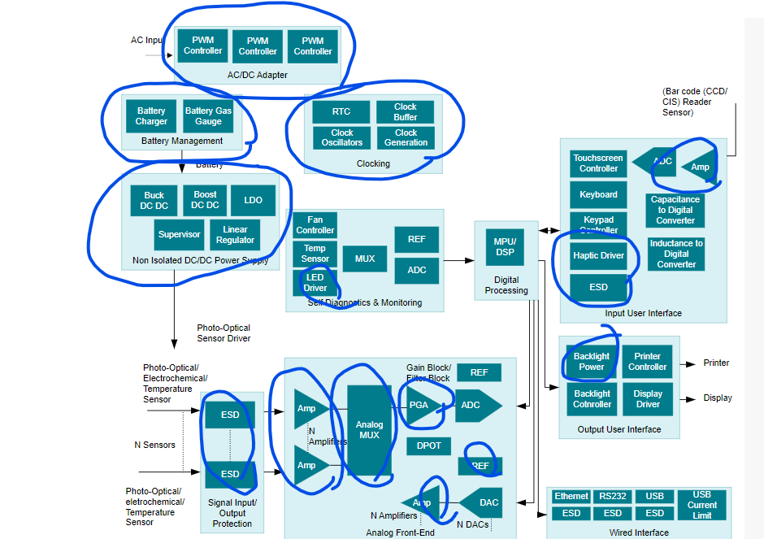

# 01 - Introducción

## Detalles Administrativos

[README](README.md)

Pagina: https://github.com/julianodb/SISTEMAS_ELECTRONICOS_PARA_INGENIERIA_BIOMEDICA

## Motivación

Electrónica Analógica vs Digital

## Trabajos

https://www.youtube.com/embed/AXxBt_TyKTw

Grupos de 3

## Revisión/Resúmen de Prerequisitos

Teoría de Circuitos

$R_{series} = R_1 + R_2$

$$R_{paralelo} = \frac{1}{\frac{1}{R_1} + \frac{1}{R_2}}$$

$$\sum{corrientes} = 0$$

$$\sum{voltajes} = 0$$
