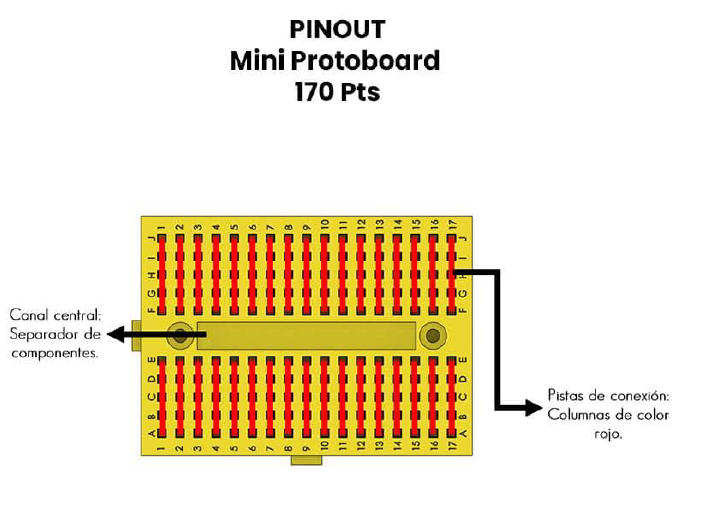
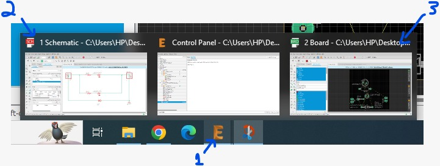
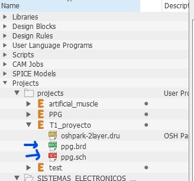

# 03 - Diodos y Aplicaciones II

## Revisión de sentido de voltaje y corrientes

Corriente tiene el sentido contrario de la tensión eléctrica, a menos que sea un dispositivo que entrega energía al circuito, como una batería.

## Diodos Zener y TVS

El diodo zener utilizado como protección de picos de voltaje limita el voltaje que llega a la carga a que esté entre $-V_f$ y $V_Z$.

## Diodo real

### Ecuación de Shockley

$$ I_D = I_S \left( e^{\frac{V_D}{n V_T}} - 1 \right) $$

- $I_D$ y $V_D$: Corriente y tención del diodo de acuerdo a la convención
- $I_S$: Corriente de saturación en inversa. Constante para cada diodo.
- $n$: Constante de idealidad. $n \in [1,2]$
- $V_T$: Voltaje térmico

$$ V_T = \frac{kT}{q}$$

- $k$: Constante de Boltzmann. $k=1.38 * 10^{-23} J/K$
- $T$: Temperatura del diodo en Kelvin
- $q$: Carga del electrón. $q=1.6*10^{-19} C$

### Curva de Carga

$I_R = I_D$

- $I_R (V_D) = \frac{V_i - V_D}{R}$
- $I_D (V_D) = I_S \left( e^{\frac{V_D}{n V_T}} - 1 \right)$

No tiene solucción analítica. Útil para entender el circuito graficamente

## Hojas de Datos

- Valores máximos: $V_f$, $I_f$, potencia disipada, $V_R$
- $V_f$ para distintos valores de prueba de $I_f$. Temperatura de prueba determinada (por ejemplo 25°C)
- Gráficos

## Bibliografia

Boylestad, R. & Nashelsky, L. (2009). Electrónica: Teoría de circuitos y dispositivos electrónicos (10ma.ed.). Cap.1 y 2, pág. 1-114

## Trabajo 1

Link: [T1](T1.md)

### Aclaraciones

1. Formato de entrega: El formato es libre, mi expectativa es un ensayo de alrededor de 2 páginas, y que se muestren los cálculos en donde haya que calcular valores.
2. Fecha/horario de entrega: En las instrucciones dice que el plazo de entrega es martes, 11 de abril. El horario limite es que lo entreguen durante la clase (hasta 16:40).
3. Selección de $I_f$: En las instrucciones menciono que utilicen el $I_f$ de prueba. Esto es suficiente para el ensayo, pero en el caso de que encuentren que el brillo de los LEDs no es satisfactorio, pueden seleccionar un valor distinto (deben ajustar el cálculo de R en dicho caso, y mostrar los resultados para ambos $I_f$: el de prueba y el seleccionado)
4. Materiales entregados: Reafirmo que la evaluación estará basada en el ensayo, y que los materiales entregados son solamente para que puedan experimentar con el diseño que están haciendo. Pueden comprobar si el brillo de los LEDs está a su gusto o les gustaría utilizar una corriente distinta, si la combinación de resistencias realmente logra la corriente deseada, si los LEDs realmente se encienden etc.
Les comparto una lista de los componentes entregados:
- 5 x cajas porta pilas para 4 pilas AA cada una, con resistencia de seguridad en los cables para evitar sobre corriente
- 5 x pack de 4 pilas AA
- 5 x mini protoboard 170 puntos. El protoboard sirve para prototipaje rápido y comprobar circuitos eléctricos. Pueden insertar los componentes como LEDs y resistencias en los agujeros del protoboard y conectarlos con cables. En la imagen abajo se muestran cuales agujeros están conectados entre sí.

    
- KIT de LEDs de 5 colores, en 2 tamaños: 5mm y 3mm. Aproximadamente 20 LEDs de cada color y cada tamaño. En algunos colores pueden haber 1 o 2 LEDs menos porque los quemé mientras probaba (¡perdón!).
- KIT de 600 resistencias de 1/4 W, 30 valores distintos
- 65 cables Dupont reforzados, para hacer conexiones en el protoboard.
5. Parte EXTRA:
    1. Punto extra: en el trabajo menciono que la entrega del proyecto vale 1 punto extra acumulable. Lo que quiero decir con esto es que no es necesario entregar la parte extra para obtener el puntaje máximo en el trabajo (7 puntos). Sin embargo, al hacer la parte extra el punto puede ayudar en el caso de que no tengan la puntuación máxima en los demás ítems. En el caso de que sí obtienen la puntuación máxima, el punto extra se suma al trabajo 2.
    1. Como abrir el archivo: Al abrir el archivo eagle.epf se deben abrir 3 ventanas, aunque sólo verás la primera en principio. Para ver las otras, hay que apretar en el icono de eagle, luego las puedes seleccionar (ver imagen abajo).

        

        En el caso de que no funcione, la alternativa es mover la carpeta T1_proyecto a la carpeta de proyectos de EAGLE, usualmente `C:\Users\<<nombre del usuario>>\Documents\EAGLE\projects`. Una vez que lo hagan, el proyecto debe aparecer en el panel de control de EAGLE, donde pueden seleccionar (doble click) el archivo del esquemático (ppg.sch) o de la placa (ppg.brd), como se indica en la imagen abajo.

        
    1. Entrega del proyecto: Hay dos opciones: comprimir la carpeta del proyecto (.zip) y entregarla a través de LOA, o crear un pull request al repositorio de la asignatura (https://github.com/julianodb/SISTEMAS_ELECTRONICOS_PARA_INGENIERIA_BIOMEDICA). Voy a crear una carpeta por grupo para guardar los proyectos entregados.
    1. Fabricación: Como les comenté en clase, mi objetivo es fabricar las placas que Ustedes diseñen. Todavía estoy negociando con el departamento para elegir un proveedor, pero les quería comentar que es posible que el plazo de entrega sea largo, tal vez más de 3 semanas.
