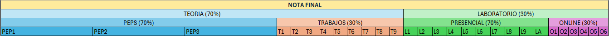

#  Sistemas Electrónicos 1/2025
##### enfoque Ingeniería Biomédia

## Página de la asignatura

[uvirtual](https://uvirtual.usach.cl/moodle/course/view.php?id=40681)

[Clase de Tinkercad para Laboratorios Online](https://www.tinkercad.com/joinclass/5XK7AATBK)

## Horário Teoría
- Martes: bloques 5 y 6 (M5: 15:20 - 16:40, M6: 16:55 - 18:15), ED606

## Horário Laboratório
- Jueves, bloque 6 (J6: 16:55 - 18:15), Laboratorio de Electromedicina y Mediciones Fisiológicas

## Profesores

- Juliano Dawid Barboza (juliano.dawid @usach.cl)
- Britam Gomez Arias (britam.gomez @usach.cl)

### Ayudante

- Joaquín Marchant (joaquin.marchant.l @usach.cl)

## Resultados de Aprendizaje - Teoría

Al término de la asignatura el alumno será capaz de identificar, analizar y especificar los principales componentes y circuitos de la electrónica analógica:
1. Resistores, capacitores, diodos, transistores
2. Aplicaciones directas de diodos y transistores, como rectificadores y drivers
3. Amplificadores operacionales y sus aplicaciones
4. Filtros analógicos pasivos y activos
5. Osciladores
6. Fuentes de alimentación lineales y conmutadas

## Resultados de Aprendizaje - Laboratório

Al término de la asignatura el alumno será capaz de:
1. Poner en práctica los conocimientos de electrónica aprendidos en cursos anteriores y en cátedra.
    1. Desarrollar las habilidades de trabajo en un laboratorio de electrónica.
    1. Comprender limitantes en el trabajo real con electrónica.
    1. Trabajar con los circuitos más emblemáticos de la electrónica análoga.
    1. Usar la instrumentación básica utilizada en electrónica.

## Contribución al Perfil de Egreso
- Capacidad de aprendizaje autónomo
- Capacidad para abordar y resolver problemas de ingeniería en una perspectiva sistémica
- Desarrollar la capacidad de diagnóstico, modelación y diseño de sistemas o procesos en el ámbito de su especialidad

## Evaluaciones

Las notas de todas las evaluaciones (pruebas escritas, trabajos de diseño y laboratorios) serán redondeadas a una casa decimal hacia arriba. Ejemplo: 4.51 se redondea a 4.6.

$$ Nota Redondeada = \frac{\lceil 10\  Nota Original \rceil}{10}$$

La siguiente tabla muestra un resúmen de las evaluaciones.

### Teoría
La nota de teoría está compuesta por 70% del promedio simple de las evaluaciones escritas, y 30% del promedio simple de los trabajos. 

$$ Promedio Teoría = 0.7\sum_{i=1}^{np} \frac{P_i}{np} + 0.3\sum_{j=1}^{nt} \frac{T_j}{nt} $$

Están planificados $np=3$ pruebas escritas y $nt=10$ trabajos de diseño.

Cada trabajo de diseño tiene una fecha y hora maxima de entrega. En el caso de que se entregue el trabajo con hasta 24 horas de atraso, se descuenta la mitad de la nota (máxima nota posible 4.0). Si se entrega el trabajo con más de 24 horas de atraso, se considera una nota 1.0.

El sistema de evaluación contempla, además, una Prueba Optativa Recuperativa (POR)

- Si el/la estudiante en el promedio final obtiene una nota menor a 4.0, pero mayor o igual a 3.0, puede optar a una POR.
- La POR reemplaza la peor nota de las 3 pruebas escritas.
- El contenido de la POR es toda la materia

$$ Promedio Teoría = 0.7\frac{ \sum{P_i} + POR - min\{P_i\}}{np} + 0.3\sum_{j=1}^{nt} \frac{T_j}{nt} $$

Si el Promedio Teoría es menor a 4.0, el/la estudiante reprueba la parte teórica de la asignatura.

#### Asistencia a Clases

Se exige un mínimo de 75 % de asistencia a clases presenciales. Una asistencia inferior al 75 % sin justificaciones ante docencia causa reprobación automatica de la parte teórica de la asignatura, con una nota 3.5 .

Están planificadas 24 clases de teoría, por lo que el número maximo de ausencias injustificadas es 3 días.

### Laboratorio

El desarrollo del laboratorio estará en función a experiencias presenciales y online. Las experiencias presenciales corresponderán a guías que deberán ser desarrolladas en clases, y cuyo informe deberá ser entregado al finalizar la sesión. Las experiencias online serán desarrolladas con la plataforma tinkercad, y serán evaluadas a través de cuestionarios en uvirtual.

Las ponderaciones para la evaluación de laboratorio serán 70% del promedio simple de las experiencias presenciales y 30% del promedio simple de las experiencias online:

$$ Promedio Laboratorio = 0.7\sum_{i=1}^{nl} \frac {Lp_i}{nl} + 0.3\sum_{j=1}^{no} \frac {Lo_j}{no}$$

Donde $Lp_i$ son las notas de las experiencias de laboratorio presenciales y $Lo_j$ son las notas de las experiencias de laboratorio online. Están planificados $nl=8$ actividades de laboratorio presenciales y $no=7$ actividades online durante el semestre.

Si el Promedio Laboratorio es menor a 4.0, el/la estudiante reprueba la parte de laboratorio de la asignatura.

#### Asistencia a Laboratorios

La inasistencia al laboratorio presencial deberá ser justificada ante docencia, quien informará a los profesores sobre la justificación de ésta. En caso de inasistencia justificada, la actividad de recuperación será informada caso a caso.

La inasistencia INJUSTIFICADA a un laboratorio causa reprobación automática de la parte de laboratorio de la asignatura, con una nota 3.5 .

### Promedio final y aprobación

En el caso de que el/la estudiante repruebe apenas teoría o apenas laboratorio, tendrá que cursar solamente la parte reprobada en el semestre siguiente en que se dicte la asignatura.

El promedio final de la asignatura se calcula como:

$$ Promedio Final = 0.7\ Promedio Teoría + 0.3\ Promedio Laboratorio  $$

Se considera redondeo convencional con una casa decimal para el promedio final (entre 0.01 y 0.04 se redondea hacia abajo: 0.0; y entre 0.05 y 0.09 se redondea hacia arriba: 0.1).

Respecto a las demás reglas de docencia, este curso se adscribe a las [DIRECTRICES DOCENCIA ING. CIVIL BIOMEDICA 2024](https://ingenieriabiomedica.usach.cl/sites/ing-civil-biomedica/files/directrices_docencia_ing._civil_biomedica_2024.pdf).

## Bibliografia
- Boylestad, R. & Nashelsky, L. (2009). Electrónica: Teoría de circuitos y dispositivos electrónicos (10ma.ed.).México: Prentice Hall.
- Millman, J. & Grabel, A. (2001). Microelectronics. MC GRAW HILL INDIA; 2nd edition.

## Programa de Actividades

[Calendario](CALENDAR.md)

### Clases

1. Introducción y contexto. (clases [01](/teoria/01_Introduccion.md) y [10](/teoria/10_manufacturing.md))
1. Dispositivos electronicos: diodos (clases [02](/teoria/02_Diodos.md), [03](/teoria/03_Diodos_II.md) y [09](/teoria/09_semiconductors.md)) y transistores (clases [04](/teoria/04_BJT_I.md), [05](/teoria/05_BJT_II.md), [07](/teoria/07_CE.md) y [08](/teoria/08_CE_II.md))
1. Amplificadores operacionales y sus aplicaciones (clases [11](/teoria/11_amplifiers.md), [12](/teoria/12_opamp.md), [13](/teoria/13_opamp_II.md), [14](/teoria/14_opamp_III.md))
1. Filtros activos y pasivos (clases [06](/teoria/06_frec.md), [15](/teoria/15_frec_II.md), [16](/teoria/16_frec_III.md), [17](/teoria/17_frec_IV.md) y [18](/teoria/18_pre_P2.md))
1. Osciladores (clases [19](/teoria/19_multivibrators.md), [20](/teoria/20_multivibrators_II.md), [23](/teoria/23_oscilators.md) y [24](/teoria/24_pre_P3.md))
1. Fuentes de alimentación conmutadas (clases [21](/teoria/21_voltage_regulators.md) y [22](/teoria/22_voltage_regulators_II.md))
