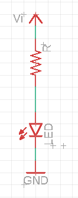

# Sistemas Electronicos Interdisciplinaria

## Trabajo 1

En el contexto del desarrollo de un Fotoplestimografo, su Grupo ha sido asignado la tarea de diseñar el circuito de la señal luminosa que indica los latidos cardiacos. El material que tienen disponible son LEDs de un color elegido y un conjunto de resistenciasde 1/4W. El circuito debe encenderse cuando se aplica un voltaje de entrada de $V_i=5V$.

Entregar un informe que contenga la siguiente información:

1. Identificación del grupo (nombres, RUT)
1. El color de LED elegido
1. Identificación de 2 o más posibles hojas de datos (datasheets) para los LEDs del color elegido. Se aceptan número de parte, de serie, links u otras formas de identificar las hojas de dato utilizadas
1. Elección de una de las hojas de datos, e identificación de los siguientes parametros:
    1. Voltaje de polarización directa máxima $V_{f,max}$
    1. Voltaje de polarización reversa máxima $V_{r,max}$
    1. Corriente directa máxima $I_{f,max}$
    1. Potencia disipada máxima $P_{D,max}$
    1. Corriente de prueba $I_f$
    1. Voltaje de polarización directa para la corriente de prueba $V_f$
1. Cálculo del valor de $R$ para encender 1 LED del color elegido con una corriente de $I_f$, conforme el circuito abajo

1. Cálculo de la potencia disipada en $R$ en el circuito anterior. Es menor que 1/4 W ?
1. Cálculo el valor de $V_i$ que impone una corriente de $I_{f,max}$ en el LED. Cuanto es la potencia disipada en la resistencia en este caso ?
1. Para este proyecto, los valores de resistencia disponibles están limitados a los de la tabla abajo. Diseñar un circuito que usa alguna combinación en serie y/o paralelo de los resistores disponibles para obtener un valor cercano ($\pm 1Ω$) a $R$. No utilizar más que 4 resistencias.

|   |  |        |       |  |
|------|------|-----------|------------|-------|
| 10Ω  | 220Ω | 1KΩ       | 6.8KΩ      | 100KΩ |
| 22Ω  | 270Ω | 2KΩ       | 10KΩ       | 220KΩ |
| 47Ω  | 330Ω | 2.2KΩ     | 20KΩ       | 300KΩ |
| 100Ω | 470Ω | 3.3KΩ     | 47KΩ       | 470KΩ |
| 150Ω | 510Ω | 4.7KΩ     | 51KΩ       | 680KΩ |
| 200Ω | 680Ω | 5.1KΩ     | 68KΩ       | 1M    |

## EXTRA

Implementación física del circuito diseñado.

1. Descargar AutoDesk Eagle (requiere registro gratuito)
1. Descargar proyecto base de la pagina de la asignatura
1. Abrir el proyecto en EAGLE.
1. En la ventana del esquemático, ajustar las resistencias de acuerdo a lo proyectado. No olvidar insertar sus valores. Hay 2 resistencias ya disponibles en el esquematico: 1 de montaje horizontal (RH) y otra de montaje vertical (RV). Se puede elegir la variedad que se utilizará.
1. Elegir el numero de LEDs que se van a utilizar (entre 3 y 6, pueden ser cualquier combinación de los de 3mm y 5mm). Duplicar las resistencias/ LEDs conforme necesario. Observe que hay un LED 3mm y otro 5mm disponibles para que se copien.
1. Asegurarse que todas las conexiones están realizadas. Se puede correr el comando ERC par detectar posibles errores
2. Abrir la ventana de la placa. Posicionar los componentes dentro del área disponible
3. Rutear la placa, se puede utilizar el ruteo manual o auto-router
4. Correr el comando DRC para asegurarse que no hay ningun error
1. Abrir pestaña de MANUFACTURING para ver una previa de la placa
1. Configurar y subir elproyectoa FUSION 360 para ver la previa 3D
1. Guardar el proyecto. La entrega se coordinará con el Profesor