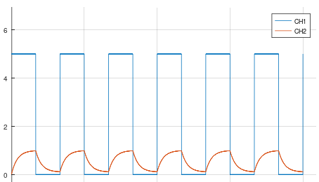
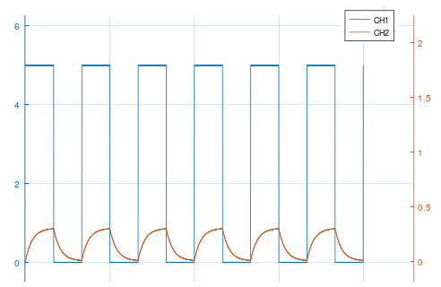

# Laboratorio 2 - Recuperativo

## Recursos utilizados

- Instrumentos
  - 1 x Osciloscopio
  - 1 x Generador de señales
  - 1 x Multímetro
  - 1 x Fuente C.C.
- Implementos
  - 2 x Sonda
  - 1 x BNC-Caimán
- Dispositivos
  - Diodos
    - 1 x Diodo de señal 1N4148
    - 1 x Fotodiodo BPW34
    - 1 x LED rojo
    - 1 x LED infrarrojo
  - Resistencias (Ω):
    - 3 x 220
    - 3 x 1k
    - 1 x 8.2M
    - 2 x fotorresistencia (LDR)
- Otro
    - 1 x Protoboard
    - cables, alicate, etc

## Resultado experimental e informe

1. Una persona midió una resistencia de 8.2 MΩ de las dos formas indicadas en la Figura 1.

Figura 1: mediciones de una misma resistencia

La persona obtuvo los siguientes valores:

- (a) 8.68 MΩ
- (b) 360 kΩ

  1. ¿Cuál de las dos formas es la correcta para medir, (a) ó (b)? (2 ptos.)
  1. Estime la resistencia del cuerpo de la persona que realizó la medición. (4 ptos)

2. Se tomó una fotorresistencia y se midió su resistencia. Luego se tapó la fotorresistencia con la mano y se midió su resistencia nuevamente. Los valores obtenidos por cada grupo realizando el experimento se muestran en la siguiente tabla:

    | grupo | medición sin tapar con la mano | medición tapando con la mano |
    | -- | -- | -- |
    | 1 | 6,3 kΩ | 100 kΩ |
    | 2 | 3,746 kΩ | 32,45 kΩ |
    | 3 | 1,6 kΩ | 22 kΩ |
    | 4 | 5 kΩ | 30 kΩ |
    | promedio | $R_{light}$ | $R_{dark}$ |

   1. Calcule el promedio y de las mediciones ($R_{light}$ y $R_{dark}$) y sus desviaciones estandar.  (2 ptos) 
   2. Calcule la razón entre $R_{dark}$ y $R_{light}$. (2 ptos)
   2. En que condiciones la resistencia de la fotorresistencia es más baja: ¿con luz o sin luz ? (2 ptos)

3. Para el siguiente experimento, se utilizó el circuito de la Figura 2a, en el cual $R_1=220$ y $R_2= 1k$. Se configuró el generador de funciones para generar una onda cuadrada, con duty cycle de 50%, 5Vpp y offset de 2.5V. Con esto, el LED se enciende y apaga de acuerdo a la frecuencia del generador de funciones. 

    

    Figura 2a: circuito con fotorresistencia
    
   1. Considerando que la resistencia de la fotorresistencia cambia al valor $R_{dark}$ cuando el LED está apagado, y al valor $R_{light}$ cuando el LED está encendido, determine el valor del voltage que se debería medir en el canal 2 del osciloscopio en ambas condiciones. (4 ptos)
   1. En el experimento se observó que el cambio del valor de la resistencia de la fotorresistencia no es immediato. Por ejemplo, a una frecuencia de 15 Hz se observaron las siguientes formas de onda:
   
    

    Figura 2b: mediciones del circuito de la Figura 2a con frecuencia de la onda cuadrada de 15Hz
   
   Estime el tiempo de subida de la fotorresistencia (tiempo necesario para cambiar del 10% al 90% del valor final). (4 ptos.) 

4. Para el siguiente experimento, se utilizó el circuito de la Figura 3a, en el cual $R_1=220$ y $R_2= 1k$. Nuevamente, se configuró el generador de funciones para generar una onda cuadrada, con duty cycle de 50%, 5Vpp y offset de 2.5V. Ésta configuración del fotodiodo se denomina modo fotoconductivo.

    
    
    Figura 3a: Tiempo de subida para modo fotoconductivo

   1. Considerando que la corriente de saturación en inversa del fotodiodo es 1 μA cuando el LED está apagado, y 300 μA cuando el LED está encendido, calcule el valor que se debería observar en el canal 2 del osciloscopio (CH2) en ambas situaciones (4 ptos).
    
   2. En el experimento se observó que el cambio del valor de la corriente del fotodiodo no es immediato. Por ejemplo, a una frecuencia de 80 kHz se observaron las siguientes formas de onda:
   
     

     Figura 3b: mediciones del circuito de la Figura 3a con frecuencia de la onda cuadrada de 80 kHz
   
     Estime el tiempo de subida del fotodiodo en modo fotoconductivo (tiempo necesario para cambiar del 10% al 90% del valor final). (4 ptos.)
    
   3. ¿Cómo se compara la velocidad de la fotorresistencia con la del fotodiodo en modo fotoconductivo? (4 ptos.)
    
Nota sesión = ptos.+10