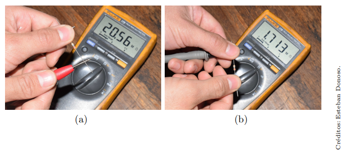

# Laboratorio 2 - Recuperativo

## Recursos utilizados

- Instrumentos
  - 1 x Osciloscopio
  - 1 x Generador de señales
  - 1 x Multímetro
  - 1 x Fuente C.C.
- Implementos
  - 2 x Sonda
  - 1 x BNC-Caimán
- Dispositivos
  - Diodos
    - 1 x Diodo de señal 1N4148
    - 1 x Diodo Zener de 3.3 a 5 V
    - 1 x Fotodiodo BPW34
    - 1 x LED rojo
    - 1 x LED infrarrojo
  - Resistencias (Ω):
    - 1 x 56
    - 1 x 100
    - 3 x 220
    - 3 x 1k
    - 1 x 10k
    - 1 x 8.2M
    - 1 x 10k variable (de panel)
    - 2 x fotorresistencia (LDR)
- Otro
    - 1 x Protoboard
    - cables, alicate, etc

## Resultado experimental e informe

1. Una persona midió una resistencia de 8.2 MΩ de las dos formas indicadas en la Figura 1.

Figura 1: mediciones de una misma resistencia

La persona obtuvo los siguientes valores:

- (a) 8.68 MΩ
- (b) 360 kΩ

  1. ¿Cuál de las dos formas es la correcta para medir, (a) ó (b)? (2 ptos.)
  1. Estime la resistencia del cuerpo de la persona que realizó la medición. (4 ptos)

2. Se tomó una fotorresistencia y se midió su resistencia. Luego se tapó la fotorresistencia con la mano y se midió su resistencia nuevamente. Los valores obtenidos por cada grupo realizando el experimento se muestran en la siguiente tabla:

    | grupo | medición sin tapar con la mano | medición tapando con la mano |
    | -- | -- | -- |
    | 1 | 6,3 kΩ | 100 kΩ |
    | 2 | 3,746 kΩ | 32,45 kΩ |
    | 3 | 1,6 kΩ | 22 kΩ |
    | 4 | 5 kΩ | 30 kΩ |

   1. Calcule la razón entre el valor más alto y más bajo para cada grupo. (2 ptos) 
   2. Calcule también el promedio y desviación estandar de dicha razón. (2 ptos)
   2. En que condiciones la resistencia de la fotorresistencia es más baja: ¿con luz o sin luz ? (2 ptos)

3. Para el siguiente experimento, se utilizó el circuito de la Figura 2, en el cual $R_1=220$ y $R_2= 1k$. Se configuró el generador de funciones para generar una onda cuadrada, con duty cycle de 50%, 5Vpp y offset de 2.5V. Con esto, el LED se enciende y apaga de acuerdo a la frecuencia del generador de funciones. Se cambió la frecuencia, hasta que la mitad del período de la onda fuese comparable con el tiempo de subida o de bajada.

   1. ¿A qué frecuencia, aproximadamente, ocurre esto? (6 ptos.) 

   

   Figura 2: circuito con fotorresistencia

4. Identifiquen en el protoboard el circuito de la Figura 3, en el cual $R_1=220$ y $R_2= 1k$. Conecten el osciloscopio conforme la figura. Configuren el generador de funciones de la misma forma que el ejercício anterior: onda cuadrada, con duty cycle de 50%, 5Vpp y offset de 2.5V.
    1. Encuentren una frecuencia adecuada para observar el tiempo de subida del fotodiodo y anoten su valor. (4 ptos.)
    
    2. ¿Cómo se compara la velocidad de la fotorresistencia con la del fotodiodo en modo fotoconductivo? (4 ptos.)

    
    
    Figura 3: Tiempo de subida para modo fotoconductivo

5. Armen el circuito de la Figura 4, considerando que $R_1=220$. Consejo: reutilicen tanto cuanto posible el circuito de la figura 3. Conecten el osciloscopio y el generador de funciones, nuevamente con la configuración de onda cuadrada, con duty cycle de 50%, 5Vpp y offset de 2.5V.
    1. Encuentren una frecuencia adecuada para observar el tiempo de subida del fotodiodo y anoten su valor. (4 ptos.) 

    2. ¿Cuál es la razón entre el tiempo de subida del fotodiodo en modo fotovoltaico y el tiempo de subida del fotodiodo en modo fotoconductivo? (4 ptos.)

    
    
    Figura 4: Tiempo de subida para modo fotovoltaico

6. Identifiquen en el protoboard el circuito de la Figura 3. Conecten la fuente C.C. y el multímetro conforme indicado y midan la corriente inversa. Puede ser necesario ajustar la escala de corriente para obtener una medida. (4 ptos.)

    

    Figura 3: Circuito para medir la corriente inversa

7. Con el mismo diodo de la medición anterior, armen el circuito de la Figura 4. Pueden desarmar el circuito de la Figura 3 para lograrlo. Usen una frecuencia de 50 Hz, y un voltaje de 3 Vpp sin offset. 
    
    1. Conecten el osciloscopio y vean las señales en modo XY. Guarden en un pendrive los datos de ambos canales y entreguen el pendrive al profesor, junto con la medición de la corriente reversa obtenida en el punto anterior. Estimen los parametros de la curva del diodo ($I_S$, $n$, $V_T$) (14 ptos.)

      

      Figura 4: Circuito para ver la curva de un diodo

    2. Cambien la visualización a YT (deshabiliten XY). Aumenten el valor de la frecuencia y anoten hasta qué punto el diodo es capaz de rectificar. (4 ptos.)
    
    3. Cambien la resistencia de carga por una de 56 Ω ¿Hay algún cambio en la amplitud de la señal? ¿A qué se debe? (4 ptos.)

8. Identifiquen en el protoboard el circuito de la Figura 5. Ajusten el potenciometro en: 0 Ω, 1 kΩ y 10 kΩ. 
   
    Anoten los valores del voltaje en $R_L$ para cada caso ¿Es constante el voltaje? ¿A que se debe la diferencia? (6 ptos.)

    
    
    Figura 5: Circuito regulador de voltaje con un diodo Zener

9. *EXTRA*. Generen una onda cuadrada y una senoidal, de 50 Hz y 5 V. Midan ambas señales con el multímetro.

    1. ¿Son iguales las mediciones de ambas señales (si difieren en menos de 0.05 volt considerenlas iguales)? (4 ptos.)
    
    2. ¿Se puede decir en base en estas mediciones que el voltímetro es true RMS? (4 ptos.)
    
Nota sesión = ptos.+10