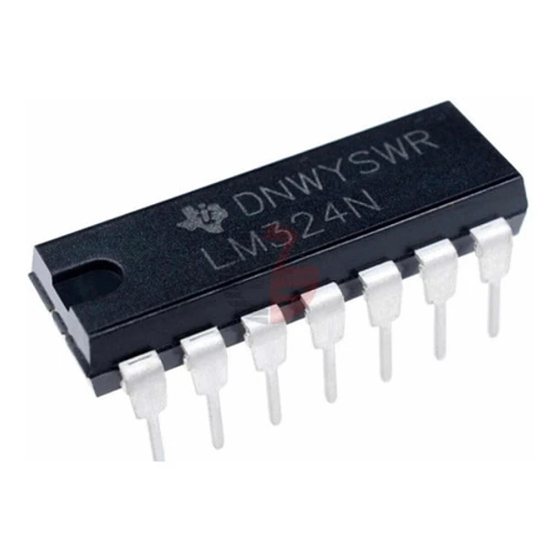
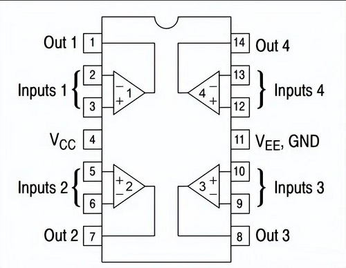

#  Laboratorio 2 de Sistemas Electrónicos
#### Segundo semestre de 2026

## Recursos del pañol

| Tipo | Descripción | Cantidad | | Tipo | Descripción | Valor | Cantidad |
| -- | -- | -- | --| -- | -- | -- | -- |
| Instrumentos |  |  | | Dispositivos |  |  |  |
|  | Osciloscopio | 1 | |  | LM324 |  | 1 |
|  | Generador de señales | 1 | |  | Resistencias (Ω) |  |  |
|  | Multímetro | 1 | |  |  | 47 k | 1 |
|  | Fuente de CC | 1 | |  | | 68 k | 1 |
| Implementos |  |  | |  |  | 680 k | 1 |
|  | Cable banana-caimán | 2 | |  |  | Potenciómetro de 10 kΩ (de panel) | 1 |
|  | Sonda | 2 | |  | Condensadores |  |  |
|  | BNC-Caimán | 1 | |  |  | $0.1 \mu F$ | 1 |
| Otros |  |  | |  | |  |  |
| | Protoboard | 1 | |  | | | |
| | Cables, alicate, etc. | | |  | | |  |

## Procedimiento experimental e informe

Nota: Ante cualquier duda sobre el uso de los instrumentos o las conexiones eléctricas, consulten al profesor.

### Introducción

En este laboratorio utilizaremos la fuente de CC por primera vez. Pidan una demostración al profesor o al ayudante antes de conectarla y encenderla en la parte 1.

Los circuitos integrados ("chips") contienen diversos componentes electrónicos en su interior y permiten conectarlos a un circuito externo a través de sus pines.

Figura 1: Ejemplo de circuito integrado.

Para este laboratorio utilizaremos un circuito integrado LM324, que contiene cuatro amplificadores operacionales.

El siguiente diagrama muestra cómo están conectados los amplificadores operacionales a los pines del LM324.

Figura 2: Pines y conexiones del LM324.

Cada amplificador operacional es un dispositivo electrónico con el siguiente símbolo:

 

Figura 3: Amplificador operacional.

Los amplificadores operacionales son dispositivos activos; es decir, necesitan una fuente que proporcione los voltajes de alimentación $V_{EE}$ y $V_{CC}$ para funcionar.

En el LM324, los terminales $V_{CC}$ de los cuatro amplificadores operacionales están conectados internamente al pin 4, como se puede ver en la figura 2. De manera similar, sus terminales $V_{EE}$ están conectados al pin 11. Para alimentar los amplificadores operacionales, conectaremos la tierra de la fuente al pin 11 y el voltaje positivo al pin 4.

### Parte 1: DC

Armen el circuito de la figura 4 en un protoboard. Pueden utilizar cualquiera de los cuatro amplificadores operacionales del LM324 como OA1. Configuren la fuente de CC con un voltaje de 12 V (se acepta una tolerancia de 0,5 V si la fuente no permite realizar un ajuste exacto) y un límite de corriente entre 0,2 y 0,5 A. Recuerden alimentar el LM324 con la fuente. Por ahora, no es necesario conectar $v_{AC}$.

Figura 4: Circuito amplificador con un amplificador operacional.

- Parámetros:
    - $V_{CC} \approx 12\ V$
    - $R_1 = 68\ k\Omega$
    - $R_2 = 680\ k\Omega$
    - $R_3 = 47\ k\Omega$
    - $C = 0.1\ \mu F$
    - $R_{pot} = 10\ k\Omega$
    - $v_{AC}$: generador de funciones
    - OA1: un amplificador operacional de un LM324 o similar

1. Con el generador de funciones apagado ($v_{AC}=0$), enciendan la fuente de CC. Ajusten el potenciómetro hasta obtener valores de $v_i$ cercanos (con una tolerancia de $\pm 20\ \%$) a los indicados en la columna «$v_i$ objetivo» de la siguiente tabla.

    | $v_i$ objetivo (mV) | $v_i$ medido (mV) |&nbsp;&nbsp;&nbsp; $v_o$ (mV) &nbsp;&nbsp;&nbsp; | &nbsp;&nbsp;&nbsp; $A_V$ (V/V) &nbsp;&nbsp;&nbsp;|
    | -- | -- | -- | -- |
    | 200 |    |    |    |
    | 400 |    |    |    |
    | 800 |    |    |    |
    | 1600 |    |    |    |

    a. Anoten los valores de «$v_i$ medido» y del voltaje de salida $v_o$ para cada caso. (1,6 pt)

    b. Calculen el factor de amplificación de voltaje en cada caso ($A_v = \frac{v_o}{v_i}$) y compárenlo con el valor teórico. (1 pt)

    Comparación con el valor teórico:

    ____________________________________________________________________________________

    ____________________________________________________________________________________

### Parte 2: AC

En este laboratorio utilizaremos el generador de funciones por primera vez. Pidan una demostración al profesor o al ayudante antes de utilizarlo.

2. Ajusten el potenciómetro para que $v_o$ sea aproximadamente $6\ V$, con una tolerancia de $\pm 10\ \%$. Configuren el generador de funciones para producir una señal sinusoidal sin offset, con una frecuencia de 10 kHz y una amplitud de 100 mV. Conecten la señal del generador de funciones a la entrada $v_{AC}$ del circuito. Midan $v_i$ y $v_o$ con el osciloscopio.
    
    Ajusten la amplitud de la señal del generador de funciones hasta obtener el valor pico a pico de $v_i$ indicado en la siguiente tabla.

    | $v_{i_{pp}}$ objetivo (mV)| $v_{i_{pp}}$ medido (mV) | &nbsp;&nbsp;&nbsp; $v_{o_{promedio}}$ (V) &nbsp;&nbsp;&nbsp;| &nbsp;&nbsp;&nbsp; $v_{o_{pp}}$ (mV) &nbsp;&nbsp;&nbsp; | forma de la señal $v_o$ |&nbsp;&nbsp;&nbsp; $A_{v_{AC}}$ (V/V) &nbsp;&nbsp;&nbsp;|
    | --|--|--|--|--|--|
    | 200 |     |     |     |     |     |
    | 400 |     |     |     |     |     |
    | 800 |     |     |     |     |     |
    | 1600 |     |     |     |     |     |

    a. Anoten los valores de «$v_{i_{pp}}$ medido», $v_{o_{promedio}}$ y $v_{o_{pp}}$, así como la forma de la señal $v_o$, para cada caso. (2 pt)

    b. Calculen el factor de amplificación de voltaje de CA en cada caso ($A_{v_{AC}} = \frac{v_{o_{pp}}}{v_{i_{pp}}}$) y compárenlo con el valor teórico. (1 pt)

    Comparación con el valor teórico:

    ____________________________________________________________________________________

    ____________________________________________________________________________________

    c. De acuerdo con las mediciones realizadas en las partes 1 y 2, ¿cuáles son los valores máximo y mínimo que puede alcanzar la salida del amplificador operacional ($v_o$)? ¿Cómo se relacionan con los voltajes de alimentación ($V_{CC} \approx 12\ V$ y $V_{EE} = 0\ V$)? (0,4 pt)

    Respuesta:

    ____________________________________________________________________________________

    ____________________________________________________________________________________

    ____________________________________________________________________________________

    ____________________________________________________________________________________
