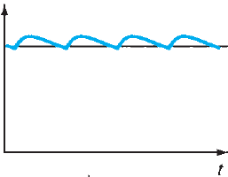

# Laboratorio 3 - Recuperativo

## Recursos utilizados

| tipo | descripcion | valor | cantidad | | tipo | descripcion | valor | cantidad |
| -- | -- | -- | -- | --| -- | -- | -- | -- |
| Instrumentos |  |  |  | | Dispositivos |  |  |  |
|  | Osciloscopio |  | 1 | |  | Transformador 12V |  | 1 |
|  | Generador de señales |  | 1 | |  | diodo 1N4007 |  | 5 |
|  | Multímetro |  | 1 | |  | regulador 7805 |  | 1 |
| Implementos |  |  |  | |  |  |  |  |
|  | Sonda |  | 2 | |  | Resistencias (Ω) |  |  |
|  | BNC-Caimán |  | 1 | |  |  | 200 | 1 |
| Otros |  |  |  | |  | | 1k | 1 |
| | Protoboard |  | 1 | |  | | 10k | 2 |
| | cables, alicate, etc |  | | |  | | 100k | 1 |
|  |  |  |  | |  | Capacitores |  |  |
| |  |  | | |  | | 1 μF | 1 |
| |  |  | | |  | | 10 μF | 1 |
| |  |  | | |  | | 100 μF | 1 |
| |  |  | | |  | | 2200 μF | 1 |

## Resultado experimental e informe

1. Se armó el circuito de la Figura 1 usando diodos rectificadores (1N4007). No se conectó el condensador todavía.

   

   Figura 1: Circuito rectificador

   1. Se midió la señal $v_i$ en el osciloscopio, conectando la sonda a $v_{i_+}$ y su tierra a $v_{i_-}$. Se observó una onda sinusoidal. Al respecto, contesten:
      - ¿Cual es la relación entre el valor maximo y el valor rms de una onda sinusoidal ? (0.5pt)
      - Considerando las siguientes mediciones obtenidas en laboratorio, ¿cual es el valor rms de la señal $v_i$ ? (0.5pt)
         | grupo | valor medio de $v_i$ | valor peak-to-peak de $v_i$ | valor maximo de $v_i$ |
         | -- | -- | -- | -- |
         | A  | -147 mV | 36,8 V | 18,4 V |
         | B  | -250 mV | 36 V | 18 V |
         | C  | 0 V | 36 V | 18 V |
         | D  | -165 mV | 36 V | 18 V |
   1. Se desconectó el osciloscopio de $v_{i_+}$ y $v_{i_-}$ y se conectó a $v_o$. La tierra del osciloscopio se conectó a la tierra del circuito. Se observó una forma de onda similar a la de la figura 2.

      

      Figura 2: Medición de $v_o$

      - ¿Qué tipo de rectificador es? ¿Media onda o onda completa? (0.5 pto.)
      - Calculen el promedio de las mediciones de $V_{min}$, $V_{max}$ y $V_{medio}$ (0.5 pto.) 
         | grupo | $V_{min}$ | $V_{max}$ | $V_{medio}$ |
         | -- | -- | -- | -- |
         | A | 0 V | 16.4 V | 9.68 V |
         | B | 0 V | 17.2 V | 10 V |
         | C | -800 mV | 16.4 V | 9.3 V |
         | D | 0 V | 16.8 V | 9.53 V |
      - Calculen el valor $\frac{V_{medio}}{V_{max}}$  de la señal $v_o$ (utilizen el valor promedio de $V_{max}$ y $V_{medio}$). Como se compara con el valor teórico de 0.636 ? (0.5 pto.) 
   1. Se conectó el condensador, y se observó una señal como la figura 3 (línea celeste).

      

      Figura 3: Medición de $v_o$ con el condensador conectado

      Se probaron distintos valores de R y C, y se midieron $V_{max}$ y $V_{pp}$ (rizo) para cada uno. Se observó que $V_{max}$ se mantuvo practicamente constante e igual al valor sin condensador. Los valores de rizo medidos se resumen a continuación:

      | R ($k\Omega$) | C ($\mu F$) | RC (??) | $V_{pp}$ (V) |
      | -- | -- | -- | -- |
      | 1 | 1 | 0.001 | 15.6 |
      | 1 | 1 | 0.001 | 15.8 |
      | 10 | 1 | 0.01 | 16.6 |
      | 10 | 1 | 0.01 | 7.6 |
      | 0.22 | 100 | 0.022 | 13.4 |
      | 1 | 100 | 0.1 | 2 |
      | 1 | 100 | 0.1 | 1.8 |
      | 100 | 1 | 0.1 | 1.6 |
      | 100 | 1 | 0.1 | 2 |
      | 10 | 100 | 1 | 4.48 |
      | 10 | 100 | 1 | 1.6 |
      | 10 | 100 | 1 | ~0 |
      | 1 | 2200 | 2.2 | ~0 |
      | 1 | 2200 | 2.2 | ~0 |
      | 100 | 100 | 10 | ~0 |
      | 100 | 100 | 10 | 1.2 |
      | 10 | 2200 | 22 | ~0 |
      | 10 | 2200 | 22 | 0.4 |
      | 10 | 2200 | 22 | 0.4 |
      | 100 | 2200 | 220 | ~0 |
      | 100 | 2200 | 220 | 1.4 |

      - ¿Cómo es la señal ahora? (0.5 pto.) 
      - ¿Expliquen qué hace el condensador? (0.5 pto.)
      - Hagan una tabla con los valores de R, C y RC, y concluyan sobre la relación entre los valores de RC, el período de la señal y la forma de onda de la salida. (1 pto.)

  
2. Agreguen el regulador de voltaje 7805 al circuito, conforme indica la figura 4. Usen 3 valores distintos de R ($R=200\ \Omega$, $R=1\ k\Omega$ y $R=100\ k\Omega$) Anoten el valor del voltaje para cada resistencia. (Sugerencia: Midan el voltaje con el multímetro.). 
   1. ¿Hay variación en el voltaje de cada una de las resistencia? (1 pto.)

  

  Figura 4: Circuito rectificador y regulador

$$ Nota\ sesión = 1.0 + pts. $$