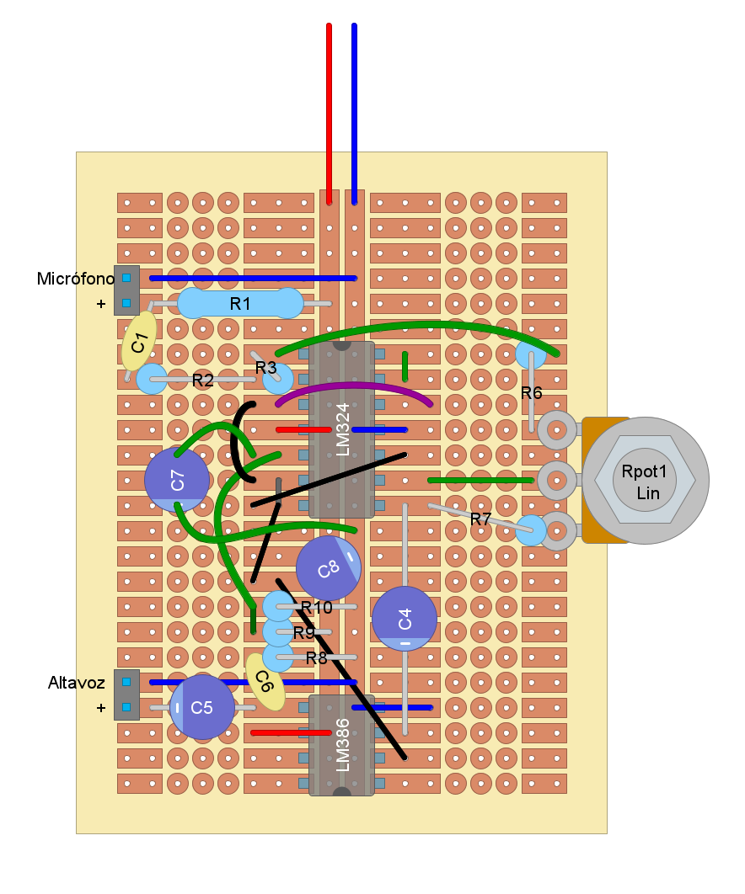

#  Laboratorio 3 de Sistemas Electrónicos
#### Segundo Semestre de 2025

???

## Recursos del pañol

- Cautín + estaño
- Alicates
- Cables
- Stripboard
- Componentes de la BOM, más LM324, LM386, asltavoz y micrófono
- Fuente CC para probar

## Procedimiento experimental e informe

1. Solden los componentes del circuito de estetoscópio diseñado hasta el momento en una stripboard. Pueden utilizar la ubicación en la imagen a continuación como referencia. Fabriquen al menos 1 placa por grupo, y demuestren su funcionamiento al profesor antes del fin del Laboratorio. (6pt)

