# Técnicas de Fabricación y Prototipaje en Electrónica

<!-- vscode-markdown-toc -->
* 1. [ 1. Tarjeta de Circuito Impreso (PCB - Printed Circuit Board)](#1.TarjetadeCircuitoImpresoPCB-PrintedCircuitBoard)
	* 1.1. [Ejemplos](#Ejemplos)
	* 1.2. [Materia Prima](#MateriaPrima)
	* 1.3. [Proceso de Fabricación de la Placa](#ProcesodeFabricacindelaPlaca)
		* 1.3.1. [Versión Casera](#VersinCasera)
		* 1.3.2. [Soldadura de Componentes](#SoldaduradeComponentes)
		* 1.3.3. [Versión Industrial](#VersinIndustrial)
* 2. [Circuitos Integrados](#CircuitosIntegrados)
	* 2.1. [Encapsulados](#Encapsulados)
* 3. [Resúmen: Conceptos Clave](#Resmen:ConceptosClave)

<!-- vscode-markdown-toc-config
	numbering=true
	autoSave=true
	/vscode-markdown-toc-config -->
<!-- /vscode-markdown-toc -->

##  1.  1. Tarjeta de Circuito Impreso (PCB - Printed Circuit Board)

###  1.1. Ejemplos

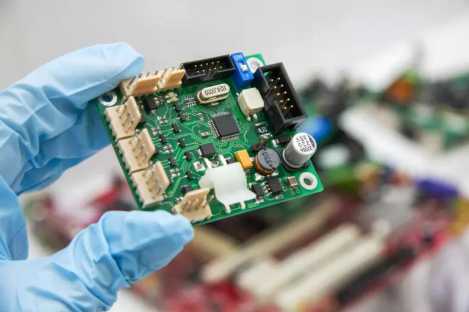

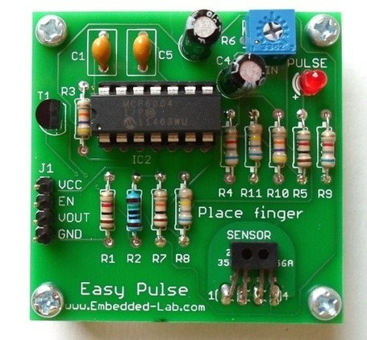

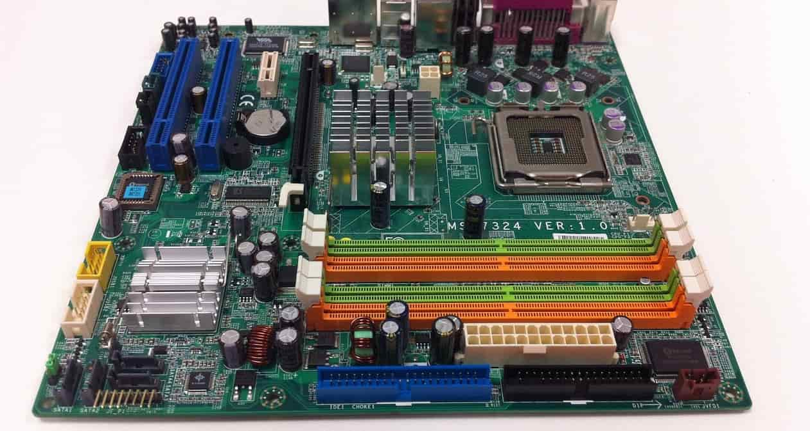

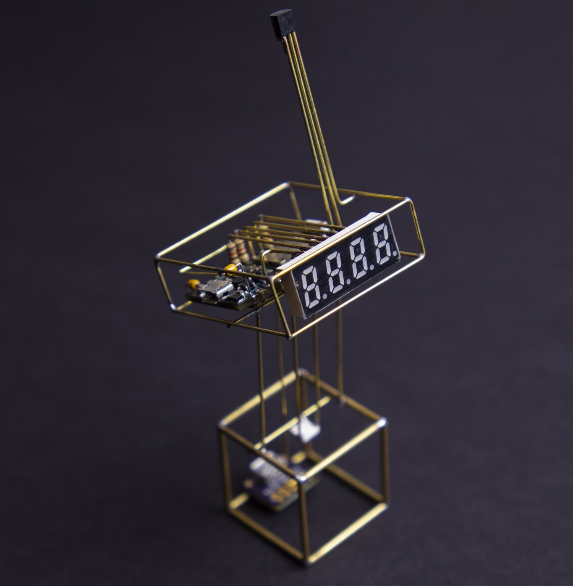

###  1.2. Materia Prima

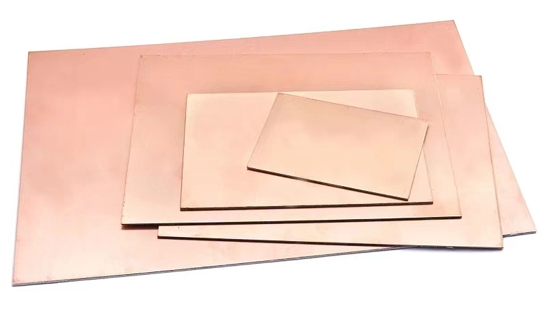

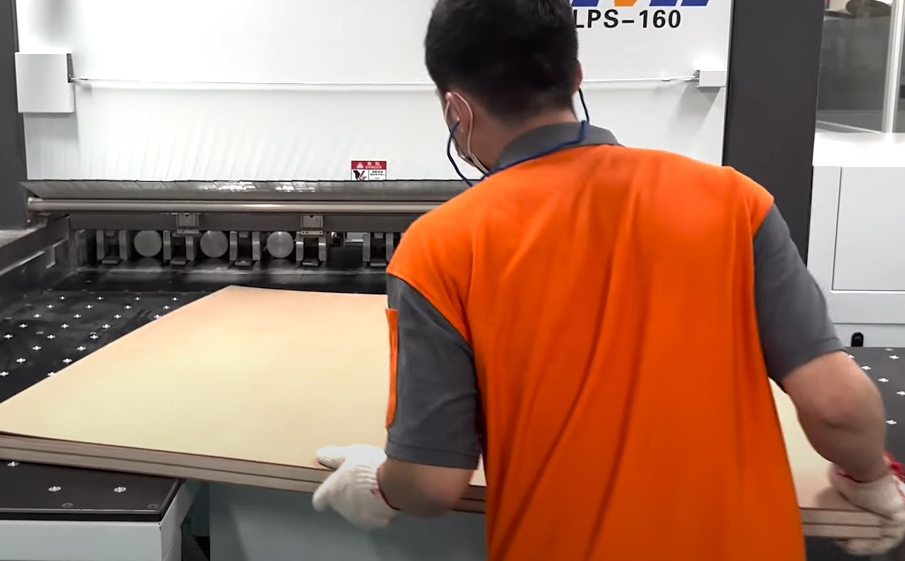

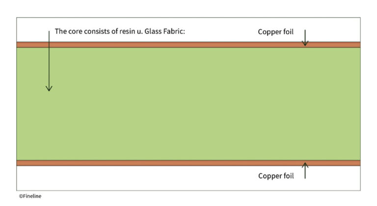

###  1.3. Proceso de Fabricación de la Placa

####  1.3.1. Versión Casera

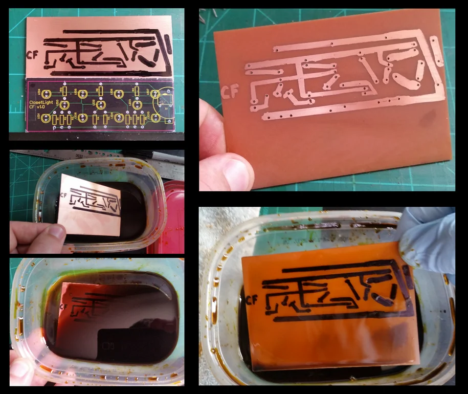

####  1.3.2. Soldadura de Componentes

[Soldadura punto a punto](https://www.youtube.com/watch?v=rK38rpUy568&t=167s)

[tips para soldar](https://www.youtube.com/shorts/D5IvlJVqa7M)

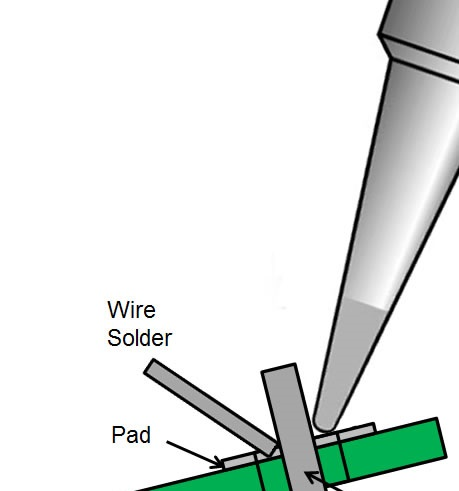

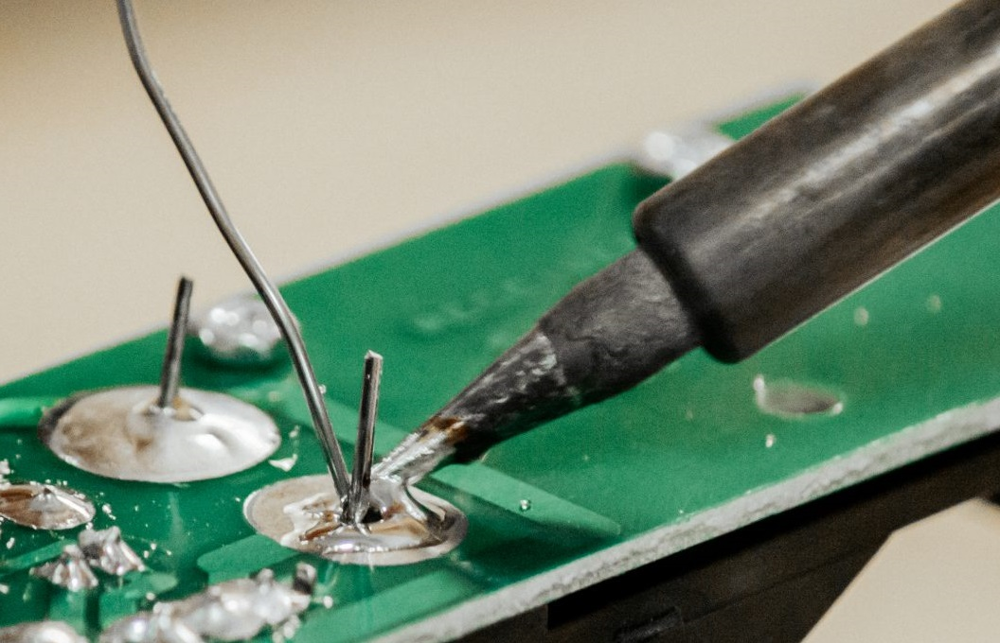

####  1.3.3. Versión Industrial

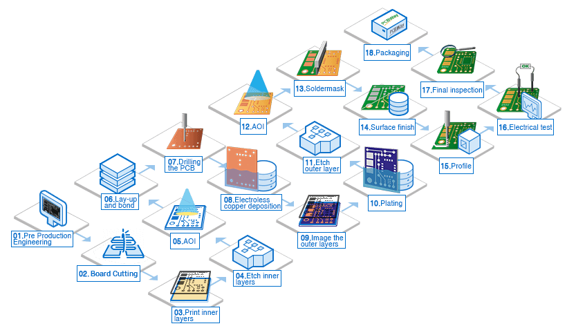

Fotolitografia

[fuente](https://www.pcbway.com/pcb-service.html)

[montaje](https://www.youtube.com/watch?v=24ehoo6RX8w)

[pick and place](https://www.youtube.com/watch?v=S8qkaTsr2_o&t=32s)

##  2. Circuitos Integrados

###  2.1. Encapsulados

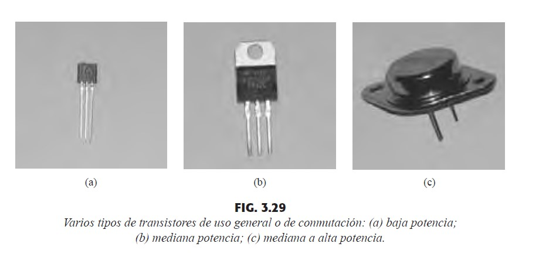

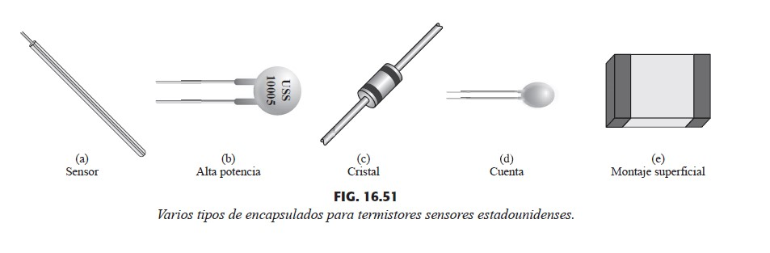

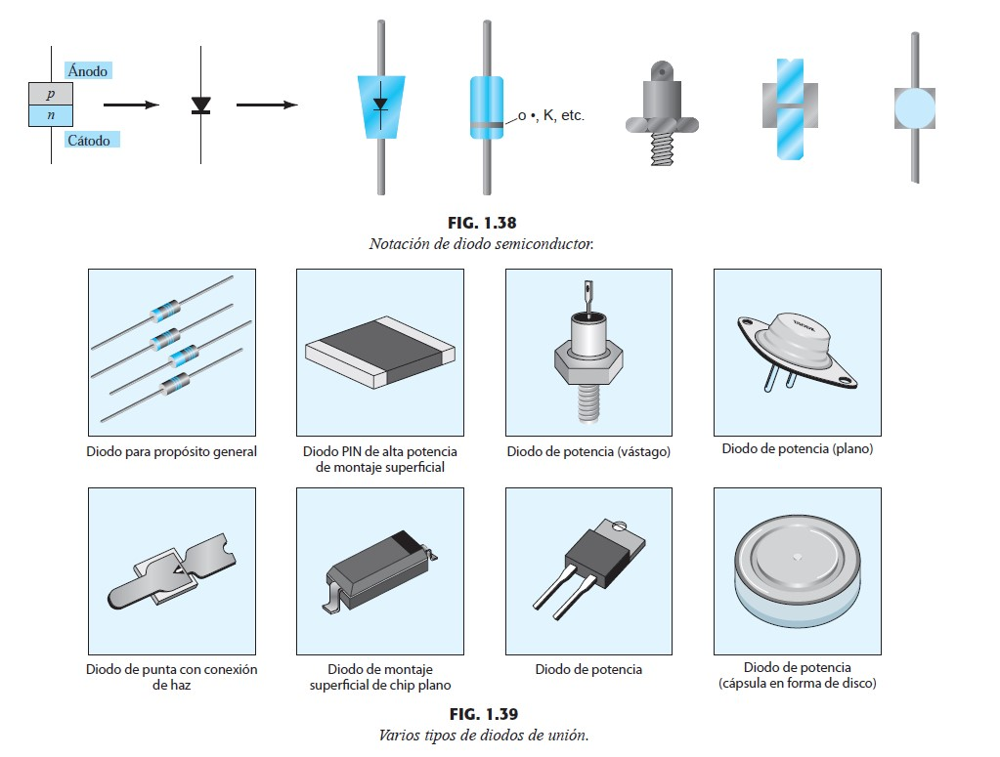

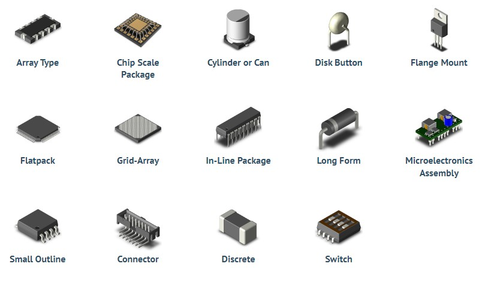

Agujero Pasante vs Montaje Superficial (Through-Hole vs Surface Mount Device (SMD))

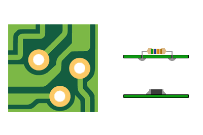

##  3. Resúmen: Conceptos Clave

- Tarjeta de Circuito Impreso (PCB)
- Fotolitografia
- Circuito Integrado
- Agujero Pasante
- Montaje Superficial