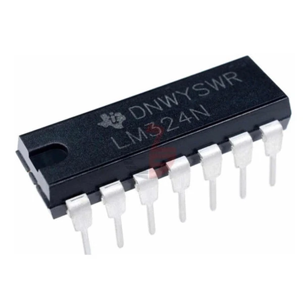
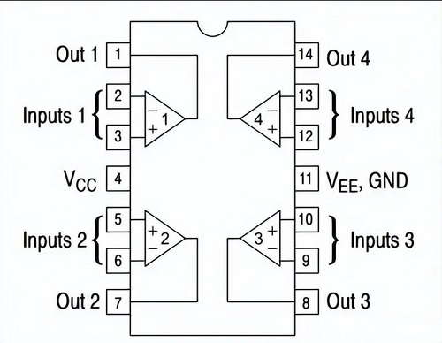

#  Laboratorio 4 de Sistemas Electrónicos
#### Primer Semestre de 2025

## Recursos del pañol

| tipo | descripcion | cantidad | | tipo | descripcion | valor | cantidad |
| -- | -- | -- | --| -- | -- | -- | -- |
| Instrumentos |  |  | | Dispositivos |  |  |  |
|  | Osciloscopio | 1 | |  | LM324 |  | 1 |
|  | Generador de señales | 1 | |  | Resistencias (Ω) |  |  |
|  | Multímetro | 1 | |  |  | 47 k | 1 |
|  | Fuente CC. | 1 | |  | | 68 k  | 1 |
| Implementos |  |  | |  |  | 680 k | 1 |
|  | Cable Banana-Caimán | 2 | |  |  | Potenciometro 10k (de panel) | 1 |
|  | Sonda | 2 | |  | Condensadores |  |  |
|  | BNC-Caimán | 1 | |  |  | $0.1 \mu F$ | 1 |
| Otros |  |  | |  | |  |  |
| | Protoboard | 1 | |  | | | |
| | cables, alicate, etc | | |  | | |  |

## Procedimiento experimental e informe

Nota: Ante cualquier duda en el uso de los instrumentos, o las conexiones eléctricas, consulten al profesor.

### Introducción
En este laboratorio utilizaremos generadores de funciones por primera vez. Pidan una demonstración al profesor o al ayudante antes de iniciar la parte 2.

Los circuitos integrados ("chips") continenen diversos componentes electrónicos en su interior, y permiten conectarlos a un circuito electrónico externo a través de sus pines.

Figura 1: Ejemplo de circuito integrado

Para este laboratorio utilizaremos un circuito integrado con número de parte LM324, que contiene 4 amplificadores operacionales en su interior. 

El siguiente diagrama muestra como están conectados los amplificadores operacionales a los pines del LM324

Figura 2: Pines y conexiones del LM324

Cada amplificador operacional es un dispositivo electrónico con el siguiente símbolo:

 

Figura 3: Amplificador Operacional

Para este laboratorio no es necesario entender el funcionamiento de un amplificador operacional, basta poder armar el circuito que se pide con las conexiones correctas.

Los amplificadore operacionales son dispositivos activos, es decir, necesitan ser alimentados por una fuente de voltaje entre $V_{EE}$ y $V_{CC}$ para poder funcionar. 
En el LM324, el $V_{CC}$ de los 4 amplificadores operacionales están unidos y se conectan al pin 4, como se pude ver en la figura 2. De manera similar, el $V_{EE}$ de los 4 amplificadores operacionales están unidos y se conectan al pin 11. Para encender los amplificadores operacionales conectaremos la tierra de la fuente de poder al pin 11, y el voltaje positivo al pin 4.

### Parte 1: DC

Armen el circuito de la figura 4. Pueden utilizar cualquier uno de los 4 amplificadores operacionales del LM324 para OA1. Configuren la fuente CC para un 12 V (tolerancia de 0.5 V si están utilizando una fuente que no permite ajustar valores exactos) y una corriente maxima entre 0.2 y 0.5 A. No se olviden de alimentar el LM324 con la fuente de poder. Por ahora no es necesari conectar $v_{AC}$.

Figura 4: Circuito amplificador utilizando amplificador operacional.

- Parámetros:
    - $V_{CC} \approx 12\ V$
    - $R_1 = 68\ k\Omega$
    - $R_2 = 680\ k\Omega$
    - $R_3 = 47\ k\Omega$
    - $C = 0.1\ \mu F$
    - $R_{pot} = 10\ k\Omega$
    - $v_{AC}$: Generador de funciones
    - OA1: 1 Amplificador Operacional de un LM324 o similar

1. Con el generador de funciones apagado ($v_{AC}=0$), enciendan la fuente CC. Muevan el potenciometro de forma a obtener voltajes de $v_i$ cercanos ($\pm 20\ \%$) a la columna "$v_i$ objetivo" en la siguiente tabla. 

    | $v_i$ objetivo (mV) | $v_i$ medido (mV) |&nbsp;&nbsp;&nbsp; $v_o$ (mV) &nbsp;&nbsp;&nbsp; | &nbsp;&nbsp;&nbsp; $A_V$ (V/V) &nbsp;&nbsp;&nbsp;|
    | -- | -- | -- | -- |
    | 200 | | | |
    | 400 | | | |
    | 800 | | | |
    | 1600 | | | |

    1. Anoten el valor de "$v_i$ medido" y del voltaje de salida "$v_o$" para cada caso. (1.6pt)

    2. Calculen el factor de amplificación de voltaje en cada caso ($A_v = \frac{v_o}{v_i}$) y comparen con el valor teórico ( $1+\frac{R_2}{R_1}$ ). (1pt)

### Parte 2: AC

2. Ajusten el potenciometro para que $v_o$ sea aproximadamente $6\ V \pm 10\ \%$. Configuren el generador de funciones para generar una señal sinusoidal, sin offset, con frecuencia de 10 kHz y amplitud 100 mV. Conecten la señal del generador de funciones en lugar de la fuente $v_{AC}$ en el circuito. Midan $v_i$ y $v_o$ con el osciloscopio.
    
    Ajusten la amplitud de la señal del generador de funciones hasta obtener el valor peak-to-peak de $v_i$ indicado en la siguiente tabla.

    | $v_{i_{pp}}$ objetivo (mV)| $v_{i_{pp}}$ medido (mV) | &nbsp;&nbsp;&nbsp; $v_{o_{promedio}}$ (V) &nbsp;&nbsp;&nbsp;| &nbsp;&nbsp;&nbsp; $v_{o_{pp}}$ (mV) &nbsp;&nbsp;&nbsp; | forma de la señal $v_o$ |&nbsp;&nbsp;&nbsp; $A_{v_{AC}}$ (V/V) &nbsp;&nbsp;&nbsp;|
    | --|--|--|--|--|--|
    | 200 | | | | | |
    | 400 | | | | | |
    | 800 | | | | | |
    | 1600 | | | | | |

    1. Anoten los valores de "$v_{i_{pp}}$ medido", "$v_{o_{promedio}}$" y "$v_{o_{pp}}$", bien como la forma de la señal $v_o$ para cada caso. (2pt)

    2. Calculen el factor de amplificación de voltaje AC en cada caso ($A_{v_{AC}} = \frac{v_{o_{pp}}}{v_{i_{pp}}}$) y comparen con el valor teórico ( $1+\frac{R_2}{R_1}$ ). (1pt)

    2. De acuerdo a las mediciones realizadas tanto en la parte 1 como en la parte 2, ¿cuales son los valores máximo y mínimo que puede producir la salida del amplificador operacional ($v_o$) ? ¿Cómo se relacionan con el voltaje de alimentación ($V_{CC} \approx 12\ V$ y $V_{EE} = 0\ V$) ? (0.4pt)
