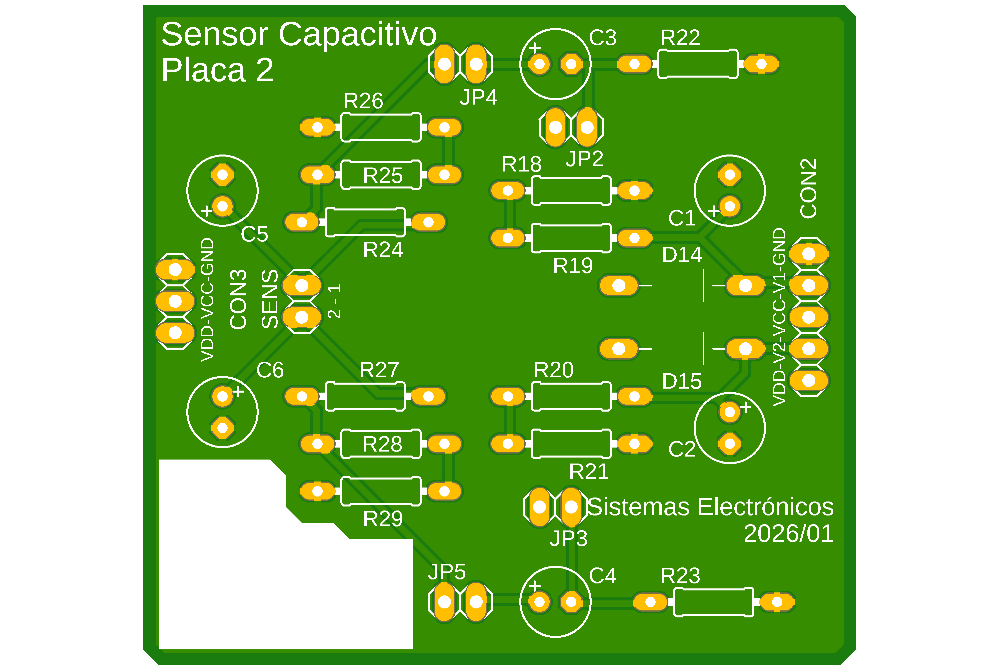
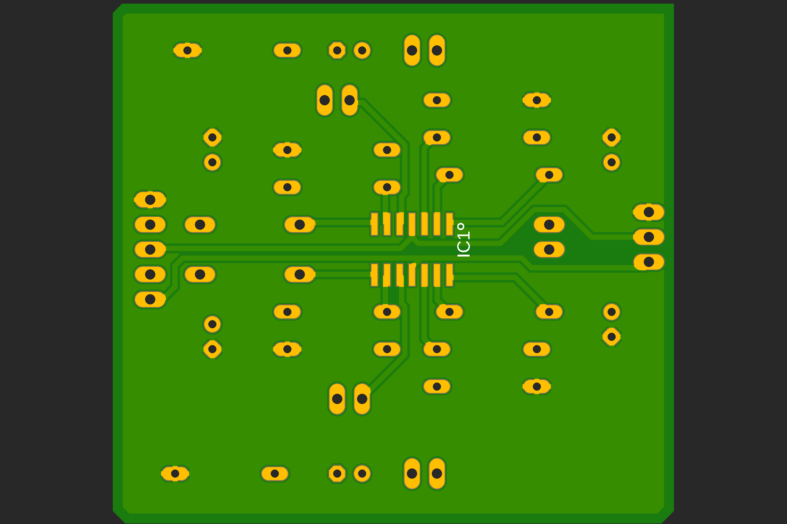

#  Laboratorio 5 de Sistemas Electrónicos
#### Primer Semestre de 2026

## Materiales

- Componentes de la BOM 
- Conector macho cortado para 5 posiciones (CON2)
- Conector macho cortado para 3 posiciones (CON3)
- 5 x Conector macho (pin head) de 2 positicones 
- 4 x jumpers
- Placas de Circuito Impreso (PCB) de la Placa 2
- Stencil para la Placa 2
- Pasta de soldadura
- Estaño
- Cables macho-macho para probar el circuito

## Equipamientos

- Horno
- Cautín
- Alicates
- Fuente CC, generador de funciones y osciloscopio para probar

## Procedimiento experimental e informe

Para este Laboratorio, organicense en los mismos grupos que para los Trabajos.

1. Solden los componentes de la placa 2 del sensor capacitivo, con los valores elegidos hasta el momento. Pueden utilizar las imagenes a continuación como referencia. Fabriquen al menos 1 placa por grupo, y demuestren su funcionamiento al profesor antes del fin del Laboratorio. (6pt).

    AYUDA: Partan por los componentes de montaje superficial 

    AYUDA2: Utilicen el área en blanco de la placa para identificarla. 

Figura 1: Circuito completo del sensor capacitivo hasta el Trabajo 7

Figura 2: Diseño de la Placa 2 (TOP)

Figura 3: Diseño de la Placa 2 (BOTTOM)

Como cada miembro del equipo recibirá una placa al terminar el curso, aprovechen de avanzar en la fabricación de las otras placas una vez que terminen la demonstración.