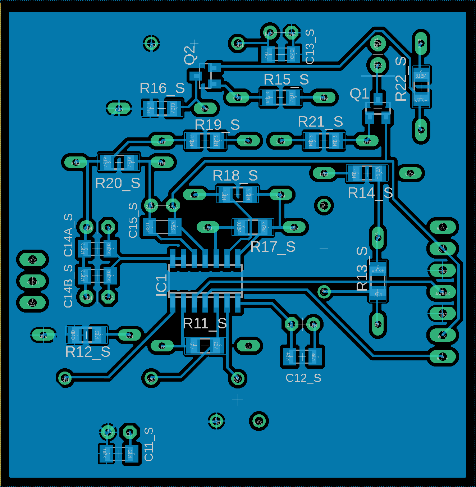
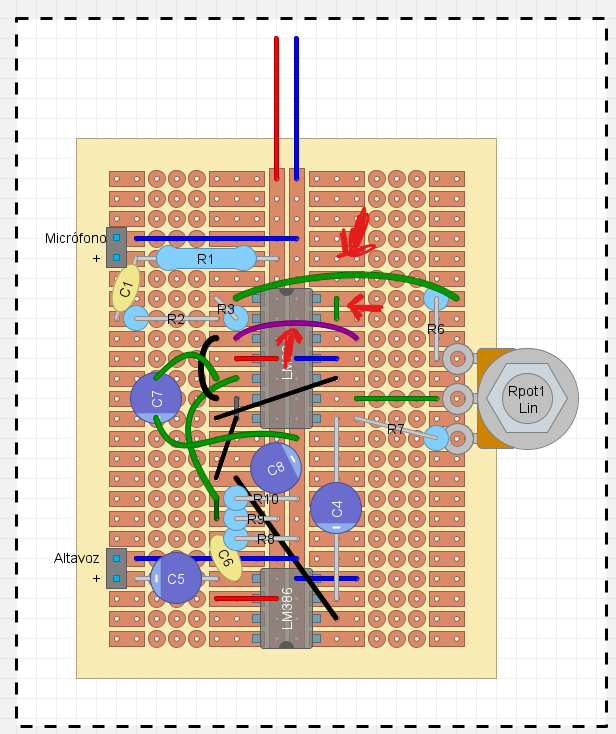
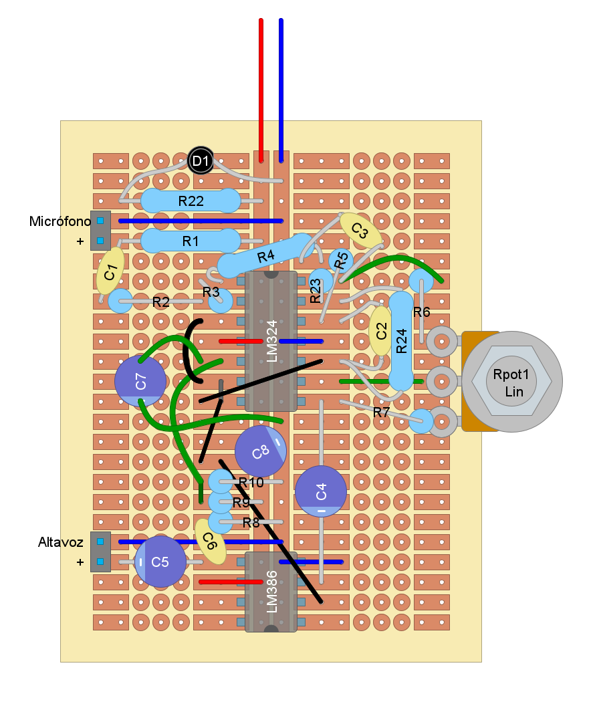

#  Laboratorio 6 de Sistemas Electrónicos
#### Segundo Semestre de 2025

## Recursos del pañol

- Placa de Circuito Impreso (PCB) del color del grupo
- Stencil para la PCB
- Pasta de soldadura
- Componentes de la BOM, más LM324, LM386, altavoz, micrófono y LED
- Fuente CC, generador de funciones y osciloscopio para probar
- Cautín + estaño
- Alicates
- Cables
- Stripboard

## Procedimiento experimental e informe

### Placa 2

1. La figura 1 muestra el circuito de la Placa 2 diseñado hasta el momento. Solden los componentes cuyos valores ya han sido determinados en la PCB del color de su grupo. Fabriquen al menos 1 placa, y demuestren el funcionamiento del Detector de envolvente y Generador de pulso al profesor antes del fin del Laboratorio. (3pt)

    AYUDA: utilicen los valores de componentes de la BOM del Trabajo 5 corregidos por el profesor. Además, para los amplificadores operacionales y comparadores, utilicen el circuito integrado MCP6009T-E/SL
    
    AYUDA2: Pidan una demostración de cómo soldar los componentes de montaje superficial

    AYUDA3: Las figuras 2 y 3 muestran el diseño de la placa PCB

Figura 1: Circuito de la Placa 2 del estetoscopio electrónico hasta el Trabajo 5

Figura 2: Placa 2 - TOP (vista superior)

Figura 3: Placa 2 - BOTTOM (vista inferior)

### Placa 1

2. Fabriquen al menos una "placa 1" en stripboard por grupo, y demuestren su funcionamiento al profesor antes del fin del Laboratorio. A diferencia de la(s) placa(s) fabricada(s) en el Laboratorio 3, ésta vez se debe incluir el circuito del filtro 1 y del LED indicador de encendido, además de las correcciones a valores de componentes. (3pt)

    AYUDA: utilicen los valores de componentes de la BOM del Trabajo 5 corregidos por el profesor. Acuérdense de utilizar el LED del color que corresponde al nombre del grupo.

    AYUDA2: La Figura 4 muestra el circuito completo de la "Placa 1" hasta el momento

    AYUDA3: En el caso de que utilicen las placas fabricadas en el Laboratorio 3, primero remuevan los 3 cables indicados en la figura 5

    AYUDA4: Pueden utilizar la disposición de componentes sugerida en la Figura 6

Figura 4: Circuito completo de la Placa 1 del estetoscopio electrónico hasta el Trabajo 5

Figura 5: Cables incluídos en el Laboratorio 3 que deben removerse para implementar el filtro 1

Figura 6: Sugerencia de como soldar los componentes en la stripboard

Como cada miembro del equipo recibirá una placa al terminar el curso, aprovechen de avanzar en la fabricación de las otras placas una vez que terminen la demonstración.