<!-- vscode-markdown-toc -->
* 1. [Producto Comercial](#ProductoComercial)
	* 1.1. [Tarjeta de Circuito Impreso (PCB - Printed Circuit Board)](#TarjetadeCircuitoImpresoPCB-PrintedCircuitBoard)
* 2. [Circuitos Integrados](#CircuitosIntegrados)
	* 2.1. [Encapsulados](#Encapsulados)
	* 2.2. [Fabricación de un Circuito Integrado](#FabricacindeunCircuitoIntegrado)
* 3. [Resúmen: Conceptos Clave](#Resmen:ConceptosClave)

<!-- vscode-markdown-toc-config
	numbering=true
	autoSave=true
	/vscode-markdown-toc-config -->
<!-- /vscode-markdown-toc -->

##  1. Producto Comercial

###  1.1. Tarjeta de Circuito Impreso (PCB - Printed Circuit Board)

Ejemplos

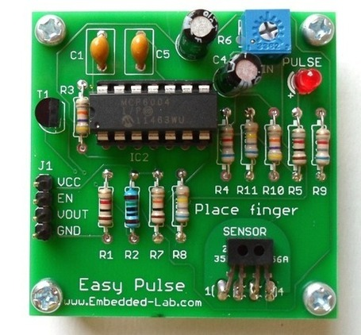

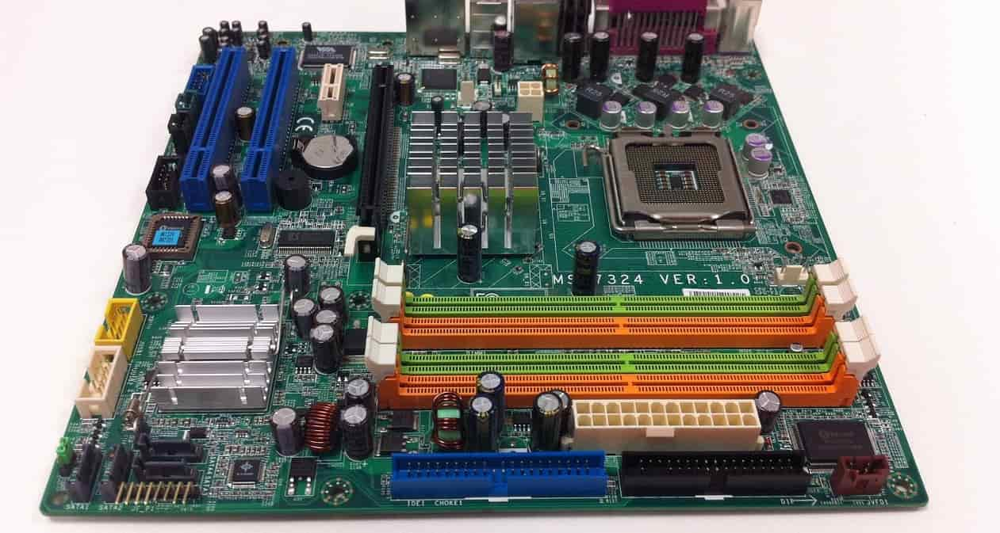

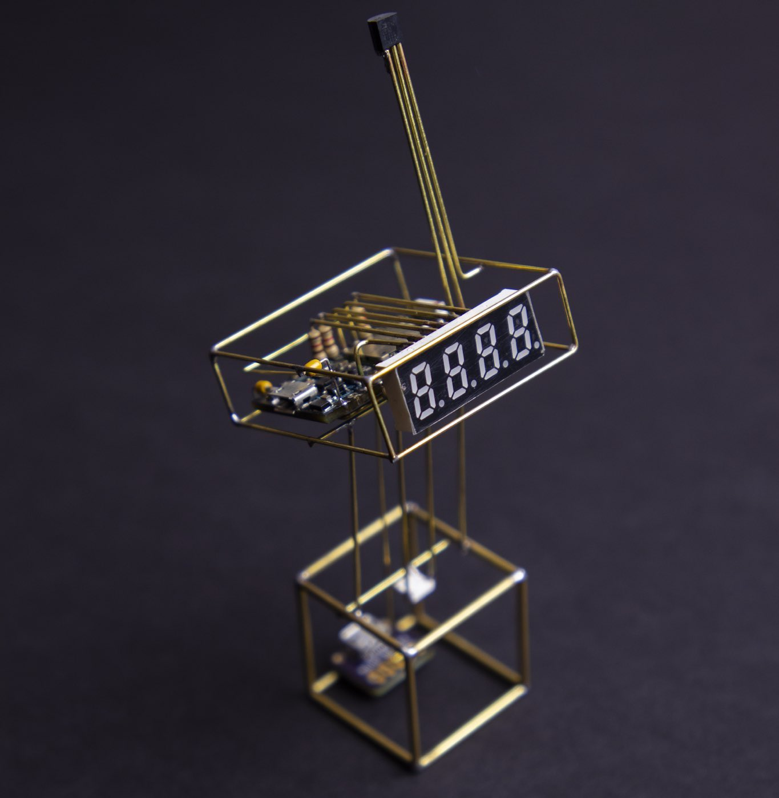

Materia Prima

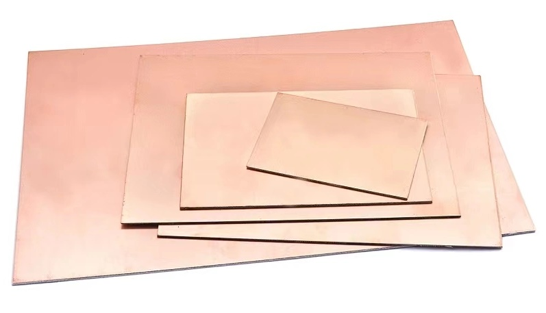

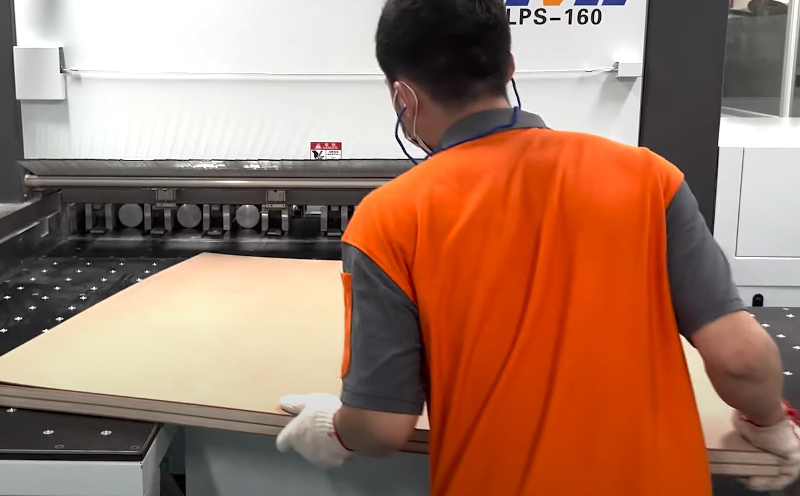

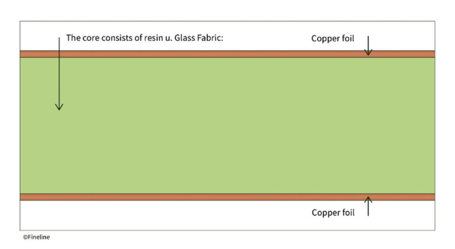

Proceso de Fabricación de la Placa

Versión Casera

Versión Industrial

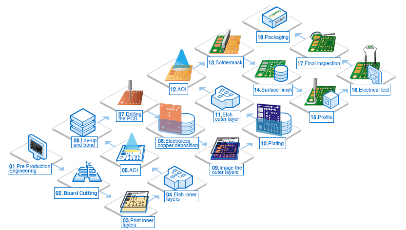

Fotolitografia

[fuente](https://www.pcbway.com/pcb-service.html)

[montaje](https://www.youtube.com/watch?v=24ehoo6RX8w)

[pick and place](https://www.youtube.com/watch?v=S8qkaTsr2_o&t=32s)

##  2. Circuitos Integrados

###  2.1. Encapsulados

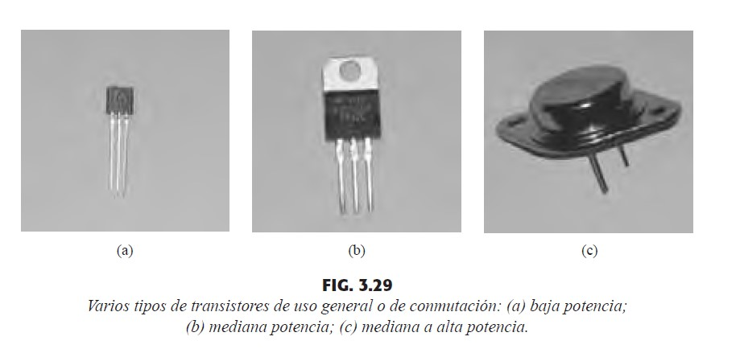

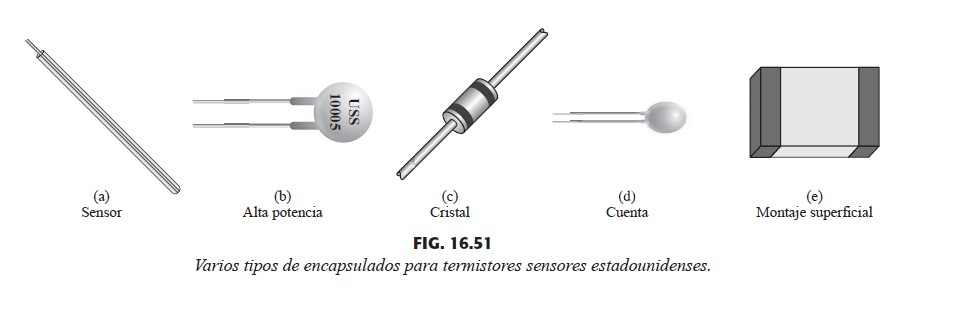

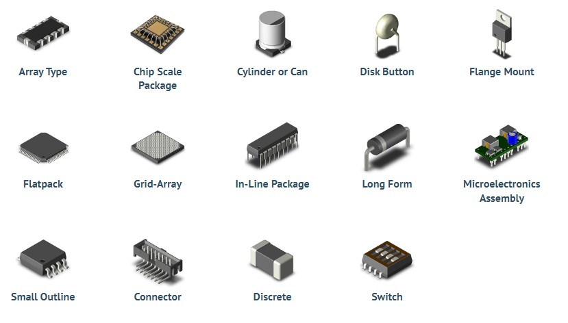

Agujero Pasante vs Montaje Superficial (Through-Hole vs Surface Mount Device (SMD))

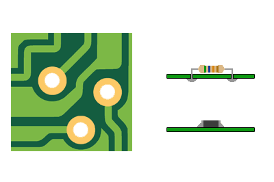

###  2.2. Fabricación de un Circuito Integrado

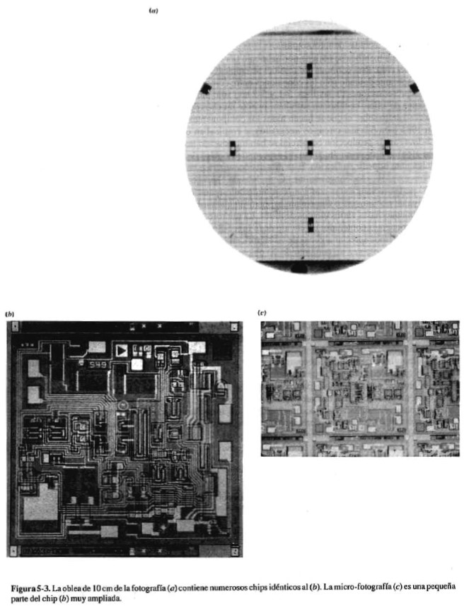

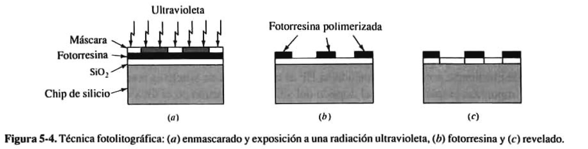

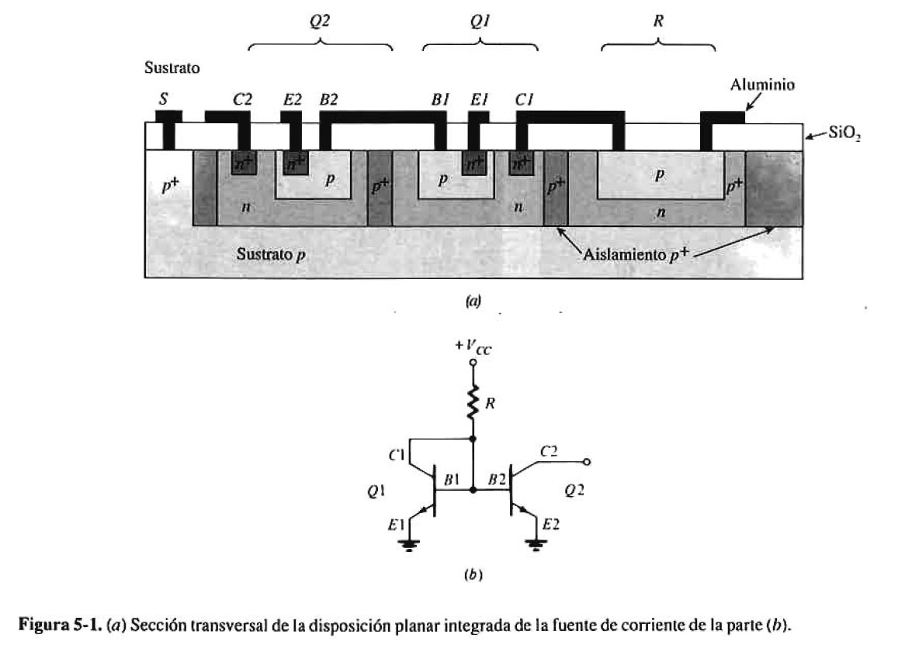

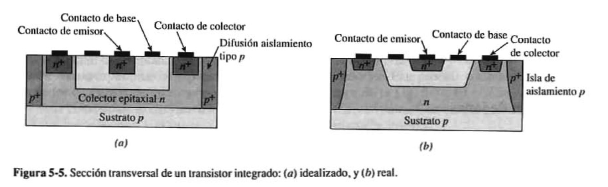

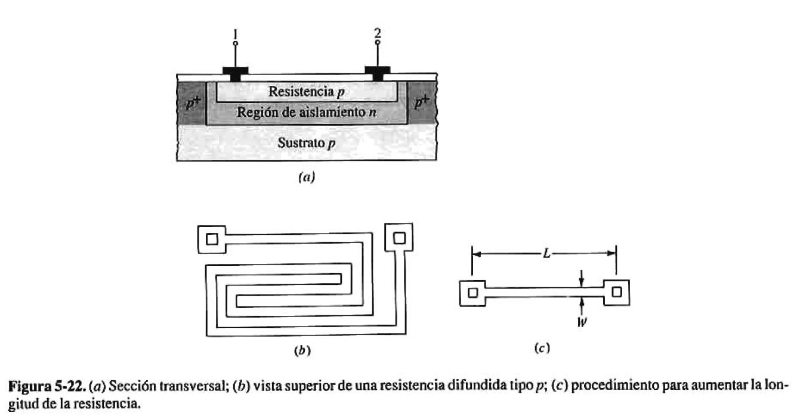

##  3. Resúmen: Conceptos Clave

- Tarjeta de Circuito Impreso (PCB)
- Fotolitografia
- Circuito Integrado
- Agujero Pasante
- Montaje Superficial