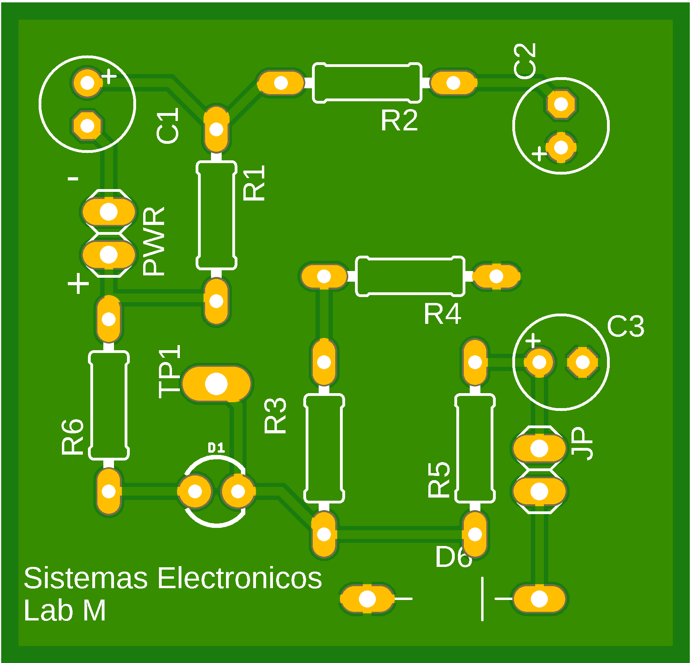
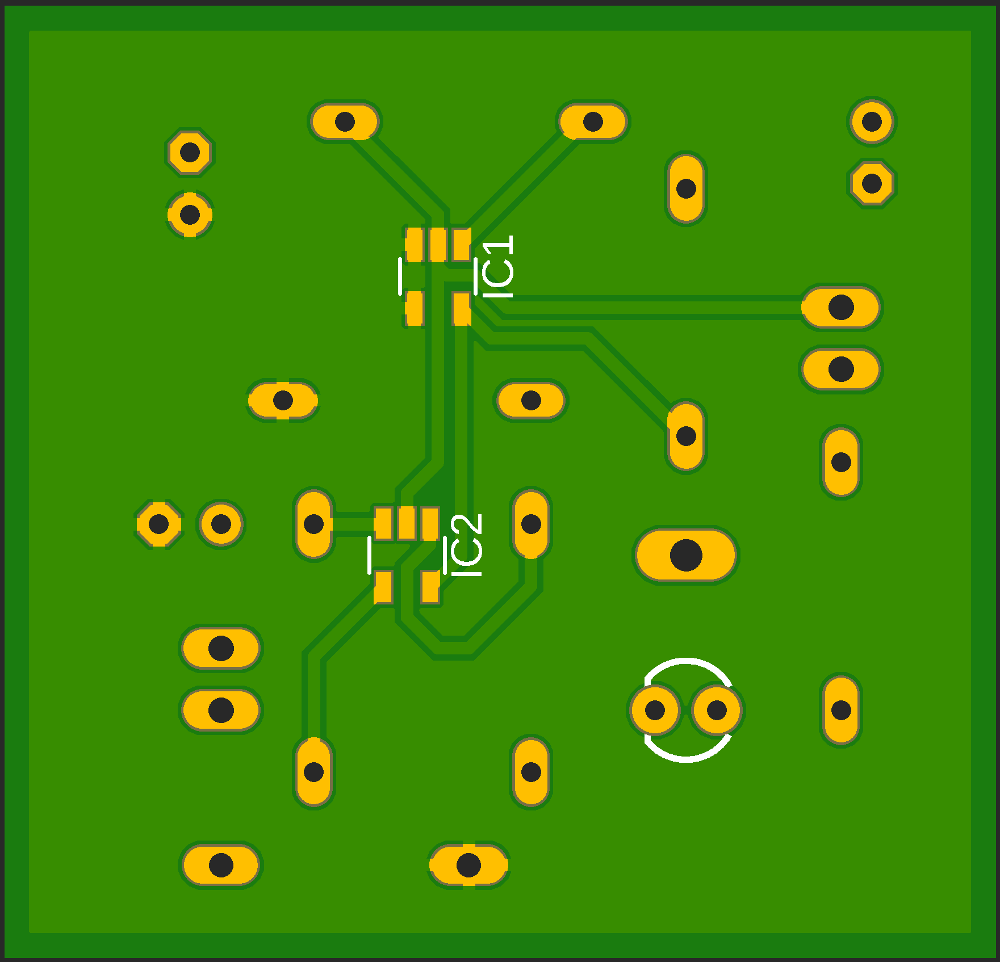

#  Laboratorio 6 de Sistemas Electrónicos
#### Primer Semestre de 2026d

## Recursos del pañol

| tipo | descripcion | cantidad | 
| -- | -- | -- | 
| Instrumentos |  |  |
|  | Osciloscopio | 1 |
|  | Fuente CC. | 1 |
| Implementos |  |  | 
|  | Cable Banana-Caimán | 2 | 
|  | Sonda | 2 | 
| Otros |  |  | 
| | cables, alicate, etc | | 
| | Placa de Circuito Impreso | 1 | 

## Procedimiento experimental e informe

Nota: Ante cualquier duda en el uso de los instrumentos, o las conexiones eléctricas, consulten al profesor.

Ajusten la fuente CC para aproximadamente 10V @ 200 mA. Conecten el botón, las tierras, Vcc (+10V) y la sonda del osciloscopio a la placa de circuito impreso conforme las instrucciones del profesor y ayudante.

1. ¿ Cuál es la forma de la señal cuando se apreta el botón ? Aguarden algunos segundos antes de apretar el botón nuevamente. Describan tanto las características temporales cuanto de voltaje de la señal observada (1 pt)
    1. ¿ Como se llama el circuito que implementa la funcionalidad observada ? (0.5 pt)

1. Desconecten el Jumper y, sin apretar el botón, contesten: ¿ Cuál es la forma de la señal ? Describan tanto sus características temporales cuanto de voltaje. (1 pt)
    1. ¿ Como se llama el circuito que implementa la funcionalidad observada ? (0.5 pt)

1. Dibujen un diagrama del circuito, incluyendo donde está el jumper y el valor de los componentes. (1.5 pt)
    
    AYUDA: Las imágenes en anexo mustran el diseño de la placa utilizada. 
    
    1. ¿ Qué componente se desconecta del circuito cuando el jumper está abierto ? (0.5pt)

1. Cómo se comparan los valores medidos en los puntos 1 y 2 con los teóricos ? (1pt)

Figura 1: Diseño de la placa utilizada (top)

Figura 1: Diseño de la placa utilizada (bottom)