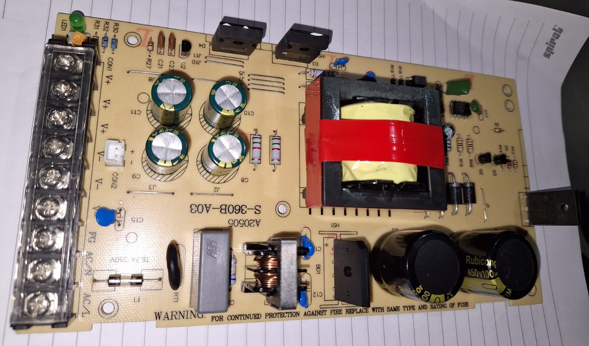
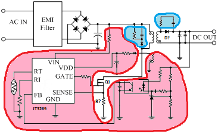
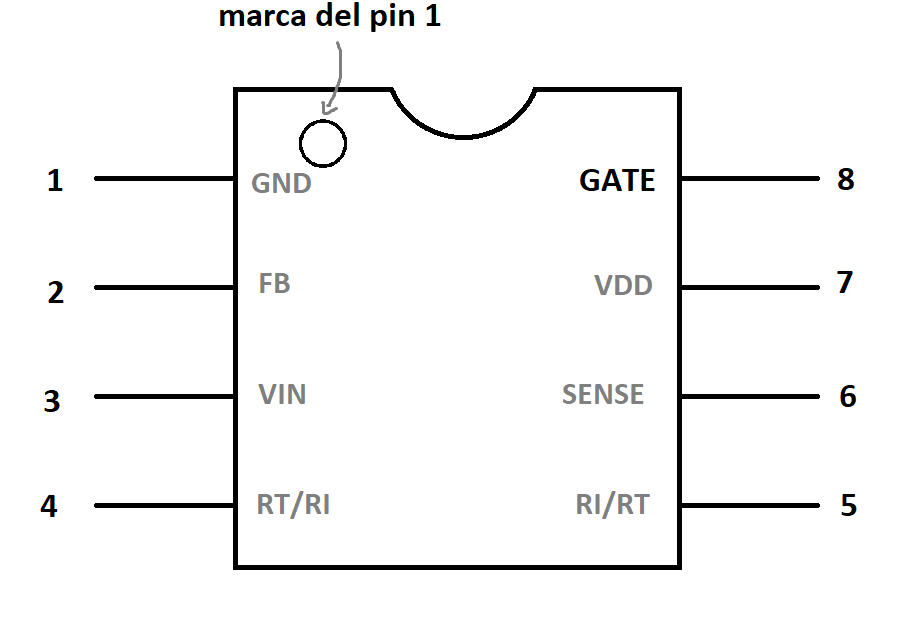

#  Laboratorio 9 de Sistemas Electrónicos
# Opción 1
#### Segundo Semestre de 2025

## Recursos del pañol

- Fuente de poder de la impresora 3D
- Multímetro

## Procedimiento experimental e informe

Para este laboratorio se debe entregar un único informe (sólo habrá un grupo con todos los estudiantes de la sesión). Dividan las tareas, trabajen en conjunto, revisen todas las preguntas y respuestas y entreguen el resultado al final de la actividad.

El objetivo del Laboratorio 9 es estudiar una placa de fuente de poder real y entender como se utilizan en la practica diversos de los componentes, circuitos y conceptos estudiados en clase. También es un objetivo que los estudiantes practiquen hacer ingenieria inversa de circuitos electronicos, y buscar información para entender una placa de circuito impreso y sus componentes.

La Figura 1 muestra la fuente de poder de una de las impresoras 3D del laboratorio. Pidan una demonstración al ayudante, y observen como la placa convierte el voltaje de entrada de la toma de corriente (220 V, 50 Hz) a un voltaje continuo de aproximadamente 30 V. Luego, contesten las siguientes preguntas.

Figura 1: Fuente de Poder de la impresora 3D

1. Indiquen la cantidad de resistencias, la cantidad de capacitores, la cantidad de inductores, la cantidad de diodos, la cantidad de transistores y la cantidad de circuitos integrados que se utilizan en la placa. (0.5pt)

1. ¿ Cuantos de los componentes indicados en la respuesta anterior son de montaje superficial, y cuantos son agujero pasante ? (0.5pt)

1. ¿Qué significa AC/N, AC/L y FG ? (0.5pt)

1. Encuentren los componentes F1 y RT1 e investiguen que tipo de dispositivos son. ¿Cuál es su función en este circuito? (0.5pt)

1. CX1, LF1, C12 y C13 implementan filtros que ayudan a disminuir la emisión de radiación electromagnética causada por el encendido y apagado de alta frecuencia del convertidor. Determinen como están conectados entre sí y con las señales de AC/N, AC/L y FG. Basándose en la posición de los capacitores, ¿qué tipo de filtro está implementado (paso-baja, paso-alta, paso-banda) ? (0.5pt)

1. Encuentren el componente BD1, y busquen su numero de parte online. ¿Qué tipo de componente es, y cual es su función ? (0.5pt)

1. Uno de los componentes más importantes de esta fuente de poder es el circuito integrado [JT3269A](https://www-sz--just-cn.translate.goog/product/32.html?_x_tr_sch=http&_x_tr_sl=zh-CN&_x_tr_tl=en&_x_tr_hl=en&_x_tr_pto=sc) (único circuito integrado con 8 pines en la placa). En la figura 2 se muestra parte de la hoja de datos del JT3269A.

    

    Figura 2: Típica aplicación del JT3269, extraído de su hoja de datos.

    1. Asumiendo que la parte resaltada en rojo es el sistema de control que genera la señal de encendido y apagado, que Q1 es utilizado como interruptor e ignorando las partes en azul, determinen qué tipo de regulador de voltaje está implementado (LDO, elevador, reductor, reductor-elevador o retroceso). (0.5pt)

    1. ¿Qué/Cuáles componente(s) en la placa implementa(n) el diodo marcado como "D?" en la figura 2 ? (0.5pt)

    1. Basándose en las figuras 2 y 3, busquen en la placa las 2 resistencias que implementan la resistencia marcada como "R?" en la figura 2, la que sirve para convertir la corriente que pasa por Q1 en un voltaje que se mide en el terminal SENSE del JT3269. ¿Cuánto vale "R?" ? (0.5pt)
    
        

        Figura 3: Denominación de los terminales del JT3269. Vista superior.

1. La placa continene un potenciometro (trimmer) para hacer un ajuste fino del voltaje de salida. El potenciometro es más compacto que los que se utilizaron en laboratorio, y se puede ubicar por su color amarillo y espacio para girarlo con un destornillador. Determinen el valor de la resistencia total del potenciometro. (0.5pt)

1. Determinen cuantos capacitores están conectados entre V+ y V- y cuál es la capacitancia total entre estos dos terminales. (0.5pt)

1. La placa contiene un LED verde para indicar cuando está encendida. Estimen cuanta corriente consume dicho LED. (0.5pt)
