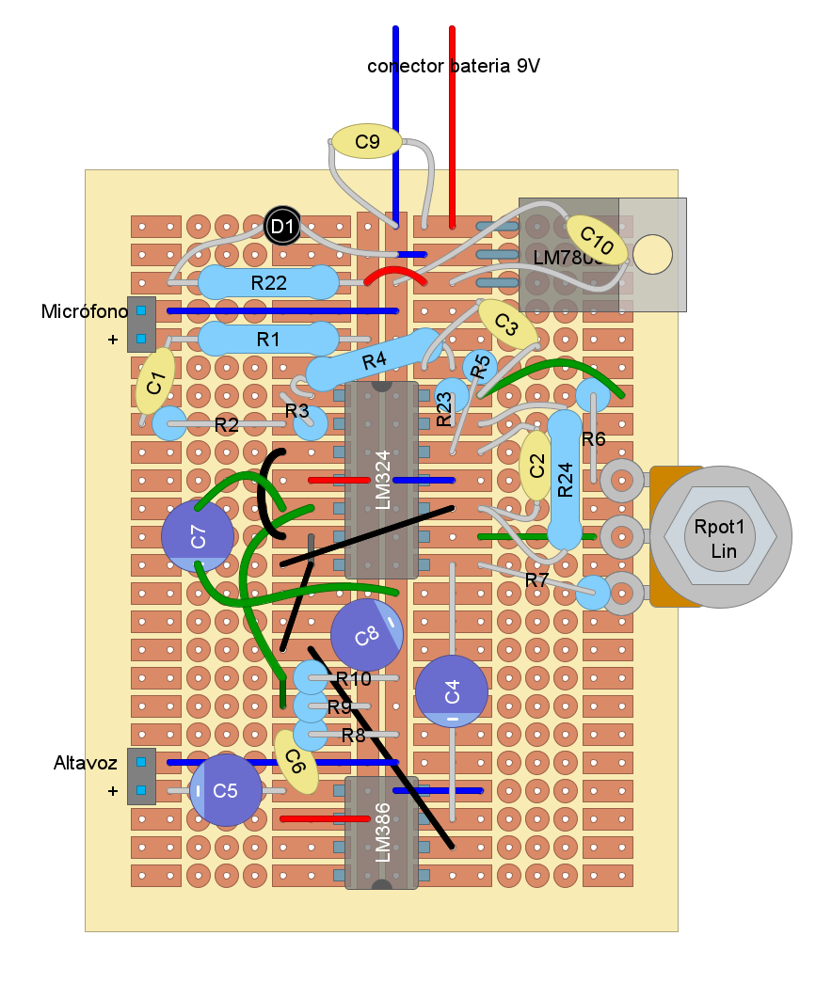
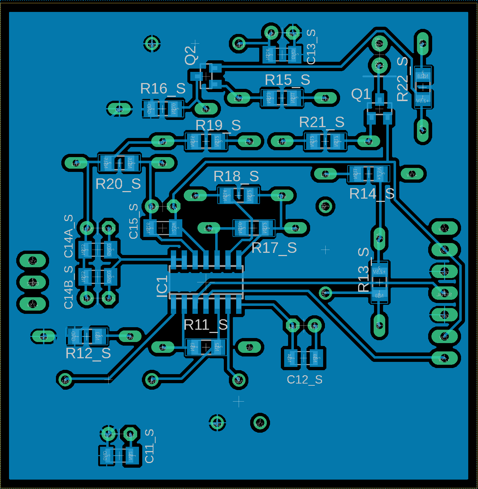

#  Laboratorio 8 de Sistemas Electrónicos
#### Primer Semestre de 2026

### La nota de este Laboratorio también es la nota del Trabajo 9

## Recursos del pañol

- Placas de Circuito Impreso (PCB) de las placas 1, 2 y 3
- Stencils para las PCBs
- Pasta de soldadura
- Componentes de la BOM
- Fuente CC, generador de funciones y osciloscopio para probar
- Cautín + estaño
- Alicates
- Cables

## Procedimiento experimental e informe

Terminen de fabricar los prototipos de sensor capacitivo de toque, utilizando los valores de componentes diseñados a lo largo del semestre. Acuérdense que cada prototipo está compuesto de una "Placa 1", una "Placa 2", y una "Placa 3". El objetivo es fabricar un prototipo por miembro del grupo. Demuestren al profesor el funcionamiento de los prototipos fabricados antes del fin del semestre. La nota final se calcula de acuerdo al número de placas funcionales, con enfasis en sets completos (placa 1+2+3).

Para cada miembro del grupo ($i$), se calcula cuantas placas completó:

$S_i = D_{1,i}+D_{2,i}+D_{3,i}$

Donde $D_{j,i}$ es el estado de avance de la placa $j$ para el alumno $i$, y puede ser cero, 50% o 100%, a criterio del profesor.

Luego se calcula el total de placas completadas:

$T = S_1+S_2+S_3$

También, cuantas placas hay en el set de placas más avanzado:

$M = max(S_1,S_2,S_3)$

Y la nota final es:

$Nota = 1+0.5(T+M)$

Algunos ejemplos:

|Situación | Placas finalizadas por estudiante ($S_1$-$S_2$-$S_3$) | $T$ | $M$ | $Nota$ |
| -- | -- | -- | -- | -- |
| Nada funciona | 0-0-0 | 0 | 0 | 1.0 |
| Una placa para un miembro | 1-0-0 | 1 | 1 | 2.0 |
| Una placa para cada miembro | 1-1-1 | 3 | 1 | 3.0 |
| 3 placas para 1 miembro | 3-0-0| 3 | 3 | 4.0 |
| 2 placas para 1 miembro, 1 para otro | 2-1-0 | 3 | 2 | 3.5 |
| 3 placas para un mimebro, 1 para otro | 3-1-0 | 4 | 3 | 4.5 |
| 3 placas para 2 miembros | 3-3-0 | 6 | 3 | 5.5 |
| 3 palcas para 2 mimebros, 1 para otro | 3-3-1 | 7 | 3 |6.0 |
| todas las placas funcionando | 3-3-3 | 9 | 3 | 7.0 |

Se adjuntan diagramas de los circuitos completos a continuación

Figura 1: Circuito de la "Placa 1"

Figura 2: Sugerencia de como soldar los componentes en la stripboard

Figura 3: Circuito de la "Placa 2"

Figura 4: Placa 2 - TOP (vista superior)

Figura 5: Placa 2 - BOTTOM (vista inferior)