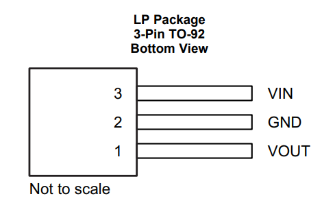

#  Laboratorio 9 de Sistemas Electrónicos
#### Primer Semestre de 2024

## Recursos del pañol

| tipo | descripcion  | cantidad | | tipo | descripcion | valor | cantidad |
| -- | -- | -- | --| -- | -- | -- | -- |
| Instrumentos  |  |  | | Dispositivos |  |  |  |
|  | Osciloscopio  | 1 | |  |regulador  |  78L05 | 1 |
|  | Generador de señales  | 1 | |  | diodo  | 1N4007 | 4 |
|  | Multímetro  | 1 | |  | Resistencias (Ω) |  |  |
| Implementos  |  |  | |  |  |510 | 1 |
|  | Sonda  | 2 | |  |  | 1k | 1 |
|  | BNC-Caimán  | 1 | |  |  | 10k | 1 |
| Otros  |  |  | |  | | 100k | 1 |
| | Protoboard  | 1 | |  | Capacitores |  |  |
| | cables, alicate, etc  | | |  | | 1 μF | 2 |

## Procedimiento experimental e informe

Nota: Ante cualquier duda en el uso de los instrumentos, o las conexiones eléctricas, consultar al profesor.

Arme el circuito de la Figura 1 utilizando diodos rectificadores (1N400X), $C_2 = 1\ \mu F$ y $R_L = 1\ k\Omega$. No conecte $C_1$ todavía. Consulte las figuras 1 y 2 para encontrar la forma correcta de conectar el regulador 7805: la entrada debe conectarse a los diodos y la salida a $R_L$. La fuente $v_{i_{AC}}$ representa el generador de funciones.

Figura 1: Circuito rectificador y regulador

Figura 2: Opciones de paquetes para el LM7805

Figura 3: Asignación de pines del LM7805

Utilice el generador de funciones para producir $v_{i_{AC}}$ con 50 Hz y 5 V de amplitud (10 V peak-to-peak).

1. Mida la señal $v_i$ en el osciloscopio, conectando la sonda a $v_{i_+}$ y la tierra a $v_{i_-}$ 
   1. ¿Que tipo de señal es ? (0.5 pt) 
   1. ¿Cuál es la amplitud de la señal (peak-to-peak, $V_{pp}$) ? (0.5 pt) 
   1. ¿Cuál es el valor medio ? (0.5 pt) 
1. ATENCIÓN: asegurese de desconectar el osciloscopio de $v_{i_+}$ y $v_{i_-}$ antes de conectarlo a $v_R$. Conecte la tierra del osciloscopio a la tierra del circuito y la sonda a $v_R$. Vea la señal $v_R$ en el osciloscopio con el condensador $C_1$ desconectado. 
   1. ¿Qué tipo de rectificador es? ¿Media onda o onda completa? (0.5 pt)
   1. ¿Cual es el valor máximo ($V_{max}$) de $v_R$ ? (0.25 pt) 
   1. ¿Cual es el valor mínimo ($V_{min}$) de $v_R$ ? (0.25 pt) 
   1. ¿Cual es el valor medio ($V_{medio}$) de $v_R$ ? (0.25 pt) 
   1. Calcule el valor $\frac{V_{medio}}{V_{max}}$ de la señal $v_R$. ¿Como se compara con el valor teórico de 0.636 ? (0.25 pt) 
1. Conecte el condensador $C_1 = 1\ \mu F$, con cuidado por su polaridad (el terminal negativo debe ir a tierra, y el positivo a los diodos).
   1. ¿Cómo es la señal $v_R$ ahora? (0.5 pt) 
   1. ¿Cual es el valor máximo ($V_{max}$) de $v_R$ ? (0.25 pt) 
   1. ¿Cual es el valor mínimo ($V_{min}$) de $v_R$ ? (0.25 pt) 
   1. ¿Cual es el valor medio ($V_{medio}$) de $v_R$ ? (0.25 pt) 
   1. ¿Cual es el valor del rizado ($V_{peak-to-peak}$) de $v_R$ ? (0.25 pt) 
  
2. Utilice 4 valores distintos de $R_L$ ($R_L=510\ \Omega$, $R_L=1\ k\Omega$, $R_L=10\ k\Omega$ y $R_L=100\ k\Omega$). 
   
   1. Anote el valor del voltaje $v_o$ medio y peak-to-peak para cada resistencia. (0.5 pt)
   1. Explique qué tan bien el LM7805 regula el voltaje cuando se cambia la carga $R_L$ (0.5 pt)
   1. Elija un valor de $R_L$ y estime cuanta energía se disipa en la resistencia y cuanta energía se disipa en el LM7805 (0.5 pt)