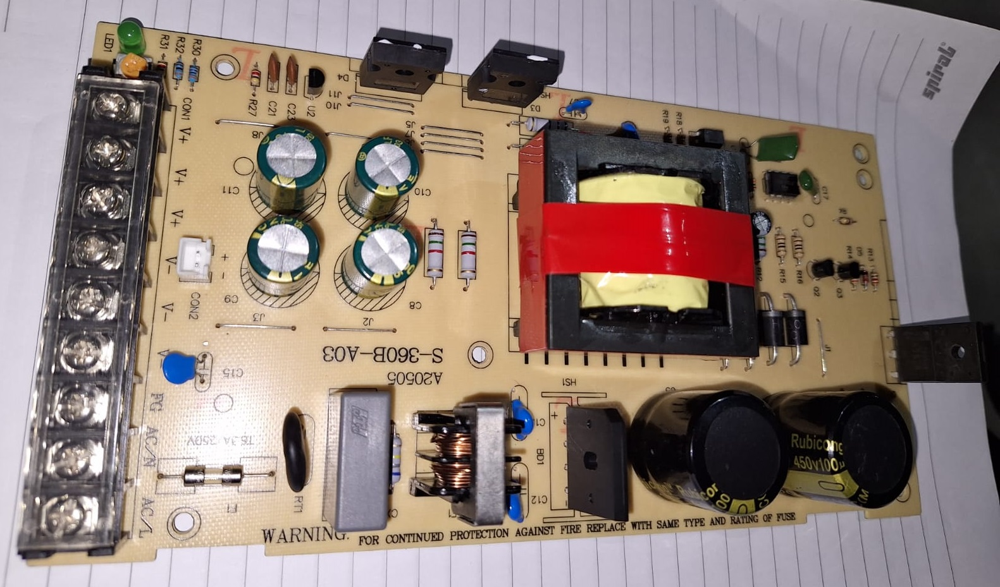
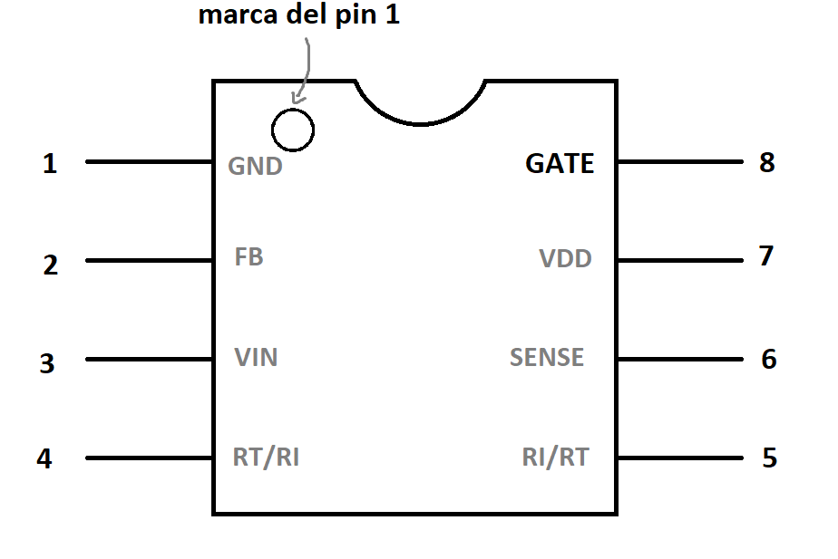

#  Laboratorio 10 de Sistemas Electrónicos
#### Primer Semestre de 2024

## Recursos del pañol

- Fuente de poder de la impresora 3D
- multímetro

## Procedimiento experimental e informe

Para este laboratorio se debe entregar un único informe (sólo habrá un grupo con 5 estudiantes). Dividan las tareas, trabajen en conjunto, revisen todas las preguntas y respuestas y entreguen el resultado al final de la actividad.

El objetivo del Laboratorio 10 es 

Figura 1: Fuente de Poder de la impresora 3D

1. Encuentre los componentes F1 y RT1 e investigue que tipo de dispositivos son. ¿Cuál es su función en este circuito? (1pt)

1. CX1, LF1, C12 y C13 implementan filtros paso baja que ayudan a disminuir la emisión de radiación electromagnética causada por el encendido y apagado de alta frecuencia del convertidor.  (1pt)

1. Encuentre el componente BD1, y busque su numero de parte online. ¿Qué tipo de componente es, y cual es su función ? (1pt)

1. Uno de los componentes más importantes de la placa es el circuito integrado [JT3269A](https://www-sz--just-cn.translate.goog/product/32.html?_x_tr_sch=http&_x_tr_sl=zh-CN&_x_tr_tl=en&_x_tr_hl=en&_x_tr_pto=sc) (único circuito integrado con 8 pines en la placa). En la figura 2 se muestra parte de la hoja de datos del JT3269A. (1pt)

    

    Figura 2: Típica aplicación del JT3269, extraído de su hoja de datos.

    1. Asumiendo que la parte resaltada en rojo es el sistema de control, que Q1 es un transistor utilizado como interruptor e ignorando las partes en azul, determine que tipo de regulador de voltaje está implementado (LDO, elevador, reductor, reductor-elevador o retroceso). (1pt)

    1. ¿Qué/Cuáles componente(s) en la placa implementa(n) el componente marcado como "D?" en la figura 2 ? (1pt)

    1. La salida GATE del JT3269 (pin 8) no tiene suficiente capacidad de corriente para encender el interruptor Q1. Identifiquen los 2 componentes que amplifican la corriente de salida de GATE, incluyendo su denominación en la placa, número de parte y qué tipo de componentes son. (1pt)
    
        

        Figura 3: Ubicación de la salida GATE (pin 8) del JT3269. Vista superior.

1. Determinen cuantos capacitores están conectados entre V+ y V- y cuál es la capacitancia total entre estos dos terminales. (1pt)

1.  (1pt)

