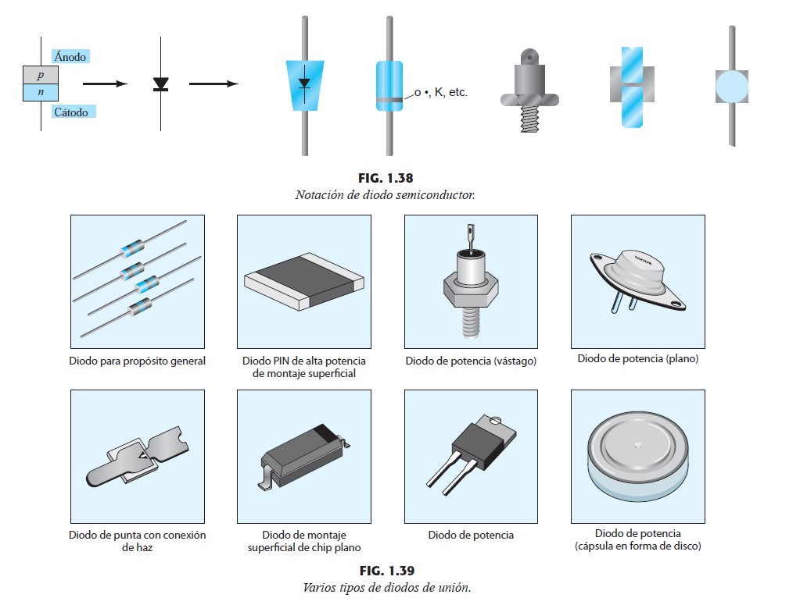
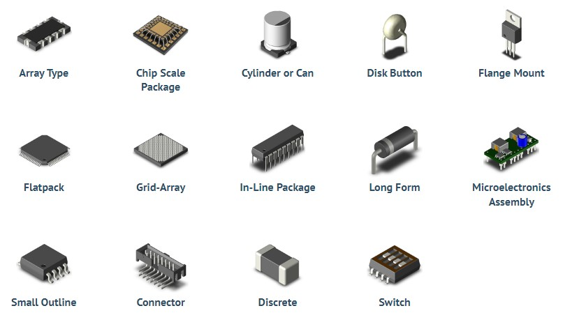
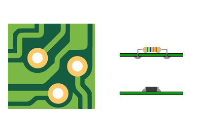
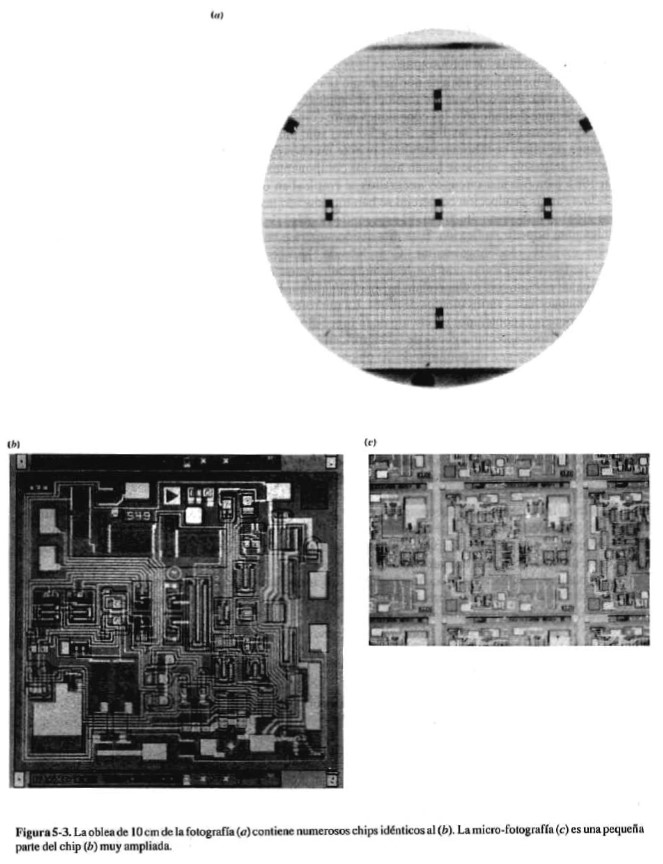
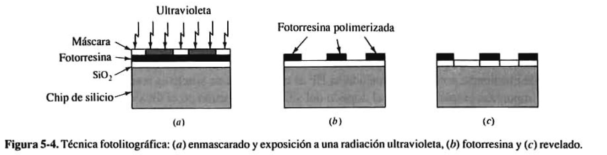
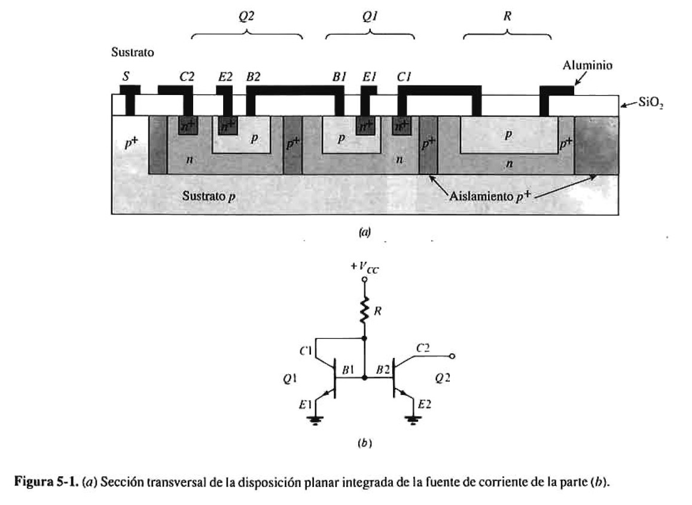

<!-- vscode-markdown-toc -->
* 1. [Circuitos Integrados](#CircuitosIntegrados)
	* 1.1. [Encapsulados](#Encapsulados)
	* 1.2. [Fabricación de un Circuito Integrado](#FabricacindeunCircuitoIntegrado)
* 2. [Resúmen: Conceptos Clave](#Resmen:ConceptosClave)

<!-- vscode-markdown-toc-config
	numbering=true
	autoSave=true
	/vscode-markdown-toc-config -->
<!-- /vscode-markdown-toc -->

##  1. Circuitos Integrados

###  1.1. Encapsulados

Agujero Pasante vs Montaje Superficial (Through-Hole vs Surface Mount Device (SMD))

###  1.2. Fabricación de un Circuito Integrado

##  2. Resúmen: Conceptos Clave

- Circuito Integrado
- Agujero Pasante
- Montaje Superficial