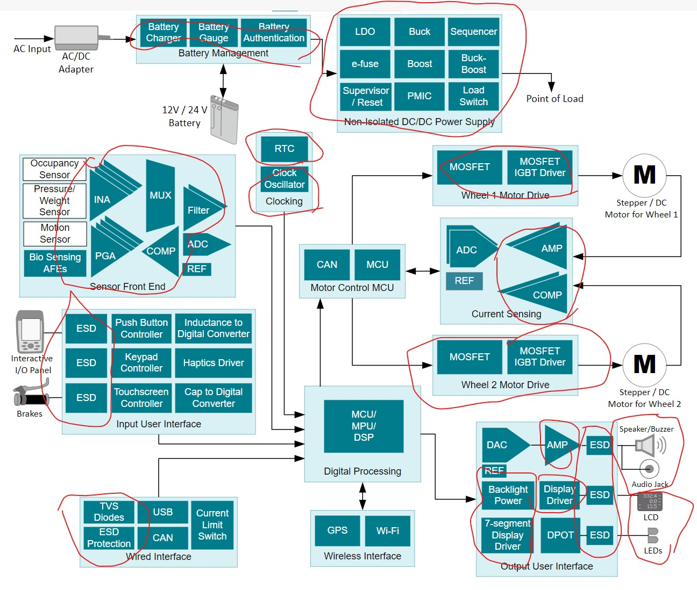

# 01 - Introducción

## Detalles Administrativos

Página: [uvirtual](https://uvirtual.usach.cl/moodle/course/view.php?id=36972)

Correo: juliano.dawid @usach.cl

[Syllabus](/README.md)

## Motivación

Electrónica Analógica vs Digital

[Texas Instruments Medical Applications](https://www.ti.com/applications/industrial/medical/overview.html)

## Trabajos

[EMG](https://learn.sparkfun.com/tutorials/myoware-muscle-sensor-kit/all)

Grupos de 3

## Revisión/Resúmen de Conceptos

- Impedancia
- BODE
- Fracciones Parciales
- Transformada de Laplace
- Teorema de la Superposición
- Kirchhoff
- Serie de Taylor / Maclaurin
- Nyquist

Teoría de Circuitos

$$R_{series} = R_1 + R_2$$

$$R_{paralelo} = \frac{1}{\frac{1}{R_1} + \frac{1}{R_2}}$$

$$\sum{corrientes} = 0$$

$$\sum{voltajes} = 0$$

## Introducción al Laboratorio

Multímetro y mediciones de baterias, resistencias fijas y resistencias variables