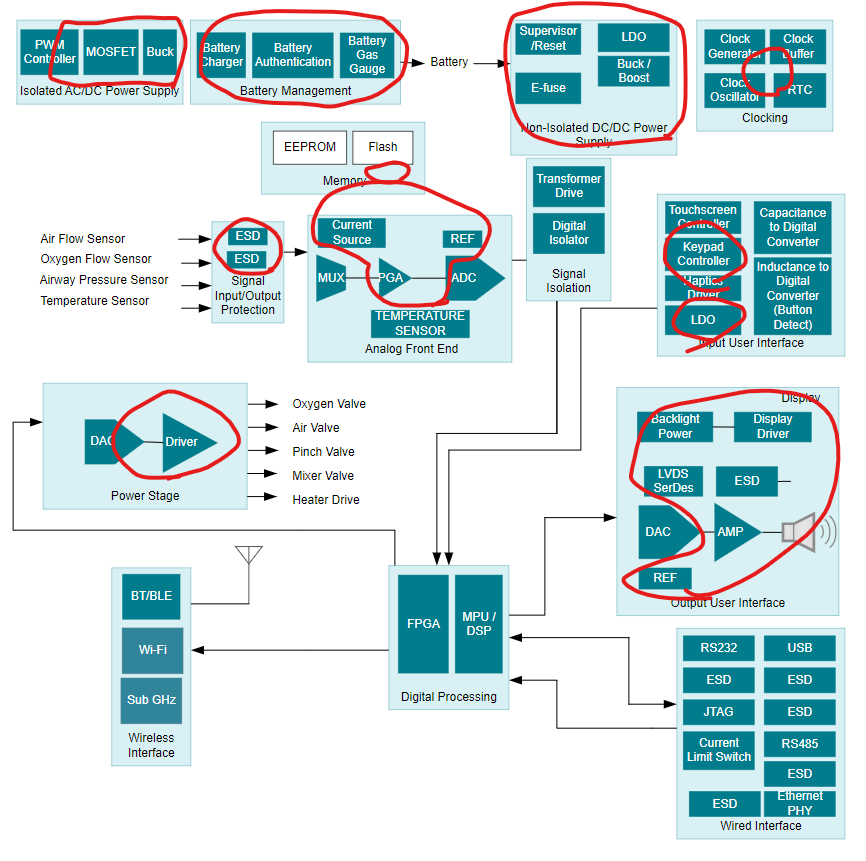

# 01 - Introducción

## Detalles Administrativos

Página: [uvirtual](https://uvirtual.usach.cl/moodle/course/view.php?id=37566)

Correo: juliano.dawid @usach.cl

[Syllabus](/README.md)

## Motivación

Electrónica Analógica

[Texas Instruments Medical Applications](https://www.ti.com/applications/industrial/medical/overview.html)

## Trabajos

[Espirometro](https://youtu.be/QbOlMsbF1qc?si=5pi-JBWxcQMdzdwz)

El espirómetro es un instrumento de medida usado en medicina para determinar los volúmenes y capacidades del pulmón. Requiere que el paciente sople por un sistema de recogida de aire (por ejemplo un tubo), y luego realiza mediciones como por ejemplo el flujo espiratorio maximo (PEF - tipicamente en L/min) y el volúmen espiratorio forzado 1 (FEV1 - tipicamente en L). Las mediciones realizadas pueden ser insumo para que un profesional de la salud identifique o descarte ciertas enfermedades pulmonares, como asma, bronquitis y emfisema.

Grupos de 3

## Notación

- Voltajes, corrientes, conexiones externas, entradas, salidas
- $\lceil x \rceil$
- $\therefore$
- $ \implies $
- $\iff$
- $ \forall $
- $ | $
- $>>$

## Revisión/Resúmen de Conceptos

Teoría de Circuitos

$$R_{series} = R_1 + R_2$$

$$R_{paralelo} = \frac{1}{\frac{1}{R_1} + \frac{1}{R_2}}$$

$$\sum{corrientes} = 0$$

$$\sum{voltajes} = 0$$

- Impedancia
- BODE
- Fracciones Parciales
- Transformada de Laplace
- Función de Transferencia
- Polos y Ceros
- Teorema de la Superposición
- Kirchhoff
- Serie de Taylor / Maclaurin
- Nyquist
- Ley de Ohm

## Introducción al Laboratorio

[Reglamento interno para el uso seguro de los laboratorios de docencia de Ingeniería Civil Biomédica](https://www.ingenieriabiomedica.usach.cl/sites/ing-civil-biomedica/files/laboratorio_cero_usach_biomedica.pdf)

Multímetro y mediciones de baterias, resistencias fijas y resistencias variables.

Protoboard y buenas practicas para conexión de circuitos electrónicos

Osciloscopio y medición de voltajes cambiantes en el tiempo.