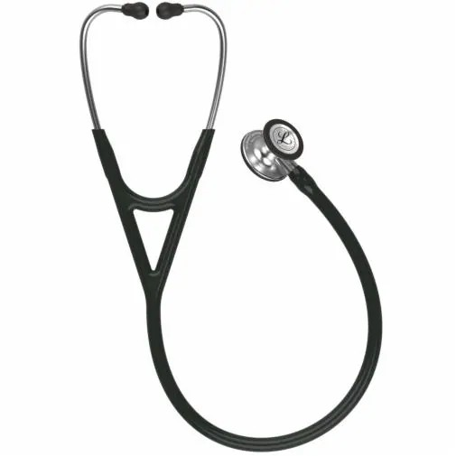
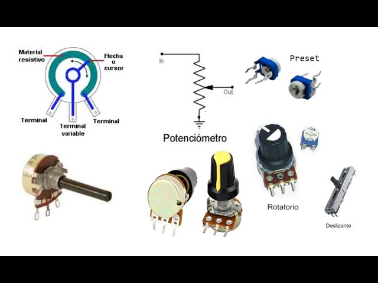

# 01 - Introducción

## Detalles Administrativos

Página: [uvirtual](https://uvirtual.usach.cl/moodle/course/view.php?id=42497)

Correo: juliano.dawid @usach.cl

[Syllabus](../README.md)

## Motivación

Electrónica Analógica

[Texas Instruments Medical Applications](https://www.ti.com/applications/industrial/medical/overview.html)

## Trabajos

Un estetoscopio es un aparato destinado a auscultar los sonidos del pecho y otras partes del cuerpo, ampliándolos con la menor deformación posible. También se conoce como fonendoscopio, un nombre que se asocia a la variedad de estetoscopio comúnmente utilizada por médicos. 

Un estetoscopio electrónico es un dispositivo médico que amplifica electrónicamente los sonidos corporales para facilitar la auscultación, especialmente de sonidos débiles o sutiles, como ciertos soplos cardíacos. A diferencia de los estetoscopios tradicionales, los electrónicos pueden filtrar el ruido ambiental y a menudo permiten grabar y reproducir los sonidos para su análisis posterior.

Los sistemas electrónicos de los estetoscopios electrónicos utilizan los componentes y circuitos estudiados en esta asignatura. Por lo tanto, este semestre su grupo desarrollará un estetoscopio electronico para reforzar y ejemplificar la aplicación de los conocimientos obtenidos. El dispositivo propuesto será capaz de amplificar los sonidos medidos además de estimar la frecuencia cardíaca.

El proyecto será implementado por 5 grupos distintos, cada uno con 3 o 4 estudiantes. Cada grupo implementará un prototipo ligeramente distinto, de acuerdo al color del LED que se utilizará: Rojo, Amarillo, Azul, Verde y Blanco. El diseño del prototipo se dividirá en 9 trabajos, conforme la imagen a continuación.

## Notación

- Voltajes, corrientes, conexiones externas, entradas, salidas
- $\lceil x \rceil$
- $\therefore$
- $ \implies $
- $\iff$
- $ \forall $
- $ | $
- $>>$

## Revisión/Resúmen de Conceptos

- Impedancia
- Potenciometro
- BODE
- Circuito Equivalente de Thevenin / Norton
- Fracciones Parciales
- Transformada de Laplace
- Transformada de Fourier
- Función de Transferencia
- Polos y Ceros
- Teorema de la Superposición
- Leyes de Kirchhoff
- Serie de Taylor / Maclaurin
- Nyquist
- Ley de Ohm

## Teoría de Circuitos

$$\sum{corrientes} = 0$$

$$\sum{voltajes} = 0$$

$$R_{series} = R_1 + R_2$$

$$R_{paralelo} = \frac{1}{\frac{1}{R_1} + \frac{1}{R_2}}$$

Divisor de voltaje

Potenciometro

Thevenin

## Introducción al Laboratorio

[Reglamento interno para el uso seguro de los laboratorios de docencia de Ingeniería Civil Biomédica](https://www.ingenieriabiomedica.usach.cl/sites/ing-civil-biomedica/files/laboratorio_cero_usach_biomedica.pdf)

Multímetro y mediciones de baterias, resistencias fijas y resistencias variables.

Protoboard y buenas practicas para conexión de circuitos electrónicos

Osciloscopio y medición de voltajes cambiantes en el tiempo.
