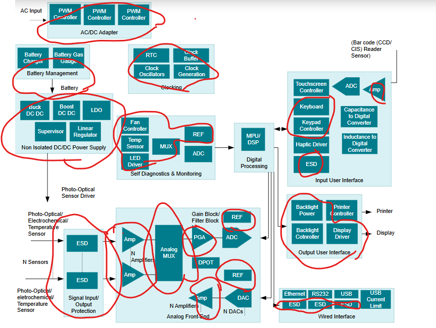
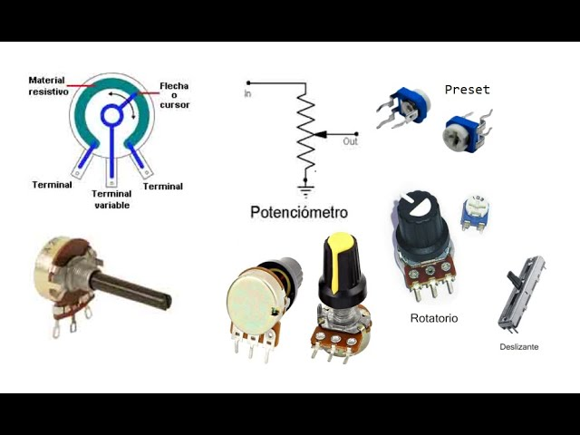
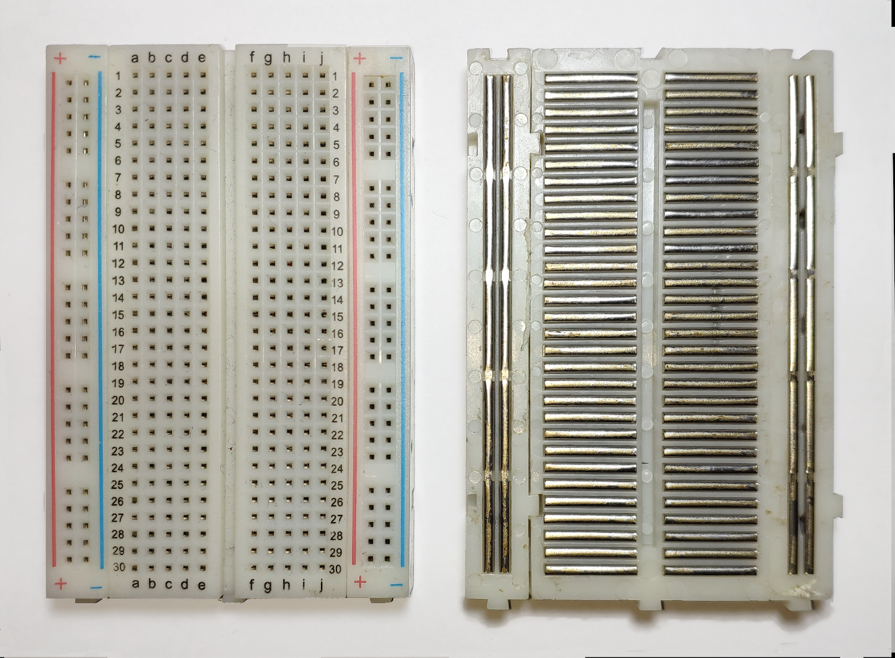

# 01 - Introducción

## Detalles Administrativos

Página: [uvirtual](https://uvirtual.usach.cl/moodle/course/view.php?id=49661)

Correo: juliano.dawid @usach.cl

[Syllabus](../README.md)

## Motivación

Electrónica Analógica

[Texas Instruments Medical Applications](https://www.ti.com/applications/industrial/medical/overview.html)

## Trabajos

Durante este semestre se desarrollará como proyecto un **amplificador de instrumentación de ganancia programable**. El circuito recibirá una señal diferencial de baja amplitud y permitirá seleccionar distintos valores de ganancia, de modo que pueda adaptarse a señales con diferentes niveles sin modificar todo el sistema de medición.

Los amplificadores de instrumentación son fundamentales en ingeniería biomédica porque las señales bioeléctricas, como el electrocardiograma (ECG), suelen tener amplitudes pequeñas y estar acompañadas por interferencias presentes simultáneamente en ambos electrodos. Para adquirirlas correctamente se requiere una alta impedancia de entrada, buena amplificación de la diferencia entre las entradas y un alto rechazo de señales de modo común. La ganancia programable permite, además, ajustar el circuito a distintas condiciones de medición y aprovechar mejor el rango de entrada de las etapas posteriores de procesamiento o digitalización.

El objetivo es integrar progresivamente los contenidos de la asignatura en un prototipo que pueda ser diseñado, simulado, fabricado y caracterizado. Se evaluarán aspectos como la ganancia, el rechazo de modo común, la respuesta en frecuencia, el ruido y el comportamiento del circuito frente a señales biomédicas representativas. **Si el avance del proyecto lo permite, el prototipo se probará midiendo ECG reales**, siempre bajo supervisión y utilizando las medidas de aislamiento y seguridad eléctrica apropiadas para cualquier circuito conectado a una persona.

El proyecto será implementado por **5 grupos de 3 estudiantes** cada uno. Cada grupo representará uno de los siguientes colores:

- Rojo
- Amarillo
- Azul
- Verde
- Blanco

El desarrollo se dividirá en **7 Trabajos**, enfocados en las distintas etapas de diseño y validación, y **3 Talleres de Fabricación**, destinados a construir, montar y probar el prototipo.

## Notación

- Voltajes, corrientes, conexiones externas, entradas, salidas, fuentes
- $\lceil x \rceil$
- $\therefore$
- $ \implies $
- $\iff$
- $ \forall $
- $ | $
- $>>$

## Revisión/Resúmen de Conceptos

- Impedancia
- Potenciometro
- Transformador
- BODE
- Circuito Equivalente de Thevenin / Norton
- Fracciones Parciales
- Transformada de Laplace
- Transformada de Fourier
- Función de Transferencia
- Polos y Ceros
- Teorema de la Superposición
- Leyes de Kirchhoff
- Serie de Taylor / Maclaurin
- Nyquist
- Ley de Ohm

## Teoría de Circuitos

$$\sum{corrientes} = 0$$

$$\sum{voltajes} = 0$$

$$R_{series} = R_1 + R_2$$

$$R_{paralelo} = \frac{1}{\frac{1}{R_1} + \frac{1}{R_2}}$$

Divisor de voltaje

Potenciometro

Thevenin

## Introducción al Laboratorio

[Reglamento interno para el uso seguro de los laboratorios de docencia de Ingeniería Civil Biomédica](https://www.ingenieriabiomedica.usach.cl/sites/ing-civil-biomedica/files/laboratorio_cero_usach_biomedica.pdf)

Multímetro y mediciones de baterias, resistencias fijas y resistencias variables.

Protoboard y buenas practicas para conexión de circuitos electrónicos

Osciloscopio y medición de voltajes cambiantes en el tiempo.

## Tareas

1. Inscribir Duplas de laboratorio
2. Inscribir Grupos para los Trabajos
3. Avisar si hay topes de PEPs con anticipación
4. Practicar Laboratorio Online 0
