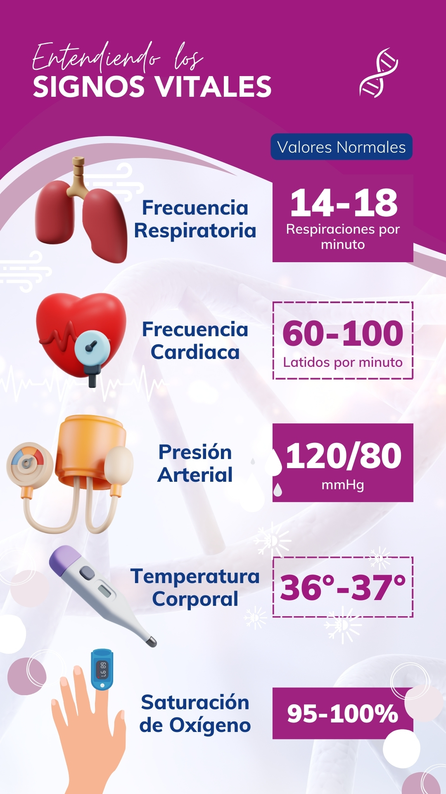

# 01 - Introducción

## Detalles Administrativos

Página: [uvirtual](https://uvirtual.usach.cl/moodle/course/view.php?id=37566)

Correo: juliano.dawid @usach.cl

[Syllabus](../README.md)

## Motivación

Electrónica Analógica

[Texas Instruments Medical Applications](https://www.ti.com/applications/industrial/medical/overview.html)

## Trabajos

Uno de los 5 signos vitales es la temperatura, que es muy importante para evaluar el estado físico y funcionamiento del cuerpo humano.

Para medir la temperatura del cuerpo humano o animal, se utiliza un termómetro médico, también llamado termómetro clínico. La punta del termómetro se introduce en la boca bajo la lengua (temperatura oral o temperatura sublingual), debajo de la de la axila (temperatura axilar), en el recto a través del ano (temperatura rectal), en el oído (temperatura timpánica), o en la frente (temperatura temporal).

[Video de un termometro médico](https://youtu.be/Kig4-cH7D9Q?si=K9Q6u9VljLcL5Y08)

Este semestre el proyecto de Sistemas Electrónicos es el desarrollo de un prototipo de termometro médico. En particular, se requiere un termómetro portátil, capaz de realizar las mediciones utilizando una bateria tipo moneda como fuente de energía. Debido a la pequeña disponibilidad de energía de la batería, será importante también que el prototipo tenga un bajo consumo, y implemente una función de auto-apagado.

El proyecto será implementado por 5 grupos distintos, cada uno con 4 estudiantes. Cada grupo implementará un prototipo ligeramente distinto, de acuerdo al color del LED que se utilizará: Rojo, Amarillo, Azul, Verde y Blanco. El diseño del prototipo se dividirá en 10 trabajos.

## Notación

- Voltajes, corrientes, conexiones externas, entradas, salidas
- $\lceil x \rceil$
- $\therefore$
- $ \implies $
- $\iff$
- $ \forall $
- $ | $
- $>>$

## Revisión/Resúmen de Conceptos

Teoría de Circuitos

$$R_{series} = R_1 + R_2$$

$$R_{paralelo} = \frac{1}{\frac{1}{R_1} + \frac{1}{R_2}}$$

$$\sum{corrientes} = 0$$

$$\sum{voltajes} = 0$$

- Impedancia
- BODE
- Fracciones Parciales
- Transformada de Laplace
- Función de Transferencia
- Polos y Ceros
- Teorema de la Superposición
- Kirchhoff
- Serie de Taylor / Maclaurin
- Nyquist
- Ley de Ohm

## Introducción al Laboratorio

[Reglamento interno para el uso seguro de los laboratorios de docencia de Ingeniería Civil Biomédica](https://www.ingenieriabiomedica.usach.cl/sites/ing-civil-biomedica/files/laboratorio_cero_usach_biomedica.pdf)

Multímetro y mediciones de baterias, resistencias fijas y resistencias variables.

Protoboard y buenas practicas para conexión de circuitos electrónicos

Osciloscopio y medición de voltajes cambiantes en el tiempo.