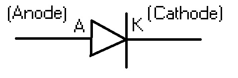

# 02 - Diodos y Aplicaciones

## Símbolo, nomenclatura y convenciones

## Diodo Ideal
$$ \left\{ 
    \begin{array}{ c l }
        \textrm{conduce }(I_D>0) & \quad \textrm{si } V_D > 0 \\
        \textrm{no conduce }(I_D=0)                 & \quad \textrm{si } V_D \leq 0
    \end{array} 
\right.
$$

## Aplicaciones
- Rectificador de media onda
- Rectificador de onda completa
- Batería de respaldo

## Modelo mejorado

$$ \left\{ 
    \begin{array}{ c l }
        \textrm{conduce }(I_D>0) & \quad \textrm{si } V_D > V_f \\
        \textrm{no conduce }(I_D=0)                 & \quad \textrm{si } V_D \leq V_f
    \end{array} 
\right.
$$

La tensión de polarización en directa ($V_f$) es una constante para cada diodo. Depende del material y forma de construcción, y es usualmente 0,7V para diodos de silício

## Ejercicios

## LEDs

## Zeners

$$ \left\{ 
    \begin{array}{ c l }
        \textrm{conduce }(I_D>0) & \quad \textrm{si } V_D > V_f \\
        \textrm{no conduce }(I_D=0)                 & \quad \textrm{si } -V_Z < V_D \leq V_f \\
        \textrm{conduce }(I_D<0)                 & \quad \textrm{si } V_D \leq -V_Z
    \end{array} 
\right.
$$

La tensión de zener ($V_Z$) es una constante para cada diodo. Depende del material y forma de construcción, y se puede obtener en distintos valores, usualmente mayores y más estables que $V_f$

- ESD -> TVS

## Bibliografia

Boylestad, R. & Nashelsky, L. (2009). Electrónica: Teoría de circuitos y dispositivos electrónicos (10ma.ed.). Cap. 1 y 2, pág. 1-114
