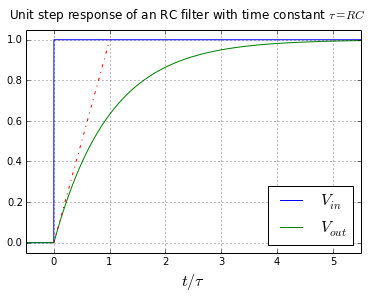

# Respuesta en estado estacionario y transitoria

# Título alternativo: Análsis DC y transitório

<!-- vscode-markdown-toc -->
* 1. [Capacitores](#Capacitores)
* 2. [Circuitos eléctricos como sistemas dinámicos](#Circuitoselctricoscomosistemasdinmicos)
	* 2.1. [ Ecuaciones diferenciales](#Ecuacionesdiferenciales)
	* 2.2. [Solución usando Laplace](#SolucinusandoLaplace)
* 3. [Respuesta en Estado Estacionario](#RespuestaenEstadoEstacionario)
* 4. [Análisis DC: Encontrando la respuesta en estado estacionario cuando la entrada es DC](#AnlisisDC:EncontrandolarespuestaenestadoestacionariocuandolaentradaesDC)
* 5. [Respuesta Transitoria](#RespuestaTransitoria)
* 6. [Análisis transitório](#Anlisistransitrio)
	* 6.1. [Encontrando $\tau$ a partir de la función de transferencia](#Encontrandotauapartirdelafuncindetransferencia)
	* 6.2. [Encontrando la función de transferencia sin escribir ecuaciones diferencials](#Encontrandolafuncindetransferenciasinescribirecuacionesdiferencials)
* 7. [Resúmen y ejemplo](#Resmenyejemplo)
* 8. [ejercicios recomendados](#ejerciciosrecomendados)

<!-- vscode-markdown-toc-config
	numbering=true
	autoSave=true
	/vscode-markdown-toc-config -->
<!-- /vscode-markdown-toc -->

##  1. Capacitores

Cuando hay dos materiales conductores eléctricos separados por un material aislante eléctrico, se observa que al aplicar una diferencia de voltaje entre los materiales conductores, cargas eléctricas se acumulan en ellos (una vez que no son capaces de cruzar el material aislante). Además, la cantidad de carga eléctrica que se acumula (Q) es proporcional al voltaje aplicado (V):

$Q \propto V$

La constante de proporcionalidad se conoce como capacitancia:

$C = \frac{Q}{V}$

Por lo tanto:

$Q = CV$

Al derivar con respecto al tiempo:

$\frac{dQ}{dt} = \frac{d(CV)}{dt}$

La carga eléctrica en movimiento es la corriente eléctrica ($i$), lo que significa que el cambio de carga eléctrica es igual a la corriente. Además, si $C$ es constante:

$i = C\frac{dV}{dt}$

(ecuación 1)

##  2. Circuitos eléctricos como sistemas dinámicos

Consideren el siguiente circuito eléctrico, con entrada $v_{in}$ y salida $v_{out}$:

 

Supongan que $v_{in}$ es un escalón unitario. Es decir, las condiciones iniciales son nulas y en $t=0$ se conecta $v_{in}$ a una fuente de voltaje constante de 1 V. ¿Cuanto vale $v_{out}(t)$ ?

###  2.1.  Ecuaciones diferenciales

ATENCIÓN: la resolución a continuación está aqui de forma referencial, pero no se recomienda para resolver ejercicios similares. Lea la sesión 6. [Análisis transitório](#Anlisistransitrio) para la forma recomendada de abordar este tipo de ejercicios.

Nótese que la corriente en la resistencia es igual a la corriente en el capacitor, por lo tanto, podemos escribir:

$i_R = i_C$

Al utilizar la Ley de Ohm y la ecuación del capacitor (ecuación 1) se obteniene:

$\frac{V_R}{R} = C\frac{dV_C}{dt}$

Como $V_R=v_{in}-v_{out}$ y $V_C=v_{out}-0$,

$\frac{v_{in}-v_{out}}{R} = C\frac{dv_{out}}{dt}$

$\implies RC\frac{dv_{out}}{dt} + v_{out} = v_{in}$

Que es una ecuación diferencial lineal heterogenea con coeficientes constantes.

 desvio: como resolver la ecuación diferencial sin utilizar Laplace 

Una forma de resolver la ecuación diferencial es encontrando la raiz de la ecuación característica ($RCx + 1 = 0 \implies x = -1/RC$), lo que nos permite escribir la familia de soluciones de la versión homogenea de la ecuación:

$V_{out,homogeneo}(t) = Ke^\frac{-t}{RC}$

Con una constante $K$. Para encontrar la solución de la versión heterogenea, basta observar que como $v_{in}=1$, $v_{out} = 1$ es una solución de la ecuación. Por lo tanto, la solución general tiene la forma

$V_{out,heterogeneo}(t) = 1+Ke^\frac{-t}{RC}$

Para encontrar K basta aplicar las condiciones iniciales nulas:

$v_{out}(0) = 0$

$\implies 1+Ke^\frac{-0}{RC} = 0$

$\implies 1+K = 0$

$\therefore K = -1$

Y la solución del problema es:

$v_{out}(t) = 1-e^\frac{-t}{RC}$

###  2.2. Solución usando Laplace

 Recordatorio 

 

$\mathcal{L}^{-1} \left\\{ \frac{1}{s+a} \right\\} = e^{-at}$

Una vez que obtuvimos la ecuación característica del circuito:

$RC\frac{dv_{out}}{dt} + v_{out} = v_{in}$

Podemos resolverla aplicando la transformada de laplace:

$\mathcal{L} \left\\{ RC\frac{dv_{out}}{dt} + v_{out} \right\\} = \mathcal{L} \left\\{ v_{in} \right\\}$

$RC(sV_{out} - v_{out}(0)) + V_{out} = V_{in}$

donde $V_{out}$ y $V_{in}$ representan la transformada de Laplace de $v_{out}$ y $v_{in}$, respectivamente. Como las condiciones iniciales son nulas, $v_{out}(0) = 0$ y se obtiene:

$RCsV_{out} + V_{out} = V_{in}$

$V_{out}(RCs + 1) = V_{in}$

$V_{out} = \frac{1}{1+RCs}V_{in}$

Que también se puede expresar como una función de transferencia:

$H(s) = \frac{V_{out}}{V_{in}} = \frac{1}{1+RCs}$

Una vez que se tiene la función de transferencia, para resolver el problema basta reemplazar $V_{in}$ por un escalón unitario ($1/s$), y, utilizando fracciones parciales, resolver la transformada inversa de Laplace:

$V_{out} = \frac{1}{1+RCs}V_{in} =  \frac{1}{1+RCs}\frac{1}{s}$

$V_{out} = \frac{-RC}{1+RCs} + \frac{1}{s}$

$\implies v_{out} = \mathcal{L}^{-1} \left\\{ V_{out} \right\\} = \mathcal{L}^{-1} \left\\{  \frac{-RC}{1+RCs} + \frac{1}{s} \right\\}$

$\implies v_{out} = \mathcal{L}^{-1} \left\\{  \frac{-1}{s+\frac{1}{RC}} + \frac{1}{s} \right\\}$

$\implies v_{out} = -e^\frac{-t}{RC}+1$

$\therefore v_{out} = 1-e^\frac{-t}{RC}$

##  3. Respuesta en Estado Estacionario

Es interesante observar el comportamiento de $v_{out}(t)$ conforme $t \to \infty$ . El segundo término ($-e^\frac{-t}{RC}$) es una exponencial cuyo exponente es una constante negativa ($\frac{-1}{RC}$) multiplicada por el tiempo. Así, conforme $t \to \infty$, el exponente tiende a $-\infty$, y la exponencial tiende a cero. Por lo tanto,

$\lim_{t \to \infty} v_{out}(t) = 1$

Es decir, conforme avanza el tiempo, la respuesta tiende a acercarse a un valor igual al primer término de la expresión de $v_{out}(t)$.

Llamaremos el término con estas características de "**respuesta en estado estacionario**". En otras palabras, la respuesta en estado estacionario es el "estado final" del sistema, el que se alcanza después de un tiempo suficientemente largo.

##  4. Análisis DC: Encontrando la respuesta en estado estacionario cuando la entrada es DC

Se puede mostrar que para circuitos estables con entradas DC, la respuesta en estado estacionario también será en DC. Tratándose de un valor de salida constante, significa que todas las corrientes y voltajes del circuito también son constantes. Dicho de otra forma, las corrientes y voltajes no cambian (sus derivadas son cero).

Si las derivadas de todas las corrientes y voltajes son cero, podemos deducir que en todos los capacitores del circuito $\frac{dV}{dt}=0$ y, por lo tanto:

$i = C\frac{dV}{dt} = 0$

Es decir, no circula corriente a través de los capacitores en estado estacionario. Podemos utilizar este hecho para encontrar la respuesta en estado estacionario simplemente reemplazando los capacitores por circuitos abiertos y resolviendo el circuito. Esta forma de encontrar la respuesta se conoce como Analisis DC.

Análisis DC del circuito de ejemplo:

 

Es facil notar que, en este ejemplo, $v_{out,DC} = v_{in}$. Es decir, después de un tiempo suficientemente largo, la salida sigue la entrada.

Informalmente se dice que "los capacitores se comportan como circuitos abiertos en DC"

##  5. Respuesta Transitoria

En contraste con la respuesta en estado estacionario, la "**respuesta transitoria**" es la forma como evoluciona el sistema antes de alcanzar el estado estacionario.

Para el circuito de ejemplo, la respuesta transitoria es:

$v_{out}(t) = 1-e^\frac{-t}{RC}$

La que tiene la siguiente forma:

El producto $RC$ se conoce como la constante de tiempo de este sistema, la cual normalmente se identifica con la letra tau ($\tau$). 

- Cuando $t=\tau$, $v_{out} = 1 - e^{-1} \approx 0.632$. Es decir, $\approx 63.2$% del valor en estado estacionario.
- Cuando $t=2\tau$, $v_{out} = 1 - e^{-2} \approx 0.865$. Es decir, $\approx 86.5$% del valor en estado estacionario.
- Cuando $t=3\tau$, $v_{out} = 1 - e^{-3} \approx 0.950$. Es decir, $\approx 95.0$% del valor en estado estacionario.
- Cuando $t=4\tau$, $v_{out} = 1 - e^{-4} \approx 0.982$. Es decir, $\approx 98.2$% del valor en estado estacionario.

Así, $\tau$ nos da una buena indicación de qué tan rápido es el sistema. Si, por ejemplo, $\tau$ es del orden de algunos milisegundos, se puede esperar que el circuito alcance estado estacionario después de algunos milisegundos (tal vez 4 o 5 veces $\tau$, por ejemplo).

##  6. Análisis transitório

###  6.1. Encontrando $\tau$ a partir de la función de transferencia

Al realizar los pasos para resolver $v_{out}(t)$ a partir de $H(s)$ se puede notar algo interesante: El término $-e^\frac{-t}{RC}$ proviene del término con denominador $(1+RCs)$, que a su vez proviene de la función de transferencia del circuito. En otras palabras, independentemente de la forma y valor de $v_{in}$, al hacer fracciones parciales siempre obtendremos un factor con denominador igual al de la función de transferencia, el que dará origen a una función de la forma  $Ke^\frac{-t}{RC}$, con alguna constante K. Es decir, *el término exponencial de la respuesta transitoria está determinado por la función de transferencia*. Además, nótese que la constante que multiplica $t$ es exactamente el pólo de $H(s)$:

$1+RCs = 0 \implies s= \frac{-1}{RC} = \frac{-1}{\tau}$

Lo que nos lleva a la siguiente conclusión:

**La constante de tiempo de la respuesta transitoria depende solamente del pólo de la función de transferencia del sistema.**

Esta conclusión aplica a cualquier sistema dinámico (no sólo circuitos eléctricos), siempre y cuando los pólos de $H(s)$ sean reales y negativos.

Algo para reflexionar: ¿como sería la respuesta transitoria si $H(s)$ tiene más de un pólo ? ¿Cómo se determinaría la constante de tiempo en dicho caso ?

###  6.2. Encontrando la función de transferencia sin escribir ecuaciones diferencials

Finalmente, discutiremos una forma de encontrar $H(s)$ sin tener que escribir ecuaciones diferenciales.

Para esto, en vez de resolver el circuito eléctrico y después aplicar la transformada de laplace, podríamos primero aplicar la transformada de laplace a cada componente, y después resolver el circuito en el dominio de laplace. Al hacerlo, obtenemos las siguiente relación para la resistencia:

$v(t) = R i(t)$

$\implies V(s) = R I(s)$

Y para el capacitor:

$i(t) = C \frac{d v(t)}{dt}$

(asumiendo condiciones iniciales nulas)

$\implies I(s) = C s V(s)$

$\implies V(s) = \frac{1}{C s} I(s)$

Se observa que la última expresión se parece a la expresión de la resistencia, pero con un valor de $R = \frac{1}{C s}$ .

Por lo tanto, si reemplazamos los capacitores en el circuito por "resistencias" con valores $\frac{1}{C s}$, al resolverlo encontraremos la función de transferencia.

En el circuito de ejemplo:

 

Aplicando divisor de voltaje:

$V_{out} = \frac{\frac{1}{Cs}}{\frac{1}{Cs} + R} V_{in}$

multiplicando por $Cs$ en el numerador y denominador:

$\implies V_{out} = \frac{1}{1+RCs} V_{in}$

$\therefore H(s) = \frac{V_{out}}{V_{in}} = \frac{1}{1+RCs}$

Algo para reflexionar: ¿Cual es la relación entre $\frac{1}{Cs}$ y la impedancia del capacitor ?

##  7. Resúmen y ejemplo

En resúmen, para encontrar la respuesta en DC de un sistema podemos reemplazar capacitores por circuitos abiertos y resolver el circuito normalmente. Luego, para hacer el analisis transitorio podemos reemplazar capacitores por resistencias con valor $\frac{1}{Cs}$ y resolver el circuito normalmente, lo que nos permitirá encontrar la función de transferencia $H(s)$. Una vez que tenemos $H(s)$, podemos deducir, por ejemplo, la constante de tiempo $\tau$ del circuito, que será -1 dividido por el pólo dominante.

Ejemplo:

Para el siguiente circuito, si $v_i$ es un escalón de 3 V, encuentre:
1. El valor de $v_o$ en estado estacionario.
1. Cuanto tiempo demora $v_o$ en estar a menos de 10 mV del valor en estado estacionario.

Datos:  $R_1=R_2=10\ k\Omega$, $C_1=10\ \mu F$

 

##  8. ejercicios recomendados

Para el siguiente circuito, si $v_i$ es un escalón de 3 V, encuentre:
1. El valor de $v_o$ en estado estacionario.
1. Cuanto tiempo demoran los términos transitorios en bajar a menos de 1% de su valor inicial.

Datos:  $R_1=10\ k\Omega$, $R_2=15\ k\Omega$, $C_1=C_2=10\ \mu F$

 

- Intercambie las resistencias y capacitores del ejemplo anterior de todas las formas posibles y resuelva el ejercicio nuevamente. Por ejemplo, intercambie $R_1$ y $C_1$.
