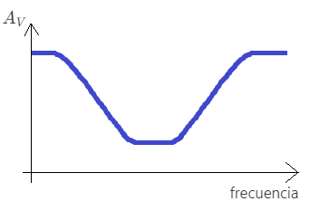

# Respuesta em frecuencia

 Recordatorio 

 

$\mathcal{L} \left\{  e^{-at} \right\} = \frac{1}{s+a}$

$\mathcal{L} \left\{ cos(\omega t) \right\} = \frac{s}{s^s+\omega^2}$

$\mathcal{L} \left\{ sen(\omega t) \right\} = \frac{\omega}{s^s+\omega^2}$

$\mathcal{L} \left\{ cos(\omega t + \phi) \right\} = \frac{s\ cos(\phi) + \omega\ sin(\phi)}{s^s+\omega^2}$

## Filtros pasivos

¿Cuanto vale $v_{out} (t)$ si $v_{in} (t) = 2\cos{(\omega t)}$ ?

 

$H(s) = \frac{1}{RCs+1}$

$V_{in}(s) = 2\frac{s}{s^2+\omega^2}$

$V_{out}(s) = H(s)V_{in}(s) = 2\frac{1}{RCs+1}\frac{s}{s^2+\omega^2}$

Para aplicar la transformada de Laplace inversa necesitamos separar la función resultante en fracciones parciales. Aplicando el método de Heaviside:

$V_{out}(s) = 2\frac{1}{RCs+1}\frac{s}{s^2+\omega^2} = 2\frac{s}{(RCs+1)(s+j\omega)(s-j\omega)} = 2(\frac{A}{RCs+1}+\frac{B}{s+j\omega}+\frac{B^*}{s-j\omega})$

Donde $B^*$ es el complejo cojungado del número complejo $B$

Para encontrar cada coeficiente, basta remover su denominador de la forma original y reemplazar s por el valor de la raiz del término removido:

$ A = \left.\frac{s}{s^2+\omega^2}\right|_{s=-\frac{1}{RC}} = \frac{-\frac{1}{RC}}{(\frac{1}{RC})^2+\omega^2}$

$ B = \left.\frac{s}{(RCs+1)(s-j\omega)}\right|_{s=-j\omega} = \frac{-j\omega}{(-RCj\omega+1)(-j\omega-j\omega)} = \frac{1}{2(-RCj\omega+1)}$

$ B^* = \left.\frac{s}{(RCs+1)(s+j\omega)}\right|_{s=+j\omega} = \frac{j\omega}{(RCj\omega+1)(j\omega+j\omega)} = \frac{1}{2(RCj\omega+1)}$

Como comprobación de los cálculos, notamos que efectivamente $B$ y $B^*$ son números complejos conjugados.

Resolviendo el ejercicio:

$V_{out}(s) = 2(\frac{-\frac{1}{RC}}{(\frac{1}{RC})^2+\omega^2}\frac{1}{RCs+1}+\frac{1}{2(-RCj\omega+1)}\frac{1}{s+j\omega}+\frac{1}{2(RCj\omega+1)}\frac{1}{s-j\omega})$

Si se juntan los dos últimos términos:

$V_{out}(s) = 2(A\frac{1}{RCs+1}+\frac{(RCj\omega+1)(s-j\omega) + (-RCj\omega+1)(s+j\omega)}{2(-RCj\omega+1)(RCj\omega+1)(s+j\omega)(s-j\omega)})$

$V_{out}(s) = 2(A\frac{1}{RCs+1}+\frac{RCj\omega s+s-RCj^2\omega^2-j\omega -RCj\omega s+s -RCj^2\omega^2+j\omega}{2(-RCj\omega+1)(RCj\omega+1)(s+j\omega)(s-j\omega)})$

$V_{out}(s) = 2(A\frac{1}{RCs+1}+\frac{2s + 2RC\omega^2}{2(R^2C^2\omega^2+1)(s^2+\omega^2)})$

$V_{out}(s) = 2(A\frac{1}{RCs+1}+\frac{s + RC\omega^2}{(R^2C^2\omega^2+1)(s^2+\omega^2)})$

Se realize una manipulación algebraica para que el último término sea de la forma $K\frac{s\ cos(\phi) + \omega\ sin(\phi)}{s^s+\omega^2}$ :

$V_{out}(s) = 2(A\frac{1}{RCs+1}+\frac{1}{\sqrt{R^2C^2\omega^2+1}}\frac{s\frac{1}{\sqrt{R^2C^2\omega^2+1}} + \omega\frac{RC\omega}{\sqrt{R^2C^2\omega^2+1}}}{s^2+\omega^2})$

Y finalmente se realiza la transformada de Laplace ivnersa:

$v_{out}(t) = 2Ae^{-\frac{t}{RC}} + 2\frac{1}{\sqrt{R^2C^2\omega^2+1}} cos(\omega t + \phi)$

Donde $\phi = arctan(\frac{RC\omega}{1})$

Si eliminamos los términos transitorios de la respuesta obtenemos su respuesta en estado estacionario:

$v_{out,estado\ estacionario}(t) = 2\frac{1}{\sqrt{R^2C^2\omega^2+1}} cos(\omega t + \phi)$

Se observa que la respuesta en estado estacionario tiene la misma frecuencia que la entrada ($\omega$). Podemos definir la ganancia de voltaje en la frecuencia $\omega$ del circuito como la relación entre la amplitud de la respuesta en estado estacionario y la amplitud de la entrada:

$A_V(\omega) = \frac{|v_{out,estado\ estacionario} (t)|}{|v_{in} (t)|}$

Y en el caso del circuito del ejercicio:

$A_V(\omega) = \frac{2\frac{1}{\sqrt{R^2C^2\omega^2+1}}}{2} = \frac{1}{\sqrt{R^2C^2\omega^2+1}}$

## Bode

Gráfica de $A_V(\omega)$:

En escala logarítimica (en decibeles, $A_{V,dB}(\omega) = 20 \log_{10}(A_V(\omega))$):

## Generalización y tipos de filtros

Al revisar como se dedujo $A_V(\omega)$, se observa que la respuesta del sistema a una entrada sinusoidal siempre tendrá un término con denominador $s^2 + \omega^2$. Es decir, si el sistema es estable, la respuesta en estado estacionario siempre será sinusoidal y con la misma frecuencia de la entrada. Las únicas diferencias entre la entrada y la salida serán la amplitud y la fase. Por lo tanto, para todos los sistemas dinámicos estables podemos definir la ganancia en frecuencia como lo hicimos en el primer ejemplo, y graficarla en un diagrama de Bode.

$A_V(\omega) = \frac{|v_{out,estado\ estacionario} (t)|}{|v_{in} (t)|}$

Dependiendo de la forma del diagrama de Bode, podemos definir distintos tipos de filtros:

|tipo de filtro| forma de $A_V$ vs $frecuencia$ |
| -- | -- |
| filtro pasa-baja |  |
| filtro pasa-alta |  |
| filtro pasa-banda |  |
| filtro rechaza-banda |  |

## Relación entre ganancia en frecuencia, función de transferencia e impedancia

 Recordatorio 

 

$|a+bj| = \sqrt{a^2+b^2}$

$|\frac{1}{a+bj}| = \frac{|1|}{|a+bj|} = \frac{1}{\sqrt{a^2+b^2}}$

$|(a+bj)(c+dj)| = |a+bj||c+dj| = (\sqrt{a^2+b^2})(\sqrt{c^2+d^2})$

$|\frac{a+bj}{c+dj}| = \frac{|a+bj|}{|c+dj|} = \frac{\sqrt{a^2+b^2}}{\sqrt{c^2+d^2}}$

Se puede probar matematicamente que la ganancia en frecuencia de un sistema con función de transferencia $H(s)$ es:

$$A_v(\omega) = |H(j\omega)|$$

Donde $H(j\omega)$ es un número imaginario obtenido al reemplazar $s=j\omega$ en la función de transferencia.

Por ejemplo, para el circuito visto al principio de la clase, como $H(s) = \frac{1}{RCs+1}$:

$A_v(\omega) = |H(j\omega)| = |\frac{1}{RCj\omega+1}|$

$A_v(\omega) = \frac{1}{\sqrt{(RC\omega)^2+1}} = \frac{1}{\sqrt{R^2C^2\omega^2+1}}$

Que es el mismo resultado obtenido de forma manual.

En problemas en lo que nos interesa conocer $A_V(\omega)$, en vez de primero calcular $H(s)$ para luego reemplazar $s=j\omega$, podemos hacerlo al revés y reemplazar $s=j\omega$ desde el principio. En este caso, en vez de reemplazar los capacitores en el circuito por "resistencias" con valores $\frac{1}{C s}$, lo hacemos por el valor $\frac{1}{Cj\omega }$

El resultado es el conocido valor de la impedancia de un capacitor, $\frac{1}{j\omega C}$ o $\frac{-j}{\omega C}$. Es decir, el valor de la impedancia es simplemente la ganancia del componente en estado estacionario, la cual puede depender de la frecuencia.

## capítulos del libro
- Capítulo 9
  - sesión 9.3 y 9.6

## ejercicios recomendados
- Capítulo 9
  - ejercicio 11 (a,b y c)
  - ejercicio 12 (a,b y c - calculen la magnitud del cociente $\frac{V_o}{V_i}$ en vez del ángulo de adelanto)
  - ejercicio 32 (utilicen Matlab en vez de PSpice)
