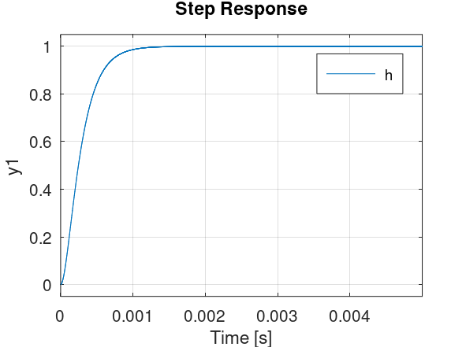
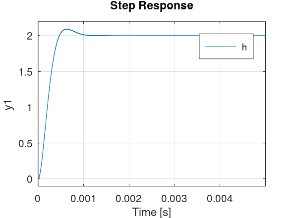
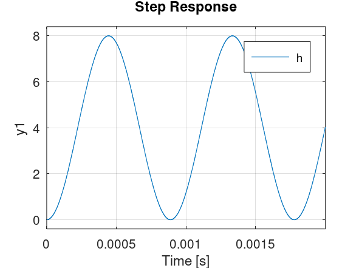
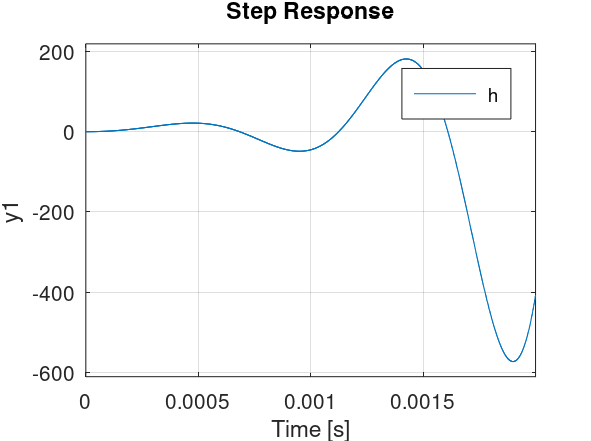
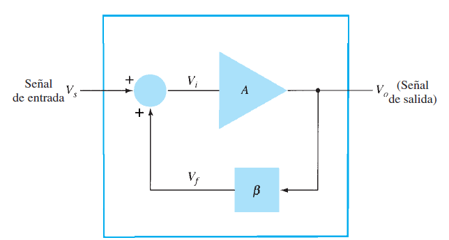
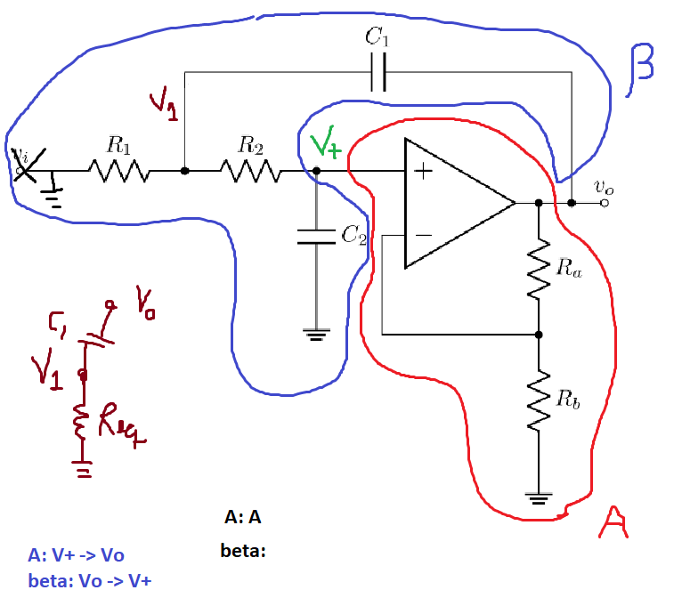
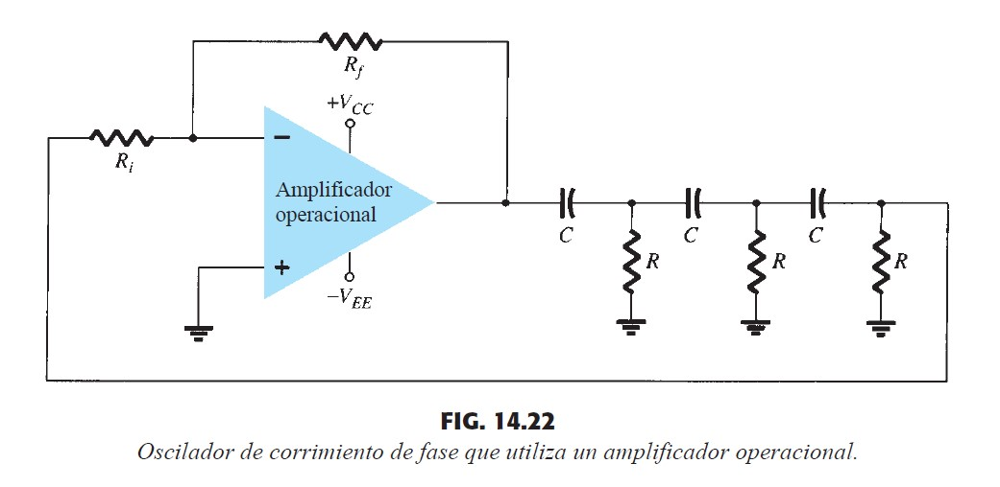

# Osciladores

## Introducción

 

$R_1=10\ k\Omega$ ,$R_2= 2 R_1 = 20\ k\Omega$, $C_1=C_2=10\ nF$ y $R_a=R_b=10\ k\Omega$

$H(s) = \frac{v_o}{v_i} = \frac{2}{ 1 + 2 R_1C_1s+ 2R_1^2C_1^2s^2}$

$ A_v(\omega) = \frac{2}{\sqrt{1 + 4 (R_1C_1 \omega)^4 }}$

$A = \frac{R_a + R_b}{R_b}$

$H(s) = \frac{v_o}{v_i} = \frac{A}{ 1 + (4-A)R_1C_1s + 2R_1^2C_1^2s^2}$

Figura 2: Respuesta a escalón de un sistema con dos pólos reales negativos (A=1)

Figura 3: Respuesta a escalón de un sistema con dos pólos complejos conjugados con parte real negativa (A=2)

Figura 4: Respuesta a escalón de un sistema con dos pólos puramente imaginarios conjugados. (A=4)

Figura 5: Respuesta a escalón de un sistema con dos pólos complejos conjugados con parte real positiva (A=5)

Figura 6: Respuesta a escalón de un sistema con dos pólos reales positivos (A=10)

para simulación de circuitos : https://explore.partquest.com/

## Criterio de oscilación de Barkhausen

$V_o = A V_i$

$V_o = A (V_s + V_f)$

$V_o = A (V_s + \beta V_o)$

$V_o(1 - A \beta)= A V_s $

$\frac{V_o}{V_s} = \frac{A}{1 - A \beta} $

Que pasa cuando $A(j\omega) \beta(j\omega) = 1$ para algún $\omega$ ?

Respuesta: una señal con frecuencia $\omega$ se amplificaría infinitamente por este sistema.

Si $A \beta < 1$ para cierto $\omega_1$, significa que señales con frecuencia $\omega_1$ decaen de amplitud naturalmente cuando se apaga la entrada. 

Si $A \beta > 1$ para cierto $\omega_2$, significa que señales con frecuencia $\omega_2$ aumentan de amplitud naturalmente incluso cuando se apaga la entrada. 

Cuano $A \beta = 1$, para cierto $\omega_3$, significa que señales con frecuencia $\omega_3$ mantienen su amplitud incluso cuando se apaga la entrada. 

## Ejemplo

Aplicando el criterio al circuito inicial:

$V_+ = V_1\frac{1/C_2 s}{1/C_2 s + R_2}$

$V_1 = V_+ (1+R_2C_2s)$

$R_{eq}=R_1 //( R_2 + 1/C_2s)$

$R_{eq}=\frac{1}{1/R_1 + 1/(R_2 + 1/C_2s)}$

$R_{eq}=\frac{1}{1/R_1 + C_2s/(R_2 C_2 s + 1)}$

$R_{eq}=\frac{R_1(R_2 C_2 s + 1)}{(1+R_2 C_2 s + R_1C_2s)}$

$V_1 = \frac{R_{eq}}{R_{eq} + 1/C_1 s} V_o$

$V_+ (1+R_2C_2s) = \frac{\frac{R_1(R_2 C_2 s + 1)}{(1+R_2 C_2 s + R_1C_2s)}}{\frac{R_1(R_2 C_2 s + 1)}{(1+R_2 C_2 s + R_1C_2s)} + 1/C_1 s} V_o$

$V_+ = \frac{\frac{R_1}{(1+R_2 C_2 s + R_1C_2s)}}{\frac{R_1 C_1 s(R_2 C_2 s + 1) + (1+R_2 C_2 s + R_1C_2s)}{(1+R_2 C_2 s + R_1C_2s)C_1 s}} V_o$

$V_+ = \frac{R_1 C_1 s}{R_1 C_1 s(R_2 C_2 s + 1) + 1+R_2 C_2 s + R_1C_2s} V_o$

$\frac{V_+}{V_o} = \frac{R_1 C_1 s}{1 +R_2 C_2 s + R_1C_2s + R_1 C_1 s + R_1 R_2 C_1 C_2 s^2} $

Aplicando criterio de oscilación de Barkhausen:

$A \beta = 1$

$A \frac{R_1 C_1 j \omega}{1 +R_2 C_2 j \omega + R_1C_2j \omega + R_1 C_1 j \omega - R_1 R_2 C_1 C_2 \omega^2} = 1$

$A R_1 C_1 j \omega = 1 +R_2 C_2 j \omega + R_1C_2j \omega + R_1 C_1 j \omega - R_1 R_2 C_1 C_2 \omega^2$

Igualando partes reales e imaginarias:

(1)
$A R_1 C_1 j \omega = R_2 C_2 j \omega + R_1C_2j \omega + R_1 C_1 j \omega $

(2)
$0 = 1  - R_1 R_2 C_1 C_2 \omega^2$

resolviendo (2):

$\omega = \frac{1}{\sqrt{R_1 R_2 C_1 C_2 }} = \frac{1}{R_1 C_1 \sqrt{2}}$

esta es la frecuencia de oscilación del sistema en el caso de que oscile.

resolviendo (1):

$A R_1 C_1  = R_2 C_2  + R_1C_2 + R_1 C_1 $

$A R_1 C_1  = 2 R_1 C_1  + R_1 C_1 + R_1 C_1 $

$A = 4 $

este es el valor de A que genera polos con parte real igual a cero. Es el punto limite en que empieza a oscilar el sistema.

## Ejemplos de Aplicaciones

1. Estudiar estabilidad de los circuitos (por ejemplo, evitar que filtros activos oscilen)
1. Generar señales para terapia (por ejemplo en un marcapaso)
1. Generar señales para diagnóstico y monitoreo (por ejemplo señales de ultrasonido para ecografía)

## Ejercicio

Cuál es el valor minimo de $\frac{R_f}{R_i}$ para que el circuito oscile, y a que frecuencia se produce la señal en este caso ?

## Capítulos del libro
- Capítulo 14
   - sesiones 14.1, 14.2, 14.3, 14.4, 14.5 y 14.7
   
## Ejercicios recomendados
- Capítulo 14
  - sesión 14.2 ejercicio 1
  - sesión 14.7
