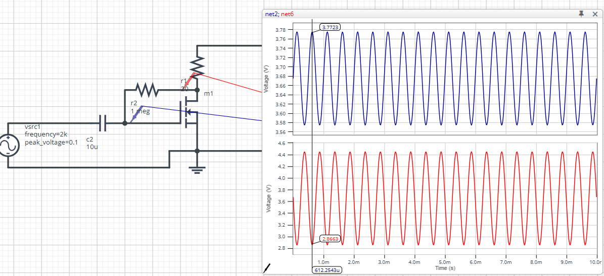
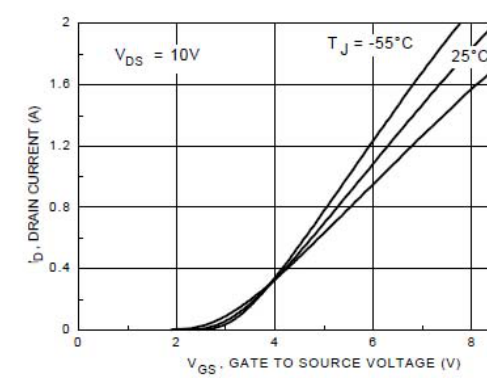

# Uso de Transistores como Amplificadores

## Ecuaciones del NMOS - parte 2 

¿Qué pasa si aumentamos $V_{DS}$ ?

1. $I_G = 0$
1. LKC: $I_S = I_D$
1. relación entre $V_{GS}$ y $I_D$:
   1. (apagado) si $V_{GS} < V_{GS(th)} \implies$ $I_D=0$
   1. (encendido, triodo) si $V_{GS} > V_{GS(th)}$ y $V_{DS} < V_{GS} - V_{GS(th)} \implies$ $V_{DS} = R_{DS(ON)}I_D$
   1. (encendido, saturado) si $V_{GS} > V_{GS(th)}$ y $V_{DS} > V_{GS} - V_{GS(th)} \implies$ $I_D = k(V_{GS}-V_{GS(th)})^2$
   
$V_{GS(th)}$ es el voltaje de umbral en la compuerta y es un valor aproximadamente constante para cada transistor, que depende de su construcción.

$R_{DS(ON)}$ es la resistencia dreno-fuente en estado ON y depende de $V_{GS}$ (cuanto mayor $V_{GS}$, menor $R_{DS(ON)}$), la temperatura y el diseño del MOSFET

k es una constante que también es función de la construcción del dispositivo.

## NMOS como amplificador

Al simular el siguiente circuito con $R_1=20\ \Omega$, $R_2=1\ M \Omega$, $C_1=10\ \mu F$ y $v_i=0.1 cos(\omega t)$ con $\omega = 2 \pi 2000$, se observa que $v_o$ tiene una componente DC constante, más una componente AC que es proporcional a $v_i$. 

Es decir:

$v_{o,DC} = constante$

$v_{o,AC} = A_V v_{i,AC}$

con $A_V \approx -8$

Pero utilizando las formulas teóricas:

(asumiendo $I_{R_2} \approx 0$)

$v_o = 10 - R_1 I_D$

$V_{GS} = v_{o,DC} + v_{i,AC}$

Asumiendo que $Q_1$ está saturado:

$I_D = k(V_{GS}-V_{GS(th)})^2$

$\implies v_o = 10 - R_1 k(V_{GS}-V_{GS(th)})^2 $

$v_o = 10 - R_1 k(v_{o,DC} + v_{i,AC}-V_{GS(th)})^2 $

$v_o = 10 - R_1 k(v_{o,DC}^2 + v_{i,AC}^2 + V_{GS(th)}^2 + 2 v_{o,DC}v_{i,AC}-2 v_{o,DC}V_{GS(th)}-2v_{i,AC} V_{GS(th)}) $

Agrupando los términos con son DC y los que son AC:

$v_{o,DC} = 10 - R_1 k(v_{o,DC}^2  + V_{GS(th)}^2 -2 v_{o,DC}V_{GS(th)}) $

$v_{o,AC} = - R_1 k( v_{i,AC}^2 + 2 v_{o,DC}v_{i,AC}-2v_{i,AC} V_{GS(th)}) $

Simplificando:

$v_{o,DC} = 10 - R_1 k(v_{o,DC}  -V_{GS(th)})^2$ (ecuación 1)

$v_{o,AC} = - R_1 k v_{i,AC}( v_{i,AC} + 2 v_{o,DC}-2 V_{GS(th)}) $ (ecuación 2)

Si resolvemos la ecuación 1, encontramos un valor para $v_{o,DC}$. Esto está de acuerdo con la observación empírica (simulación).

Sin embargo, la ecuación 2 muestra una relación entre $v_{o,AC}$ y $v_{i,AC}^2$, la que no se observó en la simulación. De hecho, lo que se observó fue que:

$v_{o,AC} = A_V v_{i,AC}$

Con $A_V$ constante. Si intentamos imponer el resultado experimental al cálculo teórico, obtenemos:

$A_V v_{i,AC} = - R_1 k v_{i,AC}( v_{i,AC} + 2 v_{o,DC}-2 V_{GS(th)}) $

$A_V  = - R_1 k ( v_{i,AC} + 2 (v_{o,DC}- V_{GS(th)})) $

Todos los términos de $A_V$ son constantes a excepción de $v_{i,AC}$. ¿Existirá alguna condición que nos permita eliminar $v_{i,AC}$ de la ecuación ?

Si imponemos que:

$v_{i,AC} + 2 (v_{o,DC}- V_{GS(th)}) \approx 2 (v_{o,DC}- V_{GS(th)})$

Tenemos:

$\frac{v_{i,AC}}{2 (v_{o,DC}- V_{GS(th)})} + 1 \approx 1$

$\frac{v_{i,AC}}{2 (v_{o,DC}- V_{GS(th)})} \approx 0$

Lo que se puede obtener en la práctica si $v_{i,AC} << 2 (v_{o,DC}- V_{GS(th)})$

En otras palabras, si la señal de entrada es pequeña lo suficiente, la relación entre la salida y la entrada (en AC) es lineal. La condición $v_{i,AC} << 2 (v_{o,DC}- V_{GS(th)})$ se conoce como condición de pequeña señal.

Por lo tanto, si se cumple la condición de pequeña señal:

$v_{o,AC} \approx - R_1 k v_{i,AC}( 2 v_{o,DC}-2 V_{GS(th)}) $

$v_{o,AC} \approx - 2 R_1 k (  v_{o,DC}- V_{GS(th)}) v_{i,AC}$ 

Donde el término $- 2 R_1 k (  v_{o,DC}- V_{GS(th)})$ representa $A_V$. Nótese que la ganancia será negativa una vez que el transistor está encendido y por lo tanto $v_{o,DC}> V_{GS(th)}$.

## Modelo de pequeñas señales

No es practico resolver las ecuaciones completas como se hizo en el ejemplo cada vez que tengamos que encontrar la señal de salida de un circuito con transistores. Por eso, construiremos un modelo del transistor que sea valido cuando se cumple la condición de pequeñas señales y que nos permita obtener la respuesta más rapidamente.

Partiremos asumiendo que el transistor está saturado y que $V_{GS}$ tiene una componente constante $V_Q$ más una señal variable $\Delta V$:

$V_{GS}= V_Q+\Delta V$

Si escribimos la fórmula para $I_D$ en modo saturado:

$I_D = k(V_{GS}-V_{GS(th)})^2$

$I_D = k(V_Q+\Delta V-V_{GS(th)})^2$

$I_D = k(V_Q^2-2V_QV_{GS(th)}+V_{GS(th)}^2+\Delta V^2+2\Delta V V_Q-2\Delta V V_{GS(th)})$

Podemos separa $I_D$ en una parte constante ($I_Q$) y otra parte que depende de $\Delta V $ ($\Delta I$):

$I_D= I_Q+\Delta I$

Con:

$I_Q = k(V_Q^2-2V_QV_{GS(th)}+V_{GS(th)}^2)= k(V_Q-V_{GS(th)})^2$

$\Delta I = k(\Delta V^2+2\Delta V V_Q+-2\Delta V V_{GS(th)}) =k\Delta V(\Delta V+2 V_Q-2 V_{GS(th)})$

Lo que implica en una ecuación para encontrar el punto fijo (constante) de operación:

$I_Q = k(V_Q-V_{GS(th)})^2$

Y otra ecuación que relaciona cuanto varia de $I_D$ ($\Delta I$) dependiendo de cuanto varia $V_{GS}$ ($\Delta V$):

$\Delta I =k(\Delta V+2 V_Q-2 V_{GS(th)})\Delta V$

Nuevamente, si imponemos la condición de pequeñas señales $\Delta V<<2 (V_Q- V_{GS(th)})$, la ecuación se simplifica y muestra una relación lineal entre $\Delta I$ y $\Delta V$:

$\Delta I =2k(V_Q- V_{GS(th)})\Delta V$

$g_m = \frac{\Delta I}{\Delta V} =2k(V_Q- V_{GS(th)})$

La relación entre una corriente y un voltaje es una conductancia. Como se trata de la corriente en un terminal distinto que el voltaje ($I_D$ vs $V_{GS}$), la relación $\frac{\Delta I}{\Delta V}$ se denomina transconductancia, y se simboliza como $g_m$ o $g_{ _{FS}}$. 

La transconductancia tiene como unidad A/V (también denominada Siemens (S) en el sistema internacional). Las hojas de datos de los MOSFET suelen especificar $g_{ _{FS}}$ en vez de $k$.

Así, cuando se están analizando las pequeñas señales, el transistor se comporta como una fuente de corriente, cuyo valor es $g_{ _{FS}} \Delta V$:

Los resultados nos muestran que podemos analizar el transistor en modo saturado en dos pasos:

Paso 1: resolver la corriente y el voltaje en el punto fijo (constante) $I_Q$ y $V_Q$ utilizando la ecuación completa del transistor (o su gráfica de la hoja de datos)
   - utilizando la ecuación: $I_D = k(V_{GS}-V_{GS(th)})^2$
   - utilizando la gráfica de la hoja de datos, por ejemplo:
      

Paso 2: resolver la relación entre las pequeñas señales que se suman al punto fijo ($\Delta V_{GS}$, $\Delta I_D$, $\Delta V_{DS}$ etc) utilizando el modelo de pequeñas señales del mosfet:
   - $\Delta I_D = g_{ _{FS}} \Delta V_{GS}$

## Relación entre $k$ y $g_m$

Como visto podemos relacionar $k$ y $g_m$ a través de la siguiente relación:

$g_m = \frac{\Delta I_D}{\Delta V_{GS}} =2k(V_Q- V_{GS(th)})$

También es posible deducir esta relación considerando que si $\Delta V_{GS}$ es pequeño, el valor de $g_m$ es aproximadamente el valor de la derivada de $I_D$ con relación a $V_{GS}$ (en el punto fijo Q):

$g_m = \frac{d I_D}{dV_{GS}} = \frac{d (k(V_{GS}-V_{GS(th)})^2)}{dV_{GS}}$

$g_m = 2 k(V_{GS}-V_{GS(th)})$

$g_m = 2 k(V_{Q}-V_{GS(th)})$

## Ejemplo

Dado el circuito de ejemplo del principio de la clase, calcular $A_V = \frac{amplitud(v_o)}{amplitud(v_i)}$.

Consideren que $R_1=20\ \Omega$, $R_2=1\ M \Omega$, $C_1=10\ \mu F$, $V_{GS(th)}=2.1\ V$ y $k=0.128\ \frac{A}{V^2}$

Paso 1:

Ignorando $I_{R_2}$ y asumiendo que $Q_1$ está saturado:

$I_D = k(V_{GS}-V_{GS(th)})^2$

$\frac{10-V_Q}{R_1} = k(v_{o}-2.1)^2$

$10-V_Q = 2.56(v_{o}^2-4.2 V_Q+2.1^2)$

$10-V_Q = 2.56v_{o}^2-10.752 V_Q+ 11.29$

$2.56v_{o}^2-9.752 V_Q+ 1.29 = 0$

$V_Q \approx 3.7\ V $

(se ignora la segunda respuesta $V_Q \approx 0.14\ V $ pues se asumió que $Q_1$ está encendido (saturado) y por lo tanto $V_{GS} > V_{GS(th)} \implies V_Q > 2.1\ V$)

$I_Q = k(V_{Q}-V_{GS(th)})^2$

$I_Q = 0.128(3.7-2.1)^2\approx 330\ mA$

Paso 2:

Al reemplazar $Q_1$ por su modelo de pequeñas señales, considerando sólo la parte variable (AC) de las señales (ignorando las señales constantes como $V_Q$ y $+10\ V$), ignorando $I_{R_2}$ y, además, considerando que $C_2$ es aproximadamente un corto-circuito en la frecuencia de $v_i$:

$\Delta I_D = g_m \Delta V_{GS}$

Con $g_m = 2 k (V_Q-V_{GS(th)}) = 2*0.128(3.7-2.1)\approx 0.41\ \frac{A}{V}$

$\frac{0-v_o}{R_1} = g_m v_i$

$-v_o = R_1 g_m v_i$

$v_o = - R_1 g_m v_i$

Por lo tanto:

$A_V = \frac{amplitud(v_o)}{amplitud(v_i)} = -R_1 g_m = -20*0.41 \approx -8$

## Bibliografia

Boylestad, R. & Nashelsky, L. (2009). Electrónica: Teoría de circuitos y dispositivos electrónicos (10ma.ed.)

### Capítulos
- Capítulo 8, sesiones 9, 10, 11 y 14

### Ejercícios Recomendados
- Capítulo 8
  - Sesíon 8.10: ejs 38, 39, 40, 41, 42
  - Sesión 8.11: ej 43
