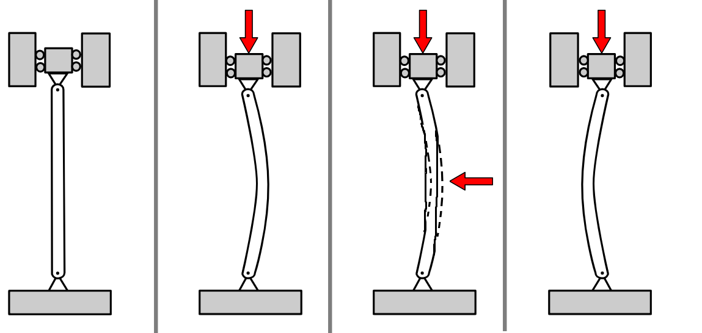
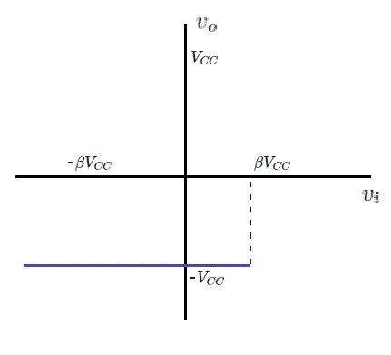
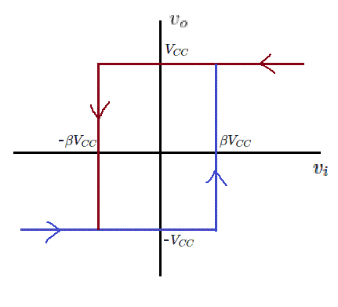
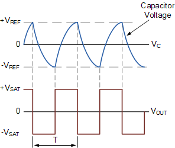

# Multivibradores

## Introducción

Los multivibradores son sistemas dinámicos que poseen 2 estados, y se clasifican de acuerdo a cuantos de estos estados son estados: 
1. Si ambos estados son estados, se denomina multivibrador biestable
2. Si ninguno de los estados es estable, se denomina multivibrador astable 
3. Si apenas 1 de los estados es estable, se denomina multivibrador monoestable

## 1. Multivibrador biestable

### Ejemplo mecanico

Un ejemplo mecánico de un multivibrador biestable es una barra comprimida en su dirección longitudinal, conforme indica la figura a continuación

La barra forma una curva para equilibrar los esfuerzos en ella aplicados. Si se intenta deshacer la curva aplicando un segundo esfuerzo, se observa que al dejar de realizar dicho esfuerzo, la barra vuelve a la configuración con la curva. Sin embargo, si el esfuerzo es grande lo suficiente, se observa que la barra "salta" a una segunda configuración, donde la curva está para el lado opuesto. Esta segunda configuración es estable, pues nuevamente al intentar moverla y soltar, la barra simplemente vuelve a formar la curva.

La barra por lo tanto es un sistema con 2 estados estables: curvado hacia la izquierda y curvado hacia la derecha. Para pasar de un estado a otro, es necesario aplicar un esfuerzo y desplazar la barra hasta que supere cierto umbral,  momento en el cual el sistema "salta" al otro estado estable. 
Como curiosidad, cuando el fenomeno estructural descrito anteriormente se conoce como pandeo.

### Comparador

Con respecto a circuitos eléctricos biestables, en realidad ya hemos estudiado un ejemplo: el comparador.

La salida del amplificador operacional depende de la diferencia entre $V_+$ y $V_-$: si es positiva la salida se satura con el voltaje de almientación positiva, y si la diferencia es negativa la salida se satura con el voltaje de alimentación negativo. El sistema, por lo tanto, tiene dos estados estables: salida en $+V_{CC}$ y salida en $-V_{CC}$. Al igual que en el caso mecanico, perturbar la entrada no cambia la salida a menos que se supere cierto umbral (0 V, en este caso), lo que hace con que el sistema "salte" a la otra configuración estable.

Al utilizar el comparador en circuitos eléctricos para comparar señales se puede encontrar el problema de "rebote". Debido a que las señales reales pueden contener ruido, el cruce cuando una señal pasa de ser menor que la referencia a ser mayor puede no ser tan claro. Como se indica en la imagen a continuación, puede que hayan varios cruces de polaridad en el momento en que las dos señales tienen valores cercanos. La señal superior es la salida del amplificador.

Para corregir el fenomeno de "rebote", se puede modificar el circuito del comparador para que tenga dos umbrales distintos: uno para transicionar de $-V_{CC}$ a $+V_{CC}$, y otro para cambiar en la dirección contraria. Dichos comparadores se denominan comparadores con histeresis, o comparadores schmitt.

### Comparador Schmitt

Una posible implementación del comparador schmitt se muestra a continuación.

Para analizarlo, se considera el voltaje en $V_+$, el cual estará dado por el divisor resistivo compuesto por $R_8$ y $R_9$:

$$ V_+ = \frac{R_9 v_i + R_8 v_o}{R_8 + R_9}$$

Si definimos $\beta = \frac{R_8}{R_9}$, se obtiene:

$$ V_+ = \frac{ v_i + \beta v_o}{\beta + 1}$$

Si suponemos que $V_+ < V_-$, la salida del amplificador es $-V_{CC}$. Dicha condición se mantendrá mientras la inegualdad sea verdadera. Por lo tanto:

$$V_+ < V_-$$

$$ \frac{ v_i + \beta v_o}{\beta + 1} <0 $$

$$ v_i - \beta V_{CC} <0 $$

$$ v_i < \beta V_{CC} $$

Es decir, mientras la entrada se mantenga menor que $\beta V_{CC}$, la salida se mantendrá en $-V_{CC}$. Si se grafica el resultado en una gráfica de $v_o$ por $v_i$, se obtiene la siguiente figura:

Analicemos el otro caso, en que $V_+ > V_-$. La salida del amplificador será $+V_{CC}$, y dicha condición se mantendrá mientras la inegualdad sea verdadera:

$$V_+ > V_-$$

$$ \frac{ v_i + \beta v_o}{\beta + 1} > 0 $$

$$ v_i + \beta V_{CC} > 0 $$

$$ v_i > - \beta V_{CC} $$

Es decir, mientras la entrada se mantenga mayor a $- \beta V_{CC}$, la salida se mantendrá en $+V_{CC}$. Si se grafica el resultado en la gráfica anterior de $v_o$ por $v_i$, se obtiene la siguiente figura:

Primeramente, notese que $v_o$ tiene dos posibles valores: $-V_{CC}$ o $+V_{CC}$. Se trata, por lo tanto, de un multivibrador. Además, cuando la salida cambia a uno de estos valores, se mantiene en él si no cambian las condiciones de entrada. Son, por lo tanto, dos estados estables. Se trata por lo tanto de un multivibrador biestable. 

Sin embargo, esta configuración contiene una característica peculiar que lo distingue del comparador tradicional. Si la entrada está entre $-\beta V_{CC}$ y $+\beta V_{CC}$, la salida puede estar en alguno de los dos estados. Solamente la información del valor de $v_i$ es insuficiente para determinar en cual de los dos. Es necesario saber, también, el pasado del circuito. Si antes de entrar en la región entre $-\beta V_{CC}$ y $+\beta V_{CC}$ $v_i$ era mayor que $+\beta V_{CC}$, la salida estará en $+V_{CC}$. Si, en el caso contrario, $v_i$ era menor que $-\beta V_{CC}$ antes de entrar a la región central, la salida se mantiene en $-V_{CC}$. Por ésta razon se dice que el comparador con histeresis es un circuito con memoria, y se puede utilizar como bloque básico para construir circuitos digitales.

Otra forma de entender el circuito es observar que el umbral de $v_i$ para hacer la salida cambiar a $+V_{CC}$ es $+\beta V_{CC}$, pero el umbral de $v_i$ para hacer la salida cambiar a $-V_{CC}$ es $-\beta V_{CC}$. Es decir, el comparador tiene dos umbrales distintos. Es ésta característica que lo hace muy útil para minimizar el fenómeno de rebote descrito anteriormente. Esto porque al cruzar el umbral positivo por primera vez, será más dificil que el voltaje cruce el umbral negativo que se encuentra más bajo por diversos milivolts. Se generan transiciones más limpias, en este caso.

## 2. Multivibrador astable

El segundo tipo de multivibrador es el multivibrados astable, en el cual ninguno de los dos estados es estable. Se puede construir un circuito de mulitivbrador astable basado en el comparador con histeresis con apenas la adición de un resistor y un capacitor, conforme se muestra en la figura a continuación:

Igual que en el caso del comparador, los dos estados del sistema son $v_o=+V_{bias}$ y $v_o=-V_{bias}$. Es decir, la salida es igual al voltaje de alimentación positivo o negativo. 

A grande razgos, el funcionamiento del sistema es el siguiente: cuando la salida del amplificador es positiva, el capacitor $C_4$ empieza a cargarse y elevar el voltaje en la entrada inversora ($V_-$). Eventualmente, $V_-$ se eleva tanto que sobrepasa $V_+$, haciendo con que el comparador cambie su salida al voltaje negativo. Cuando eso ocurre, el capacitor $C_4$ empieza a descargarse y disminuir el voltaje $V_-$. Eventualmente, $V_-$ disminuye tanto que se vuelve más negativo que $V_+$, y el ciclo se repite. En resúmen, la salida del amplificador hace con que el voltaje del capacitor cambie en la dirección que eventualmente cambia la salida.

En términos matemáticos, si nuevamente utilizamos la definición $\beta = \frac{R_9}{R_8}$, el valor de $V_+$ siempre será $\beta v_o$. Por lo tanto, la transición de $v_o = -V_{bias}$ a $v_o = +V_{bias}$ debe ocurrir cuando $V_- = -\beta V_{bias}$. En dicho instante, $C_4$ se empezará a cargar de acuerdo a la respuesta del circuito RC compuesto por $R_{10}$ y $C_4$, con valor inicial $-\beta V_{bias}$ y entrada $+V_{bias}$. Si consideramos la siguiente expresión para la carga de un circuito RC:

$$ v = V_{final} - (V_{final}  -V_{inicial})e^\frac{-t}{RC}$$

Reemplazando los valores $V_{inicial} = -\beta V_{bias}$ , $V_{final} = +V_{bias}$ , $R = R_{10}$ y $C = C_4$ ,se obtiene la siguiente expresión:

$$ V_- = +V_{bias} - (+V_{bias}  +\beta V_{bias})e^\frac{-t}{R_{10}C_4}$$

$$ V_- = V_{bias} (1 - (1 +\beta )e^\frac{-t}{R_{10}C_4})$$

Que es una función creciente, conforme esperado. Como $v_o = +V_{bias}$ , $V_+ = \beta V_{bias}$ . Por lo tanto, el valor de $V_-$ seguirá creciendo hasta que supere $V_+ = \beta V_{bias}$ , momento en el cual la salida pasará a $-V_{bias}$, pues $V_- > V_+$. Si se define el tiempo necesario para alcanzar dicho valor como $\frac{T}{2}$ , se tiene:

$$ \beta V_{bias} = V_{bias} (1 - (1 +\beta )e^\frac{-T}{2 R_{10}C_4})$$

$$ \beta  = 1 - (1 +\beta )e^\frac{-T}{2 R_{10}C_4}$$

$$ e^\frac{-T}{2 R_{10}C_4} = \frac{1-\beta}{1+\beta}$$

$$ \frac{-T}{2 R_{10}C_4} = \ln{\frac{1-\beta}{1+\beta}}$$

$$ \frac{T}{2} = R_{10}C_4 \ln{\frac{1+\beta}{1-\beta}}$$

Analogamente, se puede analizar el tiempo que el sistema demora en descargar el capacitor hasta $-\beta V_{bias}$, y se llega exactamente a la misma expresión. Por lo tanto, la salida del multivibrador astable oscila entre $+V_{bias}$ y $-V_{bias}$ con período T, o, de forma equivalente, con frecuencia $f = \frac{1}{T}$. 

$$ T = 2 R_{10}C_4 \ln{\frac{1+\beta}{1-\beta}}$$

La siguiente figura muestra las formas de onda, donde se definió $V_{SAT} = V_{bias}$ y $V_{REF} = \beta V_{bias}$ :

## 3. Multivibrador monoestable

El último tipo de multivibrador es el monoestable, el cual tiene un estado estable y otro estado "cuasi-estable". El multivibrador monoestable, cuando libre de perturbaciones exteriores, se mantiene en su estado estable. Cuando perturbado de la manera apropiada, cambia su estado al "cuasi-estable", se mantiene un período de tiempo predeterminado, y luego vuelve a estar en su estado estable. De ésa forma, es un sistema que produce un cambio de estado después de un valor fijo de tiempo. 

Una posible implementación del multivibrador monoestable en circuitos electrónicos se muestra en la figura a continuación.

El circuito está basado en el multivibrador astable, ya que éste implementa un mecanismo para cambiar de estado después de un tiempo fijo. Para convertirlo en un monoestable, simplemente se agrega el diodo $D_3$, que interrumpe la descarga del capacitor $C_4$ cuando $v_o = -V_{bias}$. En dicha condición, el diodo se polariza en directa y efectivamente corto-circuita el capacitor $C_4$, impidiendo que el voltaje $V_-$ siga bajando. De ésta forma, $V_-$ no llega a $-\beta V_{bias}$, y no ocurre la transición de $v_o = - V_{bias}$ a $v_o = + V_{bias}$. El estado estable, por lo tanto, es $v_o = - V_{bias}$. Si se asume un diodo ideal, $V_- = 0$ en el estado estacionario del estado estable.

El subcircuito compuesto por $C_3$, $R_7$ y $D_2$ es un circuito gatillo cuyo objetivo es gatillar la transición del monoestable a su estado casi-estable. En este caso esécífico, el objetivo es elevar $V_+$ (que normalmente está en $-\beta V_{bias}$) por sobre 0 momentaneamente. Cuando eso ocurre, $V_+ > V_-$ y el comparador cambia la salida a $+V_{bias}$. Asumiendo que el voltaje en $D_2$ se vuelve negativo después de la transición, el diodo estará cortado y el circuito gatillo deja de influenciar el resto del circuito. El análisis a partir de éste punto es bastante similar al astable: $C_4$ empezará a cargarse a través de $R_{10}$, siguiendo la siguiente expresión:

$$ v = V_{final} - (V_{final}  -V_{inicial})e^\frac{-t}{RC}$$

Reemplazando los valores $V_{inicial} = 0$ , $V_{final} = +V_{bias}$ , $R = R_{10}$ y $C = C_4$ ,se obtiene la siguiente expresión:

$$ V_- = +V_{bias} - (+V_{bias} - 0)e^\frac{-t}{R_{10}C_4}$$

$$ V_- = V_{bias} (1 - e^\frac{-t}{R_{10}C_4})$$

Eventualmente, $V_-$ alcanza $V_+ = \beta V_{bias}$ y el monoestable vuelve a su estado estable con $v_o = - V_{bias}$. El tiempo en transición $T_t$, contado desde el momento en que el monoestable cambia al estado casi-estable hasta en instante donde vuelve a su estado natural se puede calcular como:

$$ \beta V_{bias} = V_{bias} (1 - e^\frac{-T_t}{R_{10}C_4})$$

$$ \beta  = 1 - e^\frac{-T_t}{R_{10}C_4}$$

$$ e^\frac{-T_t}{R_{10}C_4} = 1- \beta$$

$$ \frac{-T_t}{R_{10}C_4} = \ln (1- \beta)$$

$$ -T_t = R_{10}C_4\ln (1- \beta)$$

$$ T_t = R_{10}C_4\ln \frac{1}{1- \beta}$$

La siguiente figura muestra un bosquejo de las formas de onda del circuito, siendo la primera señal el voltaje sobre $R_7$.

