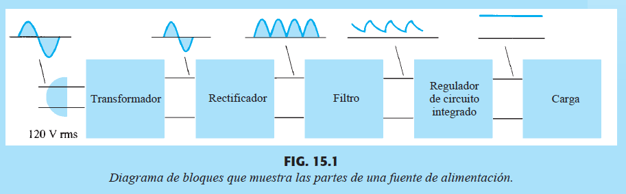
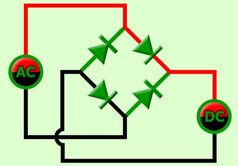
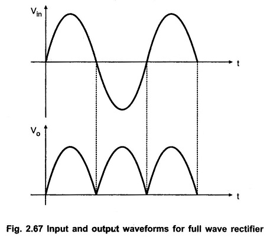
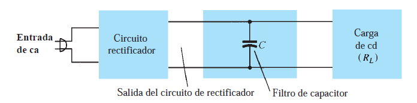
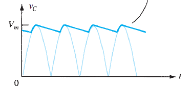

# Reguladores de Voltaje

## Introducción

El objetivo de esta clase y la siguiente es completar el conocimiento necesario para entender el funcionamiento completo de una fuente de alimentación.

En el ambiente de trabajo, la fuente de energía eléctrica es típicamente una fuente de corriente alterna (220 V @ 50 Hz en Chile, por ejemplo). Sin embargo, practicamente todos los circuitos electrónicos estudiados en este ramo requieren de una fuente de alimentación de corriente contínua. Para poder convertir la fuente ca en un voltaje cc, se utilizan las fuentes de alimentación. Un diagrama simplificado del funcionamiento de una fuente de alimentación se muestra a continuación.

Figura 1: Diagrama de bloques de una fuente de alimentación y formas de onda intermedias

### Transformador

La primera etapa es normalmente un transformador, el que baja el voltaje (por ejemplo de 220 V rms a 18 V rms) y provee aislamento galvanico entre la fuente y la carga. El aislamiento galvánico es una separación física y eléctrica entre dos circuitos, permitiendo la transferencia de energía o señales sin conexión eléctrica directa, lo que previene interferencias, bucles de tierra y aumenta la seguridad al separar diferentes potenciales eléctricos (como la tierra de una red de la de un dispositivo). En el caso del transformador, se logra transmitir la energía convirtiendo el voltaje alterno de la fuente en flujo magnético a través de una bobina, y luego, en una segunda bobina aislada eléctricamente de la primera, convirtiendo el flujo magnético de nuevo en un voltaje alterno.

### Rectificador

La segunda etapa es un Rectificador. Hemos estudiado rectificadores en las clases 10 y 11 en el contexto del estudio de diodos. Como recordatorio, el siguiente circuito convierte un voltaje alterno (con parte positiva y negativa) en un voltaje rectificado que solamente tiene voltajes positivos:

Figura 2: Rectificador de onda completa

Figura 3: Animación mostrando el funcionamiento del rectificador de onda completa

Figura 4: Forma de onda de la entrada y salida del rectificador de onda completa

### Filtro

Una vez que se tiene la señal rectificada, es necesario eliminar las oscilaciones. Al analizar la serie de fourier de la señal $V_o$ de la figura 4, por ejemplo, se puede mostrar que tiene una componente DC correspondiente a $\frac{2V_{max}}{\pi} \approx 0.637 V_{max}$ y diversas componentes AC con frecuencias multiples del doble de la frecuencia inicial. Por lo tanto, al aplicar un filtro pasa-baja ideal, que fuera capaz de eliminar todas las componentes AC, se debería obtener una señal de corriente contínua de $0.637 V_{max}$ voltios.

Una forma simple de filtrar las componentes AC es introducir un capacitor a la salida del rectificador, conforme a siguiente figura:

Figura 5: Filtro de capacitor

Durante la parte ascendiente de la señal rectificada, el capacitor se carga, elevando su voltaje junto con la señal de entrada hasta que llega al punto más alto. Una vez que la señal rectificada empieza a bajar, los diodos del rectificador dejan de conducir, y el capacitor mantiene el voltaje elevado. Como la carga consume cierta corriente, el capacitor se descarga, pero se elige un valor de capacitancia suficientemente alto para que el tiempo de descarga sea mucho más alto que el período de la señal de entrada. De ésta forma, el capacitor se vuelve a cargar en el siguiente ciclo de la señal rectificada, conforme muestra la figura a continuación:

Figura 6: Señal del filtro de capacitor

## Reguladores de Voltaje

Incluso con buenos filtros, la salida del rectificador filtrada no es completamente constante. Además, es posible que el valor de voltaje promedio obtenido no sea el necesario para alimentar los otros circuitos del sistema electrónico. Por lo tanto, se requiere un último bloque en la fuente de alimentación que termina de estabilizar el voltaje y también ajusta su valor. Este último bloque se conoce como regulador de voltaje.

Para las siguientes secciones supongamos que el voltaje después del filtro tiene un valor promedito de 10 V y una oscilación (rizo) de 100 mV peak-to-peak, y que se requiere un voltaje regulado de $5\ V \pm 10\ mV$. Supongamos también que los circuitos que necesitan los 5 V de alimentación consumen hasta 500 mA en total.

#### Primer intento de Regulador

Como el objetivo es bajar el voltaje promedio de 10 V a 5 V, un primer circuito para lograr el objetivo es un divisor de voltaje:

Si $R_1=R_2$, $v_o =\frac{v_i}{2}$. Esto se aplica tanto al promedio cuanto al rizo, por lo que la oscilación del voltaje de salida también se reducirá por la mitad, a 50 mV peak-to-peak.

La última restricción del diseño es que el circuito sea capaz de alimentar hasta 500 mA de corriente. Al considerar que el circuito que se conecta a $v_o$ consume $i_{carga} = 500 mA$, podemos calcular de qué forma se afecta $v_o$, aplicando LKC:

$\frac{v_i-v_o}{R_1} = \frac{v_o}{R_2} + i_{carga}$

$\frac{v_i-v_o}{R_1} = \frac{v_o}{R_2} + 500\ mA$

$v_o(\frac{1}{R_1}+\frac{1}{R_2}) - \frac{v_i}{R_1}+0.5 = 0$

$v_o(\frac{R_1+R_2}{R_2}) = v_i-0.5 R_1$

Como $R_1=R_2$ y $v_i=10\ V$,

$v_o(2) = 10-0.5 R_1$

$v_o = \frac{10-0.5 R_1}{2}$

$v_o = 5-0.25 R_1$

Es decir, el voltaje regulado disminuye de forma proporcional al valor de las resistencias. Para que esta disminución sea lo más pequeña posible, es deseable que $R_1$ y $R_2$ tengan el menor valor posible. Por ejemplo, si se tolera una disminución de hasta 10 mV en el voltaje regulado, se necesitaría:

$0.25 R_1 = 0.01$

$\implies  R_1 = 0.04\ \Omega$

El problema con utilizar resistencias tan pequeñas, sin embargo, es que el consumo de corriente (y por lo tanto energía) del regulador sería muy alto. Si $R_1 = R_2 = 0.04\ \Omega$, por ejemplo, el divisor de voltaje por sí sólo consumiría $i_b = \frac{v_i}{R_1+R_2} = \frac{10}{0.04+0.04} = 125 A$.

Para evaluar si este consumo de corriente es aceptable introduzcamos una definición de eficiencia ($\eta$) del regulador de voltaje. Consideraremos que la eficiencia es la potencia consumida por la carga dividida por la potencia total consumida por el sistema regulador + carga.

$\eta_{regulador} = \frac{potencia(carga)}{potencia(total)}$

Para el ejemplo con el divisor de voltaje,

$\eta = \frac{v_{carga}i_{carga}}{v_i(i_{carga}+i_b)}$

$\eta = \frac{5 * 0.5}{10(0.5+125)}$

$\eta = \frac{2.5}{1255}\approx 0.002$

Es decir, la eficiencia del regulador es de 0.2 %. Podríamos aumentar la eficiencia disminuyendo el valor de las resistencias, pero esto generaría una mayor variación de $v_o$ por la corriente que consume la carga.

Este ejemplo no es una coincidencia, en general **divisores de voltaje son pésimos reguladores de voltaje**.

#### Segundo intento de Regulador

ffd

## Capítulos del libro
- Capítulo 15
   - sesiones 15.1, 15.5 y 15.6
   
## Ejercicios recomendados
- Capítulo 15
  - sesión 15.5 ejercicios 19, 21, 23, 26 y 27
