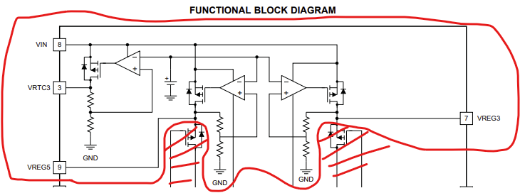
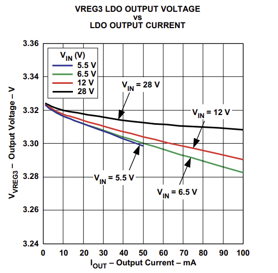

# Reguladores de Voltaje

## Introducción

El objetivo de esta clase y la siguiente es completar el conocimiento necesario para entender el funcionamiento completo de una fuente de alimentación.

En el ambiente de trabajo, la fuente de energía eléctrica es típicamente una fuente de corriente alterna (220 V @ 50 Hz en Chile, por ejemplo). Sin embargo, practicamente todos los circuitos electrónicos estudiados en este ramo requieren de una fuente de alimentación de corriente contínua. Para poder convertir la fuente ca en un voltaje cc, se utilizan las fuentes de alimentación. Un diagrama simplificado del funcionamiento de una fuente de alimentación se muestra a continuación.

Figura 1: Diagrama de bloques de una fuente de alimentación y formas de onda intermedias

### Transformador

La primera etapa es normalmente un transformador, el que baja el voltaje (por ejemplo de 220 V rms a 18 V rms) y provee aislamento galvanico entre la fuente y la carga. El aislamiento galvánico es una separación física y eléctrica entre dos circuitos, permitiendo la transferencia de energía o señales sin conexión eléctrica directa, lo que previene interferencias, bucles de tierra y aumenta la seguridad al separar diferentes potenciales eléctricos (como la tierra de una red de la de un dispositivo). En el caso del transformador, se logra transmitir la energía convirtiendo el voltaje alterno de la fuente en flujo magnético a través de una bobina, y luego, en una segunda bobina aislada eléctricamente de la primera, convirtiendo el flujo magnético de nuevo en un voltaje alterno.

### Rectificador

La segunda etapa es un Rectificador. Hemos estudiado rectificadores en las clases 10 y 11 en el contexto del estudio de diodos. Como recordatorio, el siguiente circuito convierte un voltaje alterno (con parte positiva y negativa) en un voltaje rectificado que solamente tiene voltajes positivos:

Figura 2: Rectificador de onda completa

Figura 3: Animación mostrando el funcionamiento del rectificador de onda completa

Figura 4: Forma de onda de la entrada y salida del rectificador de onda completa

### Filtro

Una vez que se tiene la señal rectificada, es necesario eliminar las oscilaciones. Al analizar la serie de fourier de la señal $V_o$ de la figura 4, por ejemplo, se puede mostrar que tiene una componente DC correspondiente a $\frac{2V_{max}}{\pi} \approx 0.637 V_{max}$ y diversas componentes AC con frecuencias multiples del doble de la frecuencia inicial. Por lo tanto, al aplicar un filtro pasa-baja ideal, que fuera capaz de eliminar todas las componentes AC, se debería obtener una señal de corriente contínua de $0.637 V_{max}$ voltios.

Una forma simple de filtrar las componentes AC es introducir un capacitor a la salida del rectificador, conforme a siguiente figura:

Figura 5: Filtro de capacitor

Durante la parte ascendiente de la señal rectificada, el capacitor se carga, elevando su voltaje junto con la señal de entrada hasta que llega al punto más alto. Una vez que la señal rectificada empieza a bajar, los diodos del rectificador dejan de conducir, y el capacitor mantiene el voltaje elevado. Como la carga consume cierta corriente, el capacitor se descarga, pero se elige un valor de capacitancia suficientemente alto para que el tiempo de descarga sea mucho más alto que el período de la señal de entrada. De ésta forma, el capacitor se vuelve a cargar en el siguiente ciclo de la señal rectificada, conforme muestra la figura a continuación:

Figura 6: Señal del filtro de capacitor

## Reguladores de Voltaje Lineales

Incluso con buenos filtros, la salida del rectificador filtrada no es completamente constante. Además, es posible que el valor de voltaje promedio obtenido no sea el necesario para alimentar los otros circuitos del sistema electrónico. Por lo tanto, se requiere un último bloque en la fuente de alimentación que termina de estabilizar el voltaje y también ajusta su valor. Este último bloque se conoce como regulador de voltaje.

Para las siguientes secciones supondremos que el voltaje después del filtro tiene un valor promedito de 10 V y una oscilación (rizo) de 100 mV peak-to-peak, y que se requiere un voltaje regulado de $5\ V \pm 10\ mV$. Supongamos también que los circuitos que necesitan los 5 V de alimentación consumen hasta 500 mA en total.

#### Primer intento de Regulador

Como el objetivo es bajar el voltaje promedio de 10 V a 5 V, un primer circuito para lograr el objetivo es un divisor de voltaje:

Si $R_1=R_2$, $v_o =\frac{v_i}{2}$. Esto se aplica tanto al promedio cuanto al rizo, por lo que la oscilación del voltaje de salida también se reducirá por la mitad, a 50 mV peak-to-peak.

La última restricción del diseño es que el circuito sea capaz de alimentar hasta 500 mA de corriente. Al considerar que el circuito que se conecta a $v_o$ consume $i_{carga} = 500 mA$, podemos calcular de qué forma se afecta $v_o$, aplicando LKC:

$\frac{v_i-v_o}{R_1} = \frac{v_o}{R_2} + i_{carga}$

$\frac{v_i-v_o}{R_1} = \frac{v_o}{R_2} + 500\ mA$

$v_o(\frac{1}{R_1}+\frac{1}{R_2}) - \frac{v_i}{R_1}+0.5 = 0$

$v_o(\frac{R_1+R_2}{R_2}) = v_i-0.5 R_1$

Como $R_1=R_2$ y $v_i=10\ V$,

$v_o(2) = 10-0.5 R_1$

$v_o = \frac{10-0.5 R_1}{2}$

$v_o = 5-0.25 R_1$

Es decir, el voltaje regulado disminuye de forma proporcional al valor de las resistencias. Para que esta disminución sea lo más pequeña posible, es deseable que $R_1$ y $R_2$ tengan el menor valor posible. Por ejemplo, si se tolera una disminución de hasta 10 mV en el voltaje regulado, se necesitaría:

$0.25 R_1 = 0.01$

$\implies  R_1 = 0.04\ \Omega$

El problema con utilizar resistencias tan pequeñas, sin embargo, es que el consumo de corriente (y por lo tanto energía) del regulador sería muy alto. Si $R_1 = R_2 = 0.04\ \Omega$, por ejemplo, el divisor de voltaje por sí sólo consumiría $i_b = \frac{v_i}{R_1+R_2} = \frac{10}{0.04+0.04} = 125 A$.

Para evaluar si este consumo de corriente es aceptable introduzcamos una definición de eficiencia ($\eta$) del regulador de voltaje. Consideraremos que la eficiencia es la potencia consumida por la carga dividida por la potencia total consumida por el sistema regulador + carga.

$\eta_{regulador} = \frac{potencia(carga)}{potencia(total)}$

Para el ejemplo con el divisor de voltaje,

$\eta = \frac{v_{carga}i_{carga}}{v_i(i_{carga}+i_b)}$

$\eta = \frac{5 * 0.5}{10(0.5+125)}$

$\eta = \frac{2.5}{1255}\approx 0.002$

Es decir, la eficiencia del regulador es de 0.2 %. Podríamos aumentar la eficiencia disminuyendo el valor de las resistencias, pero esto generaría una mayor variación de $v_o$ por la corriente que consume la carga.

Este ejemplo no es una coincidencia, en general **divisores de voltaje son pésimos reguladores de voltaje**.

#### Segundo intento de Regulador

Para mejorar las características del divisor de voltaje como regulador, sustituiremos $R_2$ por un diodo zener:

Figura 6: Regulador de Voltaje basado en Zener

Donde $R_L$ representa la carga. 

La idea es que el zener mantiene el voltaje de salida en aproximadamente $V_Z$. Para proyectar este circuito, es necesario considerar que el zener necesita una corriente mínima para alcanzar su valor de $V_Z$. Suponiendo que dicha corriente es $50\ mA$, podemos considerar dos casos extremos:

1. Si $R_L$ consume 500 mA.

    En esta condición, supondremos que el zener consume su mínimo de corriente para mantener $V_Z$ (50 mA). Por lo tanto, por la resistencia $R_S$ fluye $I_{R_S}=I_{D_Z}+I_{R_L} = 50 + 500 = 550\ mA$. Si escribimos la Ley de Ohm para $R_S$:

    $v_i-v_o = R_S I_{R_S}$

    $10-5 = R_S 0.55$

    $R_S \approx 9.1\ \Omega$

    La eficiencia del regulador en este caso sería:

   $\eta_{regulador} = \frac{potencia(carga)}{potencia(total)}$

   $\eta_{regulador} = \frac{v_o i_{R_L}}{v_i (i_{R_L}+i_{D_Z})}$

   $\eta_{regulador} = \frac{v_o i_{R_L}}{v_i i_{R_S}} = \frac{5*0.5}{10*0.55}$

   $\eta_{regulador} \approx 0.45$

   Es decir, aproximadamente 45 %.

2. Si $R_L$ consume 0 A (por ejemplo si está desconectada)

   En esta condición la corriente que fluye por $R_S$ sigue siendo 550 mA, asumiendo que el zener sigue regulando la salida en 5 V:
   
   $v_i-v_o = R_S I_{R_S}$
   
   $10-5 = 9.1 I_{R_S}$
   
   $I_{R_S} \approx 550\ mA$

   Como la corriente en la carga es cero ($I_{R_L}=0$), toda la corriente que fluye por $R_S$ también fluye por el zener. Por lo tanto, el zener debe ser capaz de consumir hasta 550 mA. Cuando esto sucede, la potencia disipada en el zener es: $pot_{D_Z} = V_{D_Z} I_{D_Z} = 5* 0.55 = 2.75\ W$ . Este es un valor relativamente alto, y conforme se aumenta la capacidad de corriente de un zener, se podría sacrificar la estabilidad del voltaje regulado y también requerir mayor corriente mínima. Los diodos zeners que utilizamos en laboratorio, por ejemplo, están especificados para soportar una potencia de disipación maxima de 1 W.

#### Tercer intento de Regulador

Habrá una forma de reducir la corriente que fluye por el zener al mismo tiempo en que se mantiene la capcidad del regulador de entregar altas corrientes a la carga ? En otras palabras, será posible construir un circuito que mide la corriente que fluye a través del zener y la amplifica en la salida ?

Si el objetivo es amplificar, probablemente transistores están involucrados en la solución. El siguiente circuito implementa un regulador de voltaje que es capaz de mantener la corriente en el zener baja al mismo tiempo en que también entrega una corriente mucho más alta a la carga:

Figura 7: Regulador Shunt con MOSFET

Comprobando que hay retroalimentación negativa para el amplificador operacional:
- Asumiendo que el MOSFET $Q_1$ está saturado, tendremos que $I_D = k(V_{GS}-V_{GS(th)})^2$. Es decir, cuanto mayor $V_{GS}$, mayor $I_D$.
- Por otro lado, cuanto mayor $I_D$, más corriente fluye por $R_S$, lo que baja $v_o$.
- Finalmente, cuando $v_o$ aumenta, la salida no inversora del amp op aumenta, lo que induce un aumento en su salida. Como la salida del amp op es el $V_{GS}$ del MOSFET, un aumento de $v_o$ induce un aumento de $I_D$ que vuelve a disminuir $v_o$. Hay, por lo tanto, retroalimentación negativa, y podemos aplicar corto-circuito virtual.

Aplicando corto-circuito virtual, tenemos:

$V_+ = V_-$

$v_o \frac{R_1}{R_1+R_2} = V_Z$

$v_o = \frac{R_1+R_2}{R_1} V_Z$

Así, se puede ajustar el valor de $v_o$ de acuerdo al valor de $V_Z$ y la proporción entre las resistencias $R_1$ y $R_2$. Por ejemplo, si $V_Z=3.6\ V$, $R_1=12\ k\Omega$ y $R_2=4.7\ k\Omega$,

$v_o = \frac{12k+4.7k}{12k} 3.6 = 5.01\ V$

La ventaja de este circuito con respecto al del segundo intento es que la corriente del zener no se afecta cuando cambia la corriente en la salida. Esto hace con que $V_Z$ se mantenga más estable y se pueda utilizar un zener con menor capacidad de corriente que la que se requiere entregar a la carga. Además, $R_Z$, $R_1$ y $R_2$ se pueden elegir de tal forma que consuman la mínima corriente necesaria para su funcionamiento, haciendo con que la corriente "extra" necesaria para la regulación de la salida sea pequeña. Denominaremos esta corriente "extra" como corriente de polarización ($i_B$), e incluye además la corriente necesaria para alimentar el amplificador operacional y cualquier otro circuito auxiliar.

Suponiendo que $i_B = 10\ mA$, podemos calcular la eficiencia del regulador cuando produce 5 V a partir de la entrada de 10 V:

Asumiremos que la carga consume el maximo de corriente de 500 mA, y que en este caso el MOSFET está apagado:

$\eta_{regulador} = \frac{potencia(carga)}{potencia(total)}$

$\eta_{regulador} = \frac{v_o i_{R_L}}{v_i (i_{R_L}+i_{B})} = \frac{5*0.5}{10(0.5+0.01)}$

$\eta_{regulador} \approx 0.49$

Es decir, la eficiencia es de 49 %.

Tanto el regulador de la figura 7, cuanto el de la figura 6 consumen una corriente constante de la entrada, incluso cuando la carga disminuye su consumo de corriente. Esto significa que la eficiencia del regulador disminuye drasticamente cuando el consumo de corriente de la carga es menor que el maximo. Como ejemplo, asumamos que la carga consume la mitad de la corriente maxima, es decir, 250 mA. En este caso:

$\eta_{regulador} = \frac{v_o i_{R_L}}{v_i (i_{R_L}+i_{Q_1}+i_{B})} = \frac{5*0.5}{10(0.5+0.01)}$

$\eta_{regulador} = \frac{v_o i_{R_L}}{v_i (i_{R_S}+i_{B})} = \frac{5*0.25}{10(0.5+0.01)}$

$\eta_{regulador} \approx 0.245$

Es decir, la eficiencia es 24.5 %, la mitad de la que se obtuvo con la corriente maxima.

#### Cuarto intento de Regulador

Para mejorar el regulador anterior, es necesario un cambio de paradigma. La baja eficiencia a corrientes bajas es una consecuencia de que el regulador intenta mantener la caída de tensión en $R_S$ constante. Para hacerlo, hasta ahora la estrategia fue mantener la corriente en $R_S$ constante. Esto significa que $R_S$ se proyecta para el mayor consumo de corriente de la carga posible, y cuando el consumo es menor, el regulador consume la diferencia. Al hacerlo, esta diferencia es efectivamente desperdiciada y no cuenta como potencia útil. Una estrategia distinta es intentar cambiar el valor de $R_S$ para ajustar el voltaje. De ésta forma, no será necesario desviar corriente extra cuando la carga no consume un valor tan alto. El circuito a continuación implementa ésta idea:

Figura 8: LDO

Comprobando que hay retroalimentación negativa para el amplificador operacional:
- Asumiendo que el MOSFET $Q_1$ está saturado, tendremos que $I_D = k(V_{GS}-V_{GS(th)})^2$. Observamos que, como $Q_1$ es un MOSFET de canal p, tanto $I_D$ cuando $V_{GS(th)}$ son negativos y la corriente $I_D$ "aumenta" (en valor absoluto) cuando $V_{GS}$ se hace más negativo que $V_{GS(th)}$. Es decir, $I_D$ aumenta conforme $V_{GS}$ se pone más negativo.
- Por otro lado, cuanto mayor $I_D$, más corriente fluye por $R_L$, lo que aumenta $v_o$.
- Finalmente, cuando $v_o$ aumenta, la salida no inversora del amp op aumenta, lo que induce un aumento en su salida. Como la salida del amp op ($v_{out}$) se relaciona de forma positiva con el $V_{GS}$ del MOSFET ($V_{GS} = v_{out} - v_i$), un aumento de $v_o$ induce una disminución de $I_D$, lo que vuelve a disminuir $v_o$. Hay, por lo tanto, retroalimentación negativa, y podemos aplicar corto-circuito virtual.

Aplicando corto-circuito virtual, tenemos el mismo resultado que en el tercer intento:

$V_+ = V_-$

$v_o \frac{R_1}{R_1+R_2} = V_Z$

$v_o = \frac{R_1+R_2}{R_1} V_Z$

Sin embargo, la ventaja del circuito de la Figura 8 es que cuando la corriente en la carga es menor que la maxima, el MOSFET simplemente se ajusta para consumir menos corriente de la fuente, mejorando la eficiencia en dicho caso. Efectivamente el MOSFET actua como una resistencia variable, que cambia su valor de forma que el divisor de voltaje compusto por $Q_1$ y $R_L$ siempre resulte en un mismo $v_o$.

Por ejemplo, como visto anteriormente, si $V_Z=3.6\ V$, $R_1=12\ k\Omega$ y $R_2=4.7\ k\Omega$,

$v_o = \frac{12k+4.7k}{12k} 3.6 = 5.01\ V$

Y la eficiencia del regulador cuando la carga consume 500 mA es, asumiendo que la corriente de polarización para el zener, divisor de voltaje $R_1$ / $R_2$ y amplificador operacional es 10 mA:

$\eta_{regulador} = \frac{potencia(carga)}{potencia(total)}$

$\eta_{regulador} = \frac{v_o i_{R_L}}{v_i (i_{R_L}+i_{B})} = \frac{5*0.5}{10(0.5+0.01)}$

$\eta_{regulador} \approx 0.49$

Es decir, la eficiencia es de 49 %.

Por otro lado, cuando la carga consume 250 mA:

$\eta_{regulador} = \frac{v_o i_{R_L}}{v_i (i_{R_L}+i_{B})} = \frac{5*0.25}{10(0.25+0.01)}$

$\eta_{regulador} \approx 0.48$

Es decir, la eficiencia es de 48 %.

Se puede observar que la eficiencia ideal del circuito de la Figura 8, que se da cuando $i_b=0$, solo depende del voltaje de entrada y de salida:

$\eta_{regulador} = \frac{v_o i_{R_L}}{v_i (i_{R_L}+\cancel{i_{B}})}$

$\eta_{regulador} = \frac{v_o \cancel{i_{R_L}}}{v_i \cancel{i_{R_L}}} = \frac{v_o}{v_i}$

Por lo tanto, para nuestro ejemplo, la eficiencia maxima teórica es 50%:

$\eta_{max} = \frac{5}{10} = 0.5$

### Reguladores de Voltaje Lineales Comerciales

Podemos reescribir la ecuación para eficiencia maxima del circuito de la Figura 8 definiendo el voltaje de desconexión ($v_{do}$, donde $do$ viene del inglés, drop-out) como la diferencia entre el voltaje de entrada y el de salida:

$v_{do} = v_i - v_o$

Así, la eficiencia maxima teórica se puede escribir como:

$\eta_{max} = \frac{v_o}{v_i} = \frac{v_o - v_i + v_i}{v_i}$

$\eta_{max} = \frac{-v_{do} + v_i}{v_i} = 1 - \frac{v_{do}}{v_i}$

Es decir, cuanto menor la diferencia entre el voltaje de entrada y salida ($v_{do}$), mayor la eficiencia maxima teórica. 

En la practica el circuito de la Figura 8 requiere un valor mínimo de $v_{do}$ para funcionar. Por ejemplo, podemos considerar que la resistencia mínima que el MOSFET puede alcanzar es su valor de $R_{DS(ON)}$, cuando está en la región del triodo. Por otro lado, incluso cuando la resistencia es mínima, al entregar corriente a la carga aún habrá una caída de tensión entre la fuente y el dreno igual a $V_{do} = R_{DS(ON)} I_{R_L}$.

Suponiendo que utilizamos un PMOS con $R_{DS(ON)} = 0.5\ \Omega$, y que la corriente maxima que entregamos a la carga es de 500 mA, esto significa que el $v_{do}$ mínimo sería de:

$v_{do,min} = 0.5*0.5 = 0.25\ V$

Es decir, es necesario que la fuente sea al menos 250 mV más alta que la salida deseada.

Comercialmente, se ha buscado minimizar el valor mínimo del voltaje de drop-out, y es por esto que los reguladores de voltaje son más conmumente conocidos como Low Drop-Out, o de forma abreviada, LDO. 

Los LDO incluyen otras características como por ejemplo un circuito de seguridad que apaga el regulador en el caso de que la corriente de carga sobrepase el límite para evitar daños.

## Ejemplo / Ejercicio

El TPS51103 es un circuito integrado comercial que implementa 3 LDOs, conforme lo muestra su diagrama de bloques a continuación:

Figura 9: Diagrama de Bloques del TPS51103

La siguiente figura muestra la capacidad de uno de los LDOs implementados en el TPS51103 de regular el voltaje de salida en 3.3 V, dados distintos voltajes de entrada y corrientes de carga.

Figura 10: Voltaje de salida del LDO VREG3 vs corriente de la carga

1. El LDO VREG5 del TPS51103 genera una salida de 5 V, y la hoja de datos especifíca el valor de $v_{do}$ mínimo típico de 400 mV. Cual es la eficiencia teórica máxima de este LDO ?

   > La eficiencia teórica maxima se da cuando $v_{do}$ es mínimo. Por lo tanto, podemos calcular $v_i$ en dicho caso:
   >
   > $v_{do} = v_i- v_o$
   >
   > $0.4 = v_i- 5$
   >
   > $ v_i =5.4\ V$
   >
   > Y calcular la eficiencia teórica maxima del LDO:
   >
   > $\eta_{max} = \frac{v_o}{v_i} = \frac{5}{5.4}$
   >
   > $\eta_{max} \approx 0.926$
   >
   > R: La eficiencia teórica maxima del VREG5 es 92.6 %.

2. Una familia de LDOs muy común son los circuitos integrados 7800. Por ejemplo, el 7805 es un LDO que genera 5V, el 7812 genera 12 V, etc. La hoja de datos del LM7805 especifica su $v_{do}$ mínimo como 2 V y su corriente de polarización típica de $i_b = 4.2\ mA$. Considerando que el voltaje de entrada es 10 V y que la carga consume 500 mA, calcule la eficiencai del LM7805 en regular 5 V.

   > $\eta_{regulador} = \frac{potencia(carga)}{potencia(total)}$
   >
   > $\eta_{regulador} = \frac{v_o i_{R_L}}{v_i (i_{R_L}+i_{B})} = \frac{5*0.5}{10(0.5+0.0042)}$
   >
   > $\eta_{regulador} \approx 0.496$
   >
   > R: La eficiencia del regulador es de aproximadamente 49.6 %

## Conclusión

En esta clase aprendimos como funcionan los reguladores de voltaje lineales, siendo el LDO la forma más común que se encuentran en los circuitos electrónicos. Una de las características de los reguladores lineales es que la eficiencia depende de la diferencia de voltaje entre la entrada y la salida. Si ésta es muy alta, la eficiencia será baja, y vice-versa. Además, también se caracterizan por una corriente de polarización o alimentación necesaria para generar los voltajes de referencia (por ejemplo con diodos zeners) y energizar los circuitos de retroalimentación (por ejemplo amplificadores operacionales). Otro punto importante es que la salida tiene un valor de voltaje más bajo que la entrada. ¿Será posible implementar un regulador de voltaje que produce un voltaje de salida más alto que la entrada ?

## Capítulos del libro
- Capítulo 15
   - sesiones 15.1, 15.5 y 15.6
   
## Ejercicios recomendados
- Capítulo 15
  - sesión 15.5 ejercicios 19, 21, 23, 26 y 27
