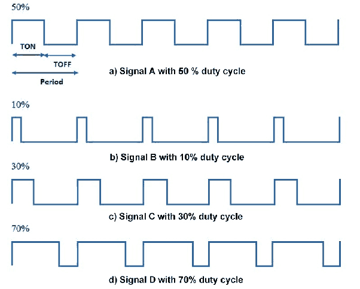

# Reguladores de Voltaje II

## Introducción

En la clase anteriores estudiamos los reguladores de voltaje lineales. Una de las limitaciones para su utilización es que el voltaje regulado necesariamente es menor que el voltaje de entrada. Será posible construir un regulador cuya salida es mayor que la entrada ?

Imagínense un circuito que tiene dos capacitores. En un determinado instante, ambos capacitores se conectan en paralelo al voltaje de entrada $v_i$. Con esto, se cargan hasta que sus voltajes son iguales a $v_i$. Luego, los capacitores se desconectan de la entrada y se conectan en serie entre sí. El voltaje total a través del circuito formado por ambos capacitores en serie es $2 v_i$. Luego, la carga $R_L$ se conecta a este voltaje de $2 v_i$ lo que hace con que una corriente fluya de los capacitores hacia la carga. Esta corriente alimenta la carga pero también descarga los capacitores. Después de un breve instante de descarga, el circuito desconecta los capacitores de la carga y los vuelve a conectar, en paralelo, a la entrada. Si este ciclo se repite con una frecuencia suficientemente alta, parecerá que la carga efectivamente está siendo alimentada con $2 v_i$. Es, por lo tanto, posible producir un voltaje de salida mayor que el de entrada. El circuito que lo hace, sin embargo, necesita conectar y desconectar componentes que almacenan energía (capacitores o inductores, por ejemplo), de forma a transportar la corriente desde un voltaje más bajo hasta uno más alto. Este tipo de regulador de voltaje es conocido como Regulador Conmutado. 

## Reguladores Conmutados

En general, los reguladores conmutados utilizan una señal de control que es una onda rectangular con duty cycle D (en español, ciclo de trabajo). D es un número entre 0 y 1, que representa el porcentaje del tiempo que la señal está encendida, como muestra la figura a continuación:

Figura 1: Ejemplos de duty cycles.

En ésta clase estudiaremos 4 circuitos de convertidores conmutados. Todos ellos utilizan inductores como elementos que almacenan energía. Como recordatorio, la ecuación fundamental que describe el comportamento del inductor es:

$V_L = L \frac{dI_L}{dt}$

Nótese que es una ecuación muy similar a la del capacitor, pero con la corriente y el voltaje intercambiados entre sí, y la constante L (inductancia) en vez de C (capacitancia). Así, de la misma forma que podemos "cargar" voltajeen un capacitor, el que lo mantiene hasta que se conecta a un circuito que consume corriente y lo descarga (baja el voltaje nuevamente), se puede "cargar" corriente en un inductor hasta que el circuito produzca un voltaje en sentido contrario que "descarga" (baja) la corriente.

En los circuitos a continuación usaremos el hecho de que si el voltaje a través de los terminales de un inductor son constantes($V_L = constante$), entonces la derivada de la corriente es constante, lo que significa que cambia linealmente. Por lo tanto, si $V_L$ es constante podemos escribir:

$V_L = L \frac{\Delta I_L}{\Delta t}$

Y, reordenando:

$\Delta I_L =  \frac{V_L \Delta t}{L}$

## Convertidor Elevador (Boost)

 

$$\Delta I =  \frac{V \Delta t}{L}$$

$$\Delta I_{ON} =  \frac{V_i DT}{L}$$

$$\Delta I_{OFF} =  \frac{(V_i-V_o) (1-D)T}{L}$$

$$ \Delta I_{ON} + \Delta I_{OFF} = 0$$

$$ \frac{V_i DT}{L} + \frac{(V_i-V_o) (1-D)T}{L} = 0$$

$$ \bcancel{V_i D} + V_i - \bcancel{V_i D}- V_o (1-D) = 0$$

$$ \frac{V_o}{V_i} = \frac{1}{1-D} $$

| D | $V_o/V_i$ |
| -- | -- |
| 1/4 | 4/3 |
| 1/2 | 2 |
| 3/4 | 4 |

$$\frac{I_o}{I_i} = 1-D$$

$$ \eta_{teorica} = \frac{Pot_o}{Pot_i} = \frac{V_o I_o}{V_i I_i} = \frac{1-D}{1-D} = 1 = 100 \%  $$

## Convertidor Reductor (Buck)

 

$$\Delta I =  \frac{V \Delta t}{L}$$

$$\Delta I_{ON} =  \frac{(V_i-V_o) DT}{L}$$

$$\Delta I_{OFF} =  \frac{(-V_o) (1-D)T}{L}$$

$$\Delta I_{ON} + \Delta I_{OFF} = 0$$

$$\frac{(V_i-V_o) DT}{L} + \frac{(-V_o) (1-D)T}{L} = 0$$

$$V_iD- \bcancel{V_o D} - V_o + \bcancel{V_oD} = 0$$

$$\frac{V_o}{V_i} = D$$

| D | $V_o/V_i$ |
| -- | -- |
| 1/4 | 1/4 |
| 1/2 | 1/2 |
| 3/4 | 3/4 |

$$\frac{I_o}{I_i} = \frac{1}{D}$$

## Convertidor Reductor-Elevador (Buck-Boost)

 

$$\Delta I =  \frac{V \Delta t}{L}$$

$$\Delta I_{ON} =  \frac{V_i DT}{L}$$

$$\Delta I_{OFF} =  \frac{V_o (1-D)T}{L}$$

$$\Delta I_{ON} + \Delta I_{OFF} = 0$$

$$\frac{V_i DT}{L} + \frac{V_o (1-D)T}{L} = 0$$

$$V_i D + V_o(1-D) = 0$$

$$V_o = - \frac{V_i D}{1-D} $$

$$\frac{V_o}{V_i} = - \frac{ D}{1-D} $$

| D | $V_o/V_i$ |
| -- | -- |
| 1/4 | -1/3 |
| 1/2 | -1 |
| 3/4 | -3 |

### Convertidor de retroceso (flyback)

