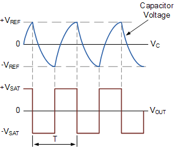
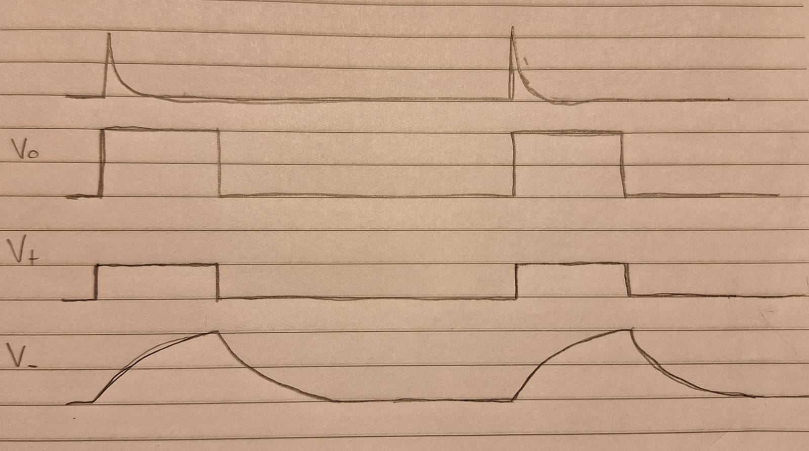

# Multivibradores II

## 2. Multivibrador astable

El segundo tipo de multivibrador es el multivibrados astable, en el cual ninguno de los dos estados es estable. Se puede construir un circuito de mulitivbrador astable basado en el comparador con histeresis con apenas la adición de un resistor y un capacitor, conforme se muestra en la figura a continuación:

Igual que en el caso del comparador, los dos estados del sistema son $v_o=+V_{bias}$ y $v_o=-V_{bias}$. Es decir, la salida es igual al voltaje de alimentación positivo o negativo. 

A grande razgos, el funcionamiento del sistema es el siguiente: cuando la salida del amplificador es positiva, el capacitor $C_4$ empieza a cargarse y elevar el voltaje en la entrada inversora ($V_-$). Eventualmente, $V_-$ se eleva tanto que sobrepasa $V_+$, haciendo con que el comparador cambie su salida al voltaje negativo. Cuando eso ocurre, el capacitor $C_4$ empieza a descargarse y disminuir el voltaje $V_-$. Eventualmente, $V_-$ disminuye tanto que se vuelve más negativo que $V_+$, y el ciclo se repite. En resúmen, la salida del amplificador hace con que el voltaje del capacitor cambie en la dirección que eventualmente cambia la salida.

En términos matemáticos, si utilizamos la definición $\beta = \frac{R_8}{R_8 + R_9}$, el valor de $V_+$ siempre será $\beta v_o$. Por lo tanto, la transición de $v_o = -V_{bias}$ a $v_o = +V_{bias}$ debe ocurrir cuando $V_- = -\beta V_{bias}$. En dicho instante, $C_4$ se empezará a cargar de acuerdo a la respuesta del circuito RC compuesto por $R_{10}$ y $C_4$, con valor inicial $-\beta V_{bias}$ y entrada $+V_{bias}$. Si consideramos la siguiente expresión para la carga de un circuito RC:

$$ v = V_{final} - (V_{final}  -V_{inicial})e^\frac{-t}{RC}$$

Reemplazando los valores $V_{inicial} = -\beta V_{bias}$ , $V_{final} = +V_{bias}$ , $R = R_{10}$ y $C = C_4$ ,se obtiene la siguiente expresión:

$$ V_- = +V_{bias} - (+V_{bias}  +\beta V_{bias})e^\frac{-t}{R_{10}C_4}$$

$$ V_- = V_{bias} (1 - (1 +\beta )e^\frac{-t}{R_{10}C_4})$$

Que es una función creciente, conforme esperado. Como $v_o = +V_{bias}$ , $V_+ = \beta V_{bias}$ . Por lo tanto, el valor de $V_-$ seguirá creciendo hasta que supere $V_+ = \beta V_{bias}$ , momento en el cual la salida pasará a $-V_{bias}$, pues $V_- > V_+$. Si se define el tiempo necesario para alcanzar dicho valor como $\frac{T}{2}$ , se tiene:

$$ \beta V_{bias} = V_{bias} (1 - (1 +\beta )e^\frac{-T}{2 R_{10}C_4})$$

$$ \beta  = 1 - (1 +\beta )e^\frac{-T}{2 R_{10}C_4}$$

$$ e^\frac{-T}{2 R_{10}C_4} = \frac{1-\beta}{1+\beta}$$

$$ \frac{-T}{2 R_{10}C_4} = \ln{\frac{1-\beta}{1+\beta}}$$

$$ \frac{T}{2} = R_{10}C_4 \ln{\frac{1+\beta}{1-\beta}}$$

Analogamente, se puede analizar el tiempo que el sistema demora en descargar el capacitor hasta $-\beta V_{bias}$, y se llega exactamente a la misma expresión. Por lo tanto, la salida del multivibrador astable oscila entre $+V_{bias}$ y $-V_{bias}$ con período T, o, de forma equivalente, con frecuencia $f = \frac{1}{T}$. 

$$ T = 2 R_{10}C_4 \ln{\frac{1+\beta}{1-\beta}}$$

La siguiente figura muestra las formas de onda, donde se definió $V_{SAT} = V_{bias}$ y $V_{REF} = \beta V_{bias}$ :

## 3. Multivibrador monoestable

El último tipo de multivibrador es el monoestable, el cual tiene un estado estable y otro estado "cuasi-estable". El multivibrador monoestable, cuando libre de perturbaciones exteriores, se mantiene en su estado estable. Cuando perturbado de la manera apropiada, cambia su estado al "cuasi-estable", se mantiene un período de tiempo predeterminado, y luego vuelve a estar en su estado estable. De ésa forma, es un sistema que produce un cambio de estado después de un valor fijo de tiempo. 

Una posible implementación del multivibrador monoestable en circuitos electrónicos se muestra en la figura a continuación.

El circuito está basado en el multivibrador astable, ya que éste implementa un mecanismo para cambiar de estado después de un tiempo fijo. Para convertirlo en un monoestable, simplemente se agrega el diodo $D_3$, que interrumpe la descarga del capacitor $C_{m1}$ cuando $v_o = -V_{CC}$. En dicha condición, el diodo se polariza en directa y efectivamente corto-circuita el capacitor $C_{m1}$, impidiendo que el voltaje $V_-$ siga bajando. De ésta forma, $V_-$ no llega a $-\beta V_{CC}$, y no ocurre la transición de $v_o = - V_{CC}$ a $v_o = + V_{CC}$. El estado estable, por lo tanto, es $v_o = - V_{CC}$. Si se asume un diodo ideal, $V_- = 0$ en el estado estacionario del estado estable.

El subcircuito $TRIGGER$ es un circuito de disparo cuyo objetivo es gatillar la transición del monoestable a su estado casi-estable. En este caso esécífico, el objetivo es elevar $V_+$ (que normalmente está en $-\beta V_{CC}$) por sobre 0 momentaneamente. Cuando eso ocurre, $V_+ > V_-$ y el comparador cambia la salida a $+V_{CC}$. El circuito de disparo está proyectado para que se desconecte después de elevar $V_+$, y por lo tanto deja de influenciar el resto del circuito. El análisis a partir de éste punto es bastante similar al astable: $C_{m1}$ empezará a cargarse a través de $R_{m3}$, siguiendo la siguiente expresión:

$$ v = V_{final} - (V_{final}  -V_{inicial})e^\frac{-t}{RC}$$

Reemplazando los valores $V_{inicial} = 0$ , $V_{final} = +V_{CC}$ , $R = R_{m3}$ y $C = C_{m1}$ ,se obtiene la siguiente expresión:

$$ V_- = +V_{CC} - (+V_{CC} - 0)e^\frac{-t}{R_{m3}C_{m1}}$$

$$ V_- = V_{CC} (1 - e^\frac{-t}{R_{m3}C_{m1}})$$

Eventualmente, $V_-$ alcanza $V_+ = \beta V_{CC}$ y el monoestable vuelve a su estado estable con $v_o = - V_{CC}$. El tiempo en transición $T_t$, contado desde el momento en que el monoestable cambia al estado casi-estable hasta en instante donde vuelve a su estado natural se puede calcular como:

$$ \beta V_{CC} = V_{CC} (1 - e^\frac{-T_t}{R_{m3}C_{m1}})$$

$$ \beta  = 1 - e^\frac{-T_t}{R_{m3}C_{m1}}$$

$$ e^\frac{-T_t}{R_{m3}C_{m1}} = 1- \beta$$

$$ \frac{-T_t}{R_{m3}C_{m1}} = \ln (1- \beta)$$

$$ -T_t = R_{m3}C_{m1}\ln (1- \beta)$$

$$ T_t = R_{m3}C_{m1}\ln \frac{1}{1- \beta}$$

La siguiente figura muestra un bosquejo de las formas de onda del circuito, siendo la primera señal del circuito de disparo ($TRIGGER$).

## Ejercicios

1. Determine la frecuencia de oscilación del siguiente circuito considerando los siguientes valores de los componentes:

    
    
    1. $R_8 = R_9 = 10\ k\Omega$ ; $R_{10} = 10\ k\Omega$ ; $C_4 = 10\ nF$ ; $V_{bias} = 12\ V$

1. Determine el tiempo en el estado "cuasi estable" del siguiente circuito, considerando los siguientes valores para los componentes:

    
    
    1. $R_8 = R_9 = 10\ k\Omega$ ; $R_{10} = 10\ k\Omega$ ; $C_4 = 10\ nF$ ; $V_{bias} = 12\ V$ ; diodos ideales 

    1. $R_8 = R_9 = 10\ k\Omega$ ; $R_{10} = 10\ k\Omega$ ; $C_4 = 10\ nF$ ; $V_{bias} = 12\ V$ ; $V_f=0.7\ V$ para los diodos polarizados en directa