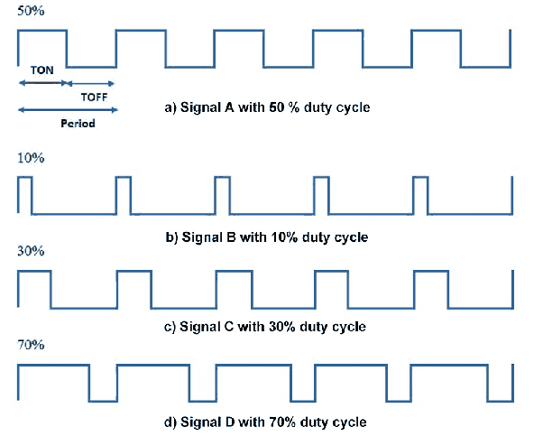

# Reguladores de Voltaje II

## Reguladores Conmutados

En general, utilizan una señal de control que es una onda rectangular con duty cycle D (en español, ciclo de trabajo). D es un número entre 0 y 1, que representa el porcentaje del tiempo que la señal está encendido, como muestra la fugura a continuación:

Figura 1: Ejemplos de duty cycles.

## Convertidor Elevador (Boost)

 

$$V_o = \frac{1}{1-D} V_i $$

## Convertidor Reductor (Buck)

 

$$V_o = D V_i $$

## Convertidor Reductor-Elevador (Buck-Boost)

 

$$V_o = -\frac{D}{1-D} V_i $$