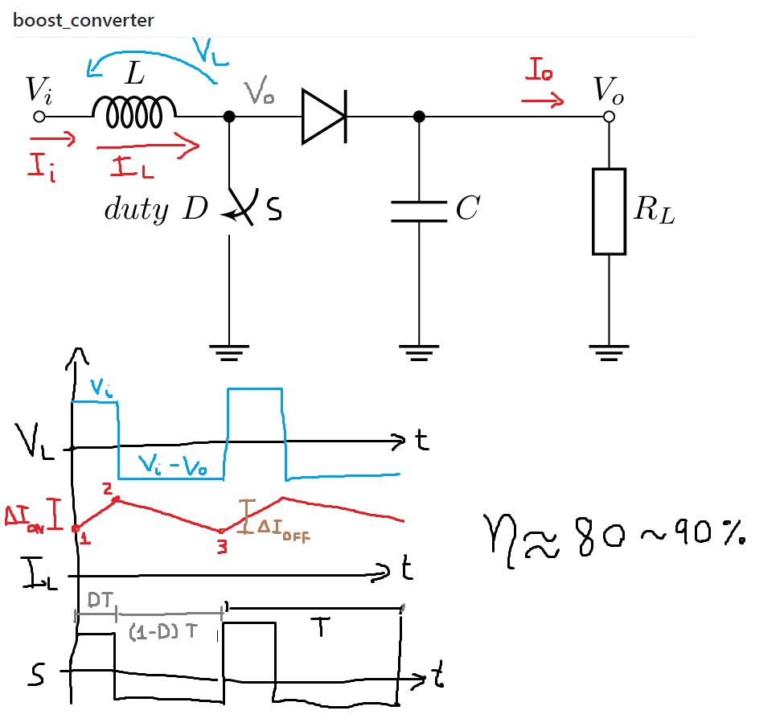
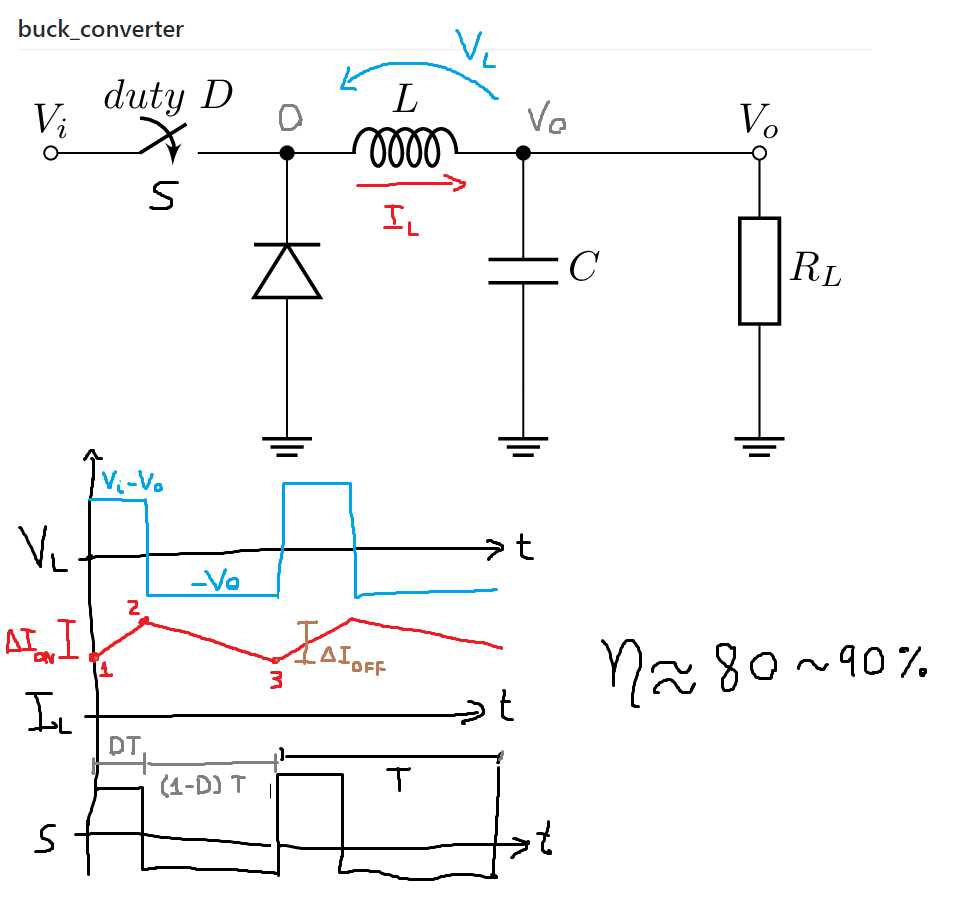
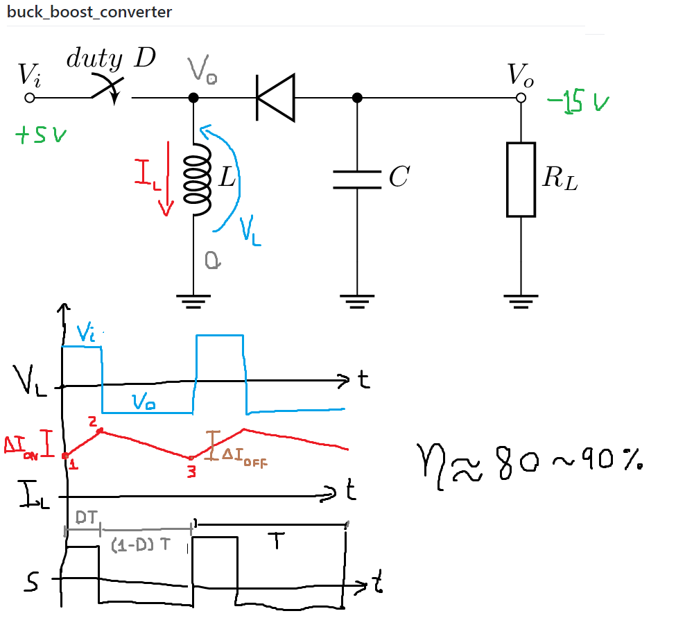

# Reguladores de Voltaje II

## Reguladores Conmutados

En general, utilizan una señal de control que es una onda rectangular con duty cycle D (en español, ciclo de trabajo). D es un número entre 0 y 1, que representa el porcentaje del tiempo que la señal está encendido, como muestra la fugura a continuación:

Figura 1: Ejemplos de duty cycles.

## Convertidor Elevador (Boost)

 

$$\Delta I =  \frac{V \Delta t}{L}$$

$$\Delta I_{ON} =  \frac{V_i DT}{L}$$

$$\Delta I_{OFF} =  \frac{(V_i-V_o) (1-D)T}{L}$$

$$ \Delta I_{ON} + \Delta I_{OFF} = 0$$

$$ \frac{V_i DT}{L} + \frac{(V_i-V_o) (1-D)T}{L} = 0$$

$$ \bcancel{V_i D} + V_i - \bcancel{V_i D}- V_o (1-D) = 0$$
$$ \frac{V_o}{V_i} = \frac{1}{1-D} $$

| D | $V_o/V_i$ |
| -- | -- |
| 1/4 | 4/3 |
| 1/2 | 2 |
| 3/4 | 4 |

$$\frac{I_o}{I_i} = 1-D$$

$$ \eta_{teorica} = \frac{Pot_o}{Pot_i} = \frac{V_o I_o}{V_i I_i} = \frac{1-D}{1-D} = 1 = 100 \%  $$

## Convertidor Reductor (Buck)

 

$$\Delta I =  \frac{V \Delta t}{L}$$

$$\Delta I_{ON} =  \frac{(V_i-V_o) DT}{L}$$

$$\Delta I_{OFF} =  \frac{(-V_o) (1-D)T}{L}$$

$$\Delta I_{ON} + \Delta I_{OFF} = 0$$

$$\frac{(V_i-V_o) DT}{L} + \frac{(-V_o) (1-D)T}{L} = 0$$

$$V_iD- \bcancel{V_o D} - V_o + \bcancel{V_oD} = 0$$

$$\frac{V_o}{V_i} = D$$

| D | $V_o/V_i$ |
| -- | -- |
| 1/4 | 1/4 |
| 1/2 | 1/2 |
| 3/4 | 3/4 |

$$\frac{I_o}{I_i} = \frac{1}{D}$$

## Convertidor Reductor-Elevador (Buck-Boost)

 

$$\Delta I =  \frac{V \Delta t}{L}$$

$$\Delta I_{ON} =  \frac{V_i DT}{L}$$

$$\Delta I_{OFF} =  \frac{V_o (1-D)T}{L}$$

$$\Delta I_{ON} + \Delta I_{OFF} = 0$$

$$\frac{V_i DT}{L} + \frac{V_o (1-D)T}{L} = 0$$

$$V_i D + V_o(1-D) = 0$$

$$V_o = - \frac{V_i D}{1-D} $$

$$\frac{V_o}{V_i} = - \frac{ D}{1-D} $$

| D | $V_o/V_i$ |
| -- | -- |
| 1/4 | -1/3 |
| 1/2 | -1 |
| 3/4 | -3 |