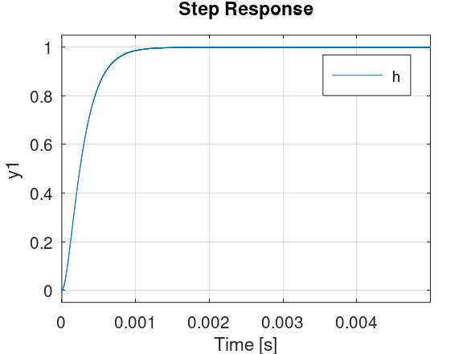
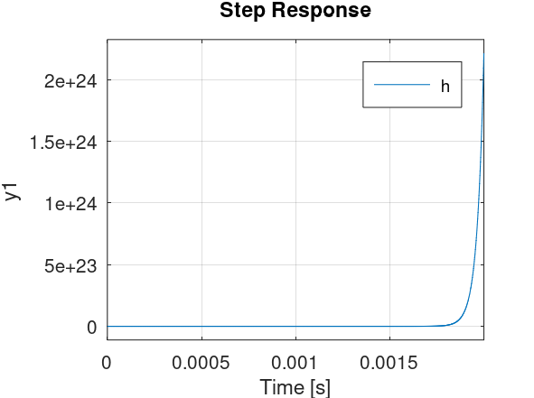

# Osciladores

## Introducción

 

$R_1=10\ k\Omega$ ,$R_2= 2 R_1 = 20\ k\Omega$, $C_1=C_2=10\ nF$ y $R_a=R_b=10\ k\Omega$

$H(s) = \frac{v_o}{v_i} = \frac{2}{ 1 + 2 R_1C_1s+ 2R_1^2C_1^2s^2}$

$ A_v(\omega) = \frac{2}{\sqrt{1 + 4 (R_1C_1 \omega)^4 }}$

$A = \frac{R_a + R_b}{R_b}$

$H(s) = \frac{v_o}{v_i} = \frac{A}{ 1 + (4-A)R_1C_1s + 2R_1^2C_1^2s^2}$

Figura 2: Respuesta a escalón de un sistema con dos pólos reales negativos (A=1)

Figura 3: Respuesta a escalón de un sistema con dos pólos complejos conjugados con parte real negativa (A=2)

Figura 4: Respuesta a escalón de un sistema con dos pólos puramente imaginarios conjugados. (A=4)

Figura 5: Respuesta a escalón de un sistema con dos pólos complejos conjugados con parte real positiva (A=5)

Figura 6: Respuesta a escalón de un sistema con dos pólos reales positivos (A=10)

para simulación de circuitos : https://explore.partquest.com/

## Criterio de oscilación de Barkhausen

## Capítulos del libro
- Capítulo 14
   - sesiones 14.1, 14.2, 14.3, 14.4, 14.5 y 14.7
   
## Ejercicios recomendados
- Capítulo 14
  - sesión 14.2 ejercicio 1
  - sesión 14.7
