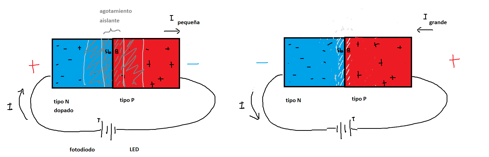
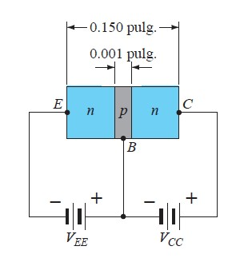
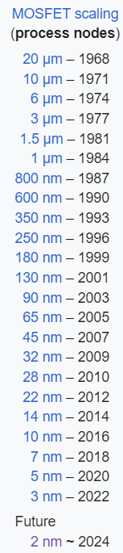

# Semiconductores

## 1. ¿Cómo se construye una resistencia ?

$ V = R I$

$ R = \rho \frac{l}{A}$

$\rho$ es la resistividad eléctrica del material. Se mide en $\Omega m $.

Composición Química de un metal:

Electrones relativamente libres -> resistividad baja.

Ejemplo Cu: $\rho_{Cu} \approx 1.7\ 10^{-8} \Omega m$

Cable de cobre con area transversal 1 mm^2 y 100 m de extensión tendrá aproximadamente:

$R = \rho l / A = 1.7\ 10^{-8} 100 / 10^{-6} = 1.7 \Omega$

Composición química del diamante:

$\rho_{diamante} \approx 10^{12}$

$\rho_{aire} \in [10^5,  10^9]$

Proceso de fabricación:

https://en.wikipedia.org/wiki/E_series_of_preferred_numbers 

## 2. ¿Cómo se construye un diodo ?

Semiconductores

Estrucutura química del Silicio:

$\rho_{Si} = 640\ \Omega m$

Tipo N

Tipo P

fotodiodos y LEDs -> enlaces covalentes requieren justo la energía igual a la de fotones de cierto color para romperse.

## 3. ¿Cómo se construye un transistor ?

## 4. ¿Por qué todos los años sale una versión nueva de los celulares ?

Ley de Moore

https://web.archive.org/web/20141006144200/http://web.eng.fiu.edu/npala/EEE6397ex/Gordon_Moore_1965_Article.pdf      

Cual es el tamaño de los transistores más chicos que se pueden fabricar actualmente ?

2024: La menor dimensión de un transistor (altura, ancho o estructura interna) es 3 nm, y se espera que el proceso de fabricación que permite 2 nm esté operativo antes del fin del año.

## Capítulos del libro
- Capítulo 1
   - sesiones 1.1, 1.3, 1.5, 1.6, 1.10 y 1.16
- Capítulo 16
   - sesiones 16.6 y 16.7
   
## Ejercicios recomendados
- Capítulo 1
  - sesión 1.3 ejercicios 1 y 2
  - sesión 1.5 ejercicios 7 y 10
  - sesión 1.6 ejercicio 13
- Capítulo 16
  - sesión 16.6 ejercicio 24
  - sesión 16.7 ejercicios 27, 28 y 29
