# Técnicas de Fabricación y Prototipaje en Electrónica

<!-- vscode-markdown-toc -->
* 1. [Antes de los Circuitos Impresos](#AntesdelosCircuitosImpresos)
* 2. [Técnicas Modernas](#TcnicasModernas)
	* 2.1. [Prueba de Concepto](#PruebadeConcepto)
		* 2.1.1. [Protoboard (breadboard)](#Protoboardbreadboard)
	* 2.2. [Prototipado](#Prototipado)
		* 2.2.1. [Tarjeta Perforada / Tarjeta Impresa para Prototipo Perforada (Perfboard)](#TarjetaPerforadaTarjetaImpresaparaPrototipoPerforadaPerfboard)
		* 2.2.2. [Tarjeta de Circuito Impreso Universal / Placa con Pistas (Stripboard)](#TarjetadeCircuitoImpresoUniversalPlacaconPistasStripboard)
	* 2.3. [Producto Comercial](#ProductoComercial)
		* 2.3.1. [Tarjeta de Circuito Impreso (PCB - Printed Circuit Board)](#TarjetadeCircuitoImpresoPCB-PrintedCircuitBoard)
* 3. [Circuitos Integrados](#CircuitosIntegrados)
	* 3.1. [Encapsulados](#Encapsulados)
	* 3.2. [Fabricación de un Circuito Integrado](#FabricacindeunCircuitoIntegrado)
* 4. [Resúmen: Conceptos Clave](#Resmen:ConceptosClave)

<!-- vscode-markdown-toc-config
	numbering=true
	autoSave=true
	/vscode-markdown-toc-config -->
<!-- /vscode-markdown-toc -->

##  1. Antes de los Circuitos Impresos

Soldadura punto a punto

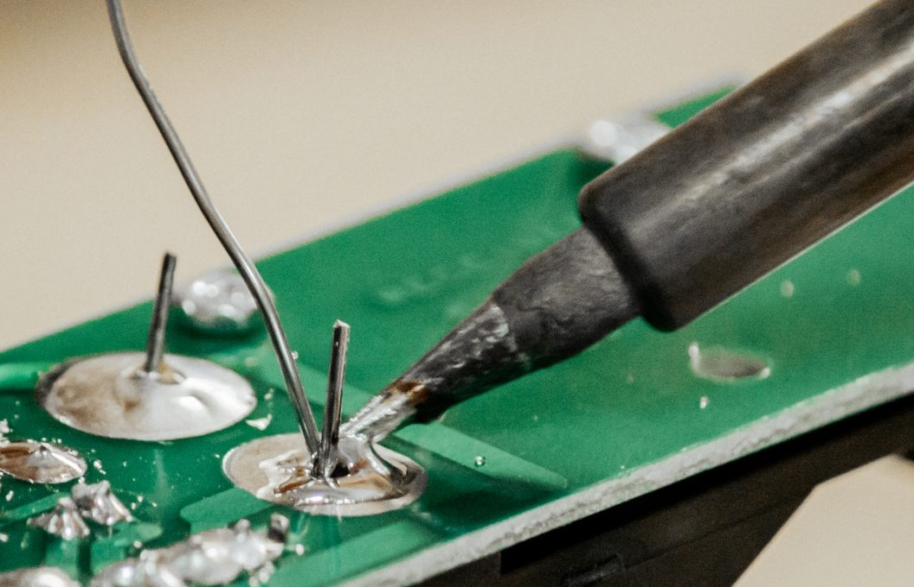

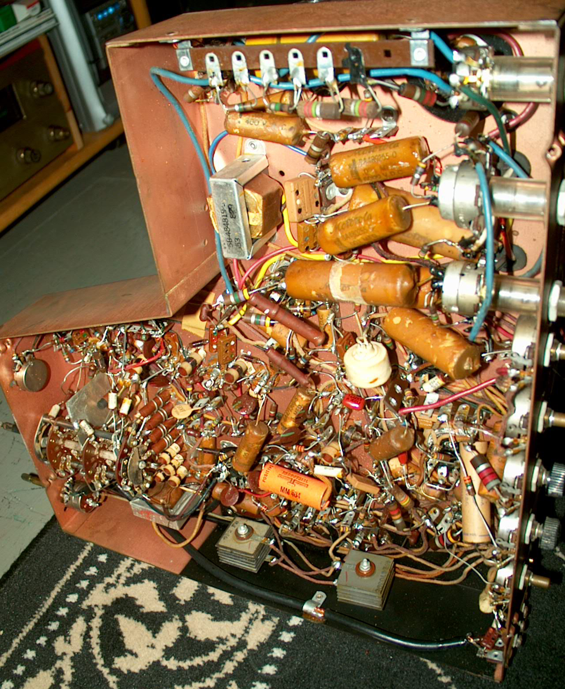

Desventajas: dificil de automatizar, dificil de replicar, dificil de escalar, complejidad, no resistente a movimentos bruscos

##  2. Técnicas Modernas

###  2.1. Prueba de Concepto

####  2.1.1. Protoboard (breadboard)

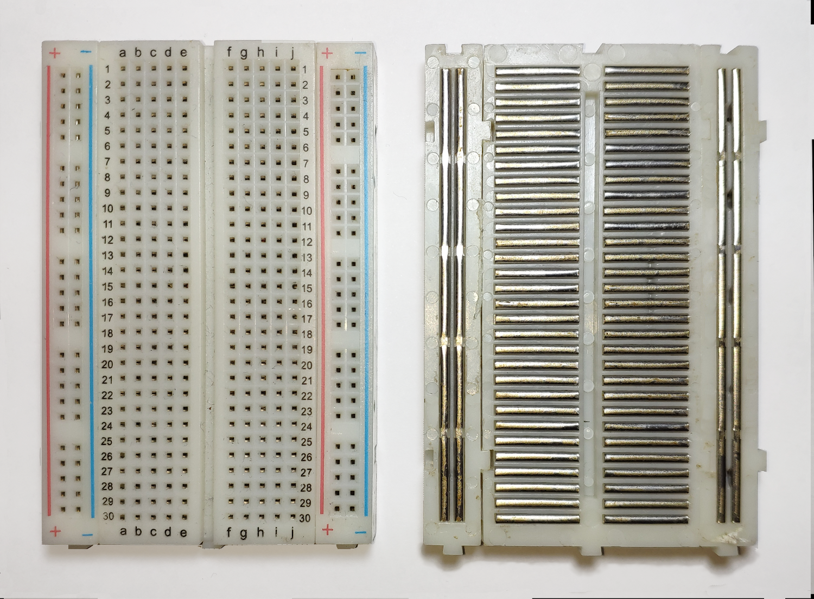

Ventajas: facil montaje, facil modificar circuitos

Desventajas: Conexiones no confiables, no resistente a movimentos bruscos, capacitancias parásitas, dificil de replicar, dificil de escalar

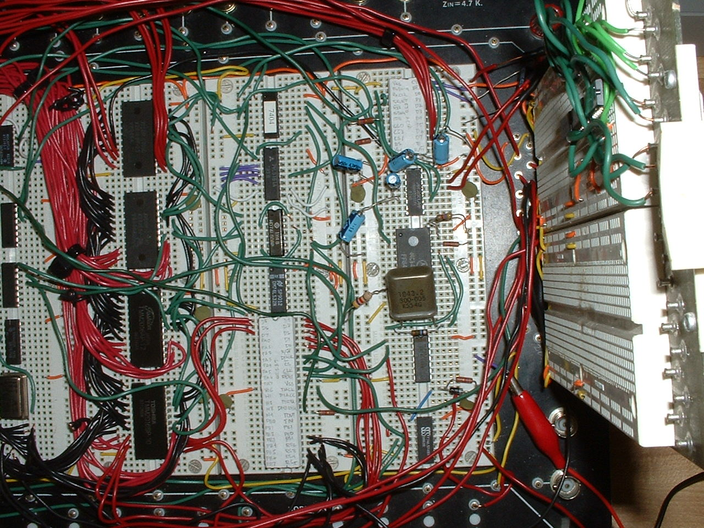

###  2.2. Prototipado

####  2.2.1. Tarjeta Perforada / Tarjeta Impresa para Prototipo Perforada (Perfboard)

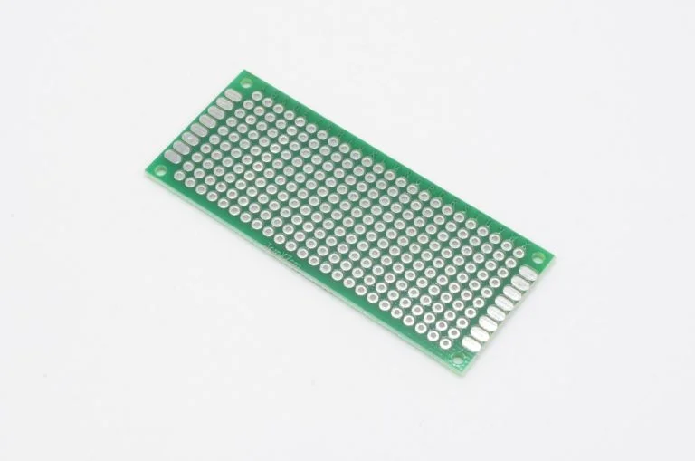

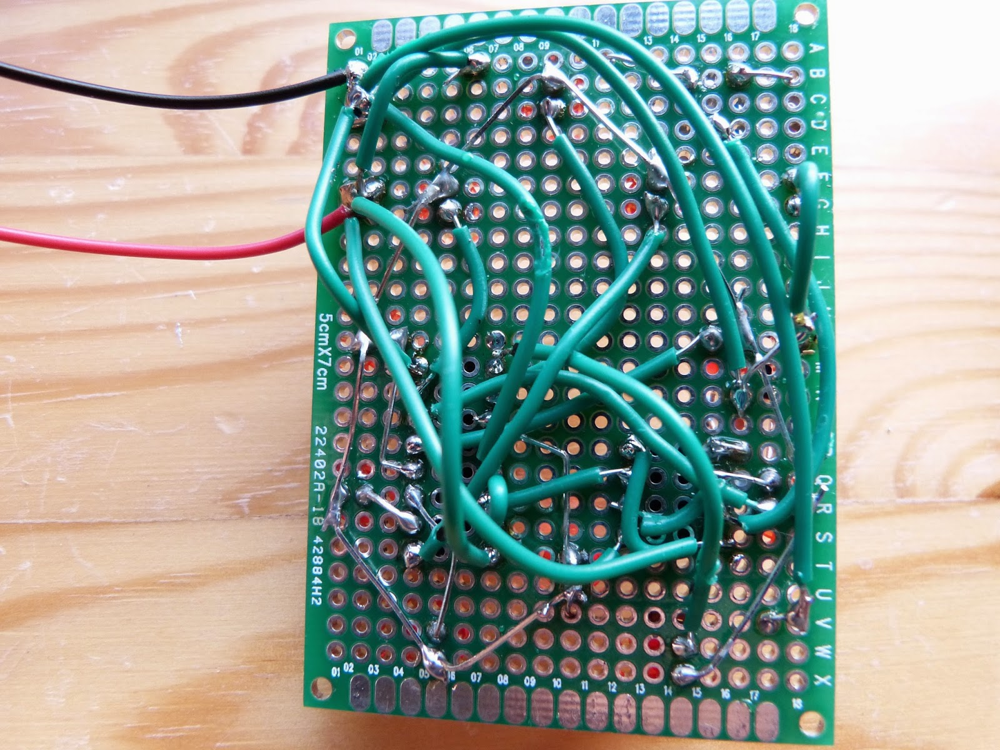

Ventajas: Unión más estable entre la tarjeta y los componentes, rapida de armar

Desventajas: Tamaños estandar, dificil de automatizar, dificil de escalar

####  2.2.2. Tarjeta de Circuito Impreso Universal / Placa con Pistas (Stripboard)

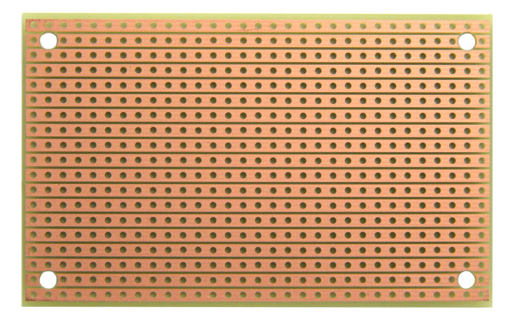

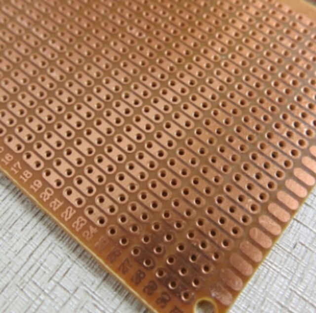

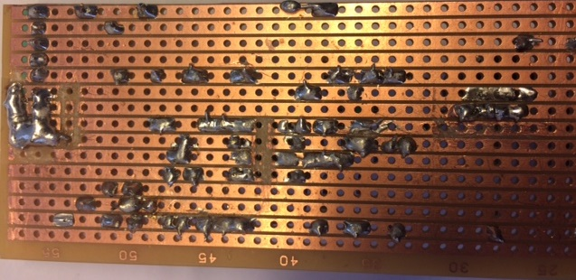

Ventajas: Unión más estable entre la tarjeta y los componentes, rapida de armar, menos cables que perfboard

Desventajas: Tamaños estandar, dificil de automatizar, dificil de escalar

###  2.3. Producto Comercial

####  2.3.1. Tarjeta de Circuito Impreso (PCB - Printed Circuit Board)

Ejemplos

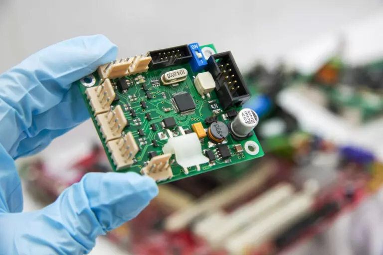

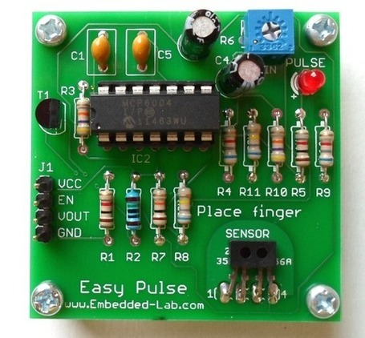

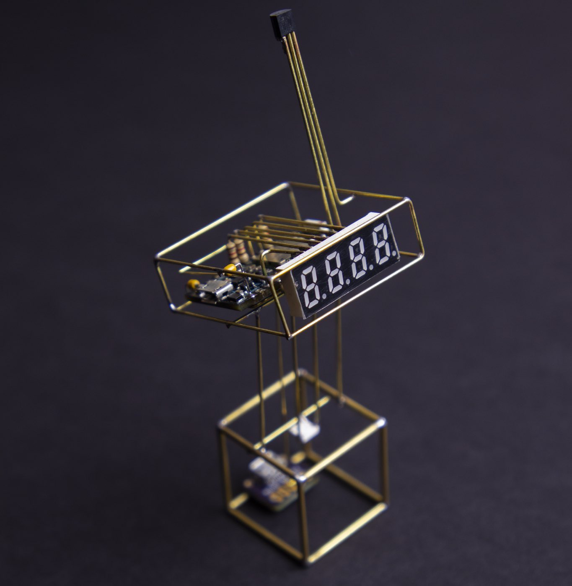

Materia Prima

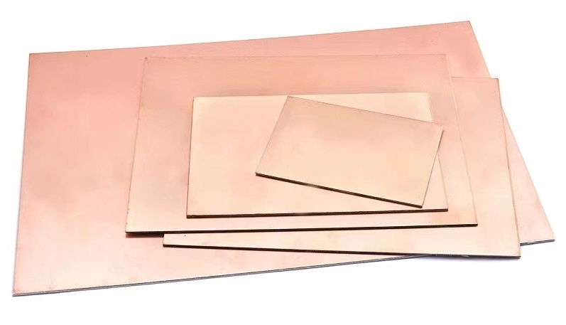

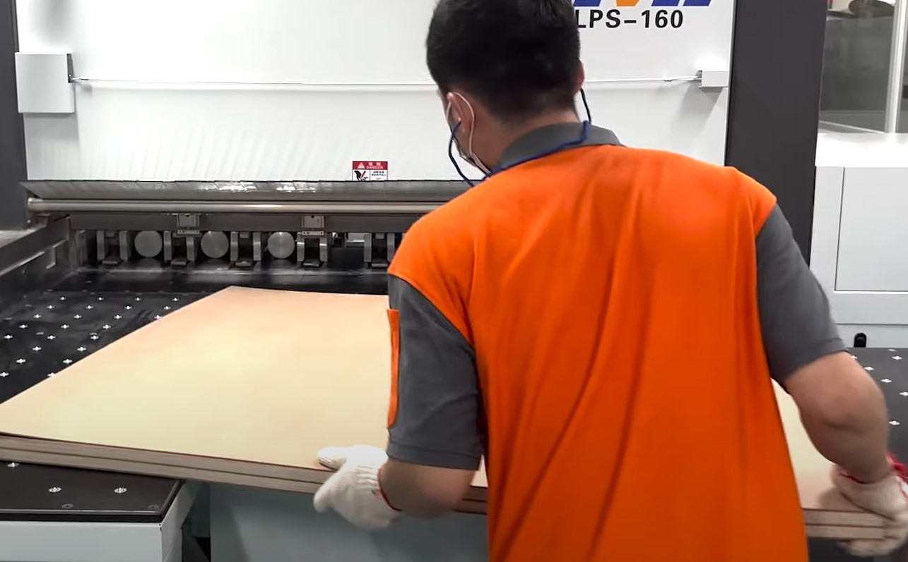

Proceso de Fabricación de la Placa

Versión Casera

Versión Industrial

Fotolitografia

[fuente](https://www.pcbway.com/pcb-service.html)

[montaje](https://www.youtube.com/watch?v=24ehoo6RX8w)

[pick and place](https://www.youtube.com/watch?v=S8qkaTsr2_o&t=32s)

##  3. Circuitos Integrados

###  3.1. Encapsulados

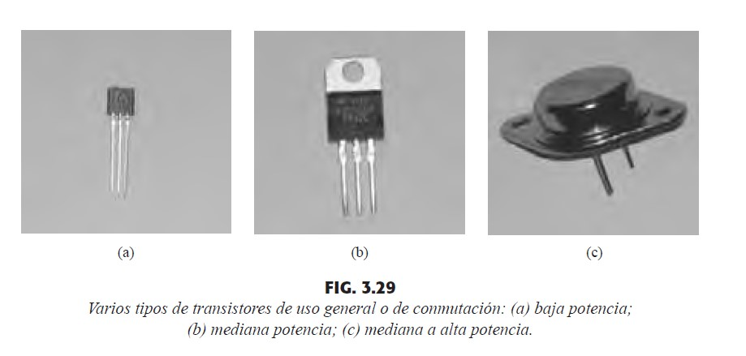

Agujero Pasante vs Montaje Superficial (Through-Hole vs Surface Mount Device (SMD))

###  3.2. Fabricación de un Circuito Integrado

##  4. Resúmen: Conceptos Clave

- Tarjeta de Circuito Impreso (PCB)
- Protoboard
- Perfboard
- Stripboard
- Fotolitografia
- Circuito Integrado
- Agujero Pasante
- Montaje Superficial