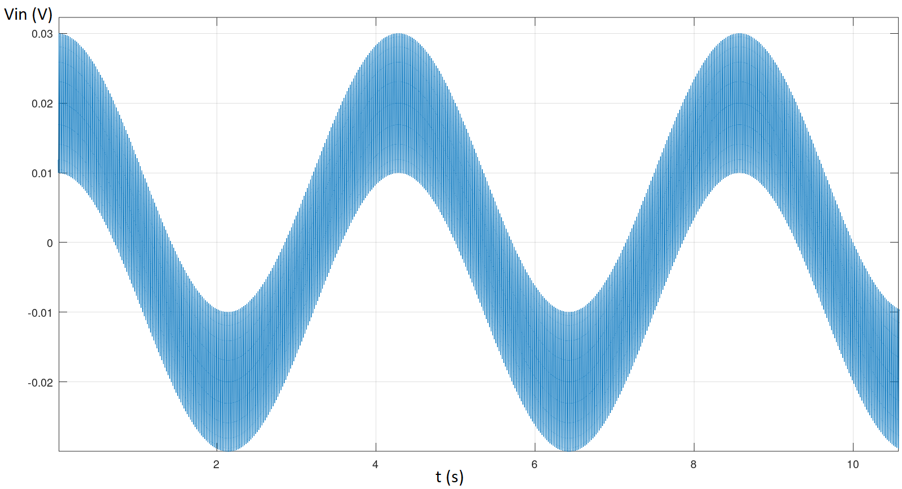

#  Sistemas Electrónicos 2024/02
## Prueba Escrita 1 - Pauta

1. Un determinado sensor genera una señal de voltaje $V_{in}$ que representa la respiración de un paciente. La señal es aproximadamente una onda sinusoidal con frecuencia entre 14 y 18 respiraciones por minuto y amplitud 20 mV peak-to-peak. Sin embargo, al medir $V_{in}$, se observa que, además de la señal esperada, también hay una oscilación de 50 Hz con amplitud 10 mV peak-to-peak, conforme se muestra en la figura a continuación:

   

   Figura 1: Señal $V_{in}$

   Se determinó que la oscilación de 50 Hz es ruido inducido por la red eléctrica. Para eliminar el ruido, un estudiante de biomédica propuso el siguiente circuito, con $R= 1\ M\Omega$ y $C= 4.7\ \mu F$:

   

   Figura 2: Filtro

   > reemplazando C por una resistencia con valor $\frac{1}{Cs}$ y aplicando divisor de voltaje:
   >
   > $V_{out} = \frac{\frac{1}{Cs}}{\frac{1}{Cs}+R} V_{in}$
   >
   > $V_{out} = \frac{1}{1+RCs} V_{in}$
   >
   > $H(s) = \frac{v_{out}}{v_{in}} = \frac{1}{1+RCs}$
   >
   > La ganancia en función de la frecuencia es, por lo tanto:
   >
   > $A_v(\omega) = | H(s=j\omega) | = |\frac{1}{1+RCj\omega}|$
   >
   > $A_v(\omega) = \frac{1}{\sqrt{1+(RC\omega)^2}}$
   >
   > $A_v(\omega) = \frac{1}{\sqrt{1+(4.7 \omega)^2}}$

   1. Determine en cuanto el circuito atenua el ruido. Es decir, si la entrada es una entrada sinusoidal con amplitud 10 mV y frecuencia 50 Hz, cual seria la amplitud de la salida en estado estacionario. (0.5 pt)

      > $\omega = 2\pi f = 2 \pi 50 = 100 \pi$ (+0.2pt)
      >
      > $A_v(100 \pi) = \frac{1}{\sqrt{1+(4.7 \times 100 \pi)^2}} \approx \frac{1}{\sqrt{2.18 \times 10^8}} \approx 6.8 \times 10^{-5}$ (+0.2pt)
      >
      > Por lo tanto, la amplitud de salida para una entrada con amplitud 10 mV sería:
      >
      > $|V_{out}| = A_v(\omega) |V_{in}| = 6.8 \times 10^{-5} 10 \times 10^{-3} = 6.8 \times 10^{-7} V = 0.68\ \mu V$ (+0.1pt)

   1. Determine en cuanto el circuito atenua la señal de respiración si la frecuencia respiratoria es 14 respiraciones / minuto. Es decir, si la entrada es sinusoidal con amplitud 20 mV y frecuencia 14 rpm, cual seria la amplitud de la salida en estado estacionario. (0.5 pt)
   
      > $\omega = 2\pi f = 2 \pi \frac{14}{60} \approx 1.466\ rad/s$ (+0.2pt)
      >
      > $A_v(1.466) = \frac{1}{\sqrt{1+(4.7 \times 1.466)^2}} \approx \frac{1}{\sqrt{48}} \approx 0.144$ (+0.2pt)
      >
      > Por lo tanto, la amplitud de salida para una entrada con amplitud 20 mV sería:
      >
      > $|V_{out}| = A_v(\omega) |V_{in}| = 0.144 \times 20 \times 10^{-3} = 2.88 \times 10^{-3} = 2.88\ m V$ (+0.1pt)

   1. Determine en cuanto el circuito atenua la señal de respiración si la frecuencia respiratoria es 18 respiraciones / minuto. Es decir, si la entrada es sinusoidal con amplitud 20 mV y frecuencia 18 rpm, cual seria la amplitud de la salida en estado estacionario. (0.5 pt)
   
      > $\omega = 2\pi f = 2 \pi \frac{18}{60} \approx 1.885\ rad/s$ (+0.2pt)
      >
      > $A_v(1.885) = \frac{1}{\sqrt{1+(4.7 \times 1.885)^2}} \approx \frac{1}{\sqrt{79}} \approx 0.112$ (+0.2pt)
      >
      > Por lo tanto, la amplitud de salida para una entrada con amplitud 20 mV sería:
      >
      > $|V_{out}| = A_v(\omega) |V_{in}| = 0.112 \times 20 \times 10^{-3} = 2.24 \times 10^{-3} = 2.24\ m V$ (+0.1pt)

1. "Resolver un circuito" significa calcular los voltajes en todos los nodos del circuito y las corrientes en cada uno de sus componentes. Asumiendo que $V_D = V_F$ cuando los diodos están polarizados en directa, $I_D=0$ cuando están polarizados en inversa, y $V_D = - V_Z$ si el diodo zener está conduciendo en inversa, resuelva los siguientes circuitos (1.5 pt):
   
   1. Datos: $V_{CC}=5\ V$, $R_1=3.3\ k\Omega$, $R_2=4.7\ k\Omega$, $V_F=0.7\ V$ (0.5 pt)

      

      > 
      >
      > Al remover el diodo del circuito, se encuentra que $V_{D_1} = V_{CC} = 5\ V$. Por lo tanto, el diodo está polarizado en directa y conduce. (+0.2pt)
      >
      > $ V_{R_1} = V_{CC} - V_{D_1} = 5 - 0.7 = 4.3\ V $ (+0.1pt)
      >
      > $ I_1 = \frac{V_{R_1}}{R_1} = \frac{4.3}{3300} \approx 1.3\ mA $ (+0.1pt)
      >
      > $ I_2 = \frac{V_{CC}}{R_2} = \frac{5}{4700} \approx 1.1\ mA $ (+0.1pt)
   
   1. Datos: $V_{CC}=10\ V$, $R_3=1\ k\Omega$, $R_4=10\ k\Omega$, $R_5=6.8\ k\Omega$, $V_F=0.7\ V$, $V_Z = 3.3\ V$ (0.5 pt)

      

      > 
      >
      > Al remover ambos diodos del circuito se encuentra que:
      > - $V_{D_Z} = V_3 - V_{CC} = -10\ V$. Como -10 V es menor que $-V_Z = -3.3\ V$, el diodo zener conduce en inversa. (+0.1pt)
      > - $V_{D_2} = V_4 - V_{CC} = -10\ V$. Como -10 V es menor que $V_F = 0.7\ V$, el diodo 2 no conduce. (+0.1pt)
      >
      > $V_3 = V_{CC} + V_{D_Z} = 10 - 3.3 = 6.7\ V$ (+0.05pt)
      >
      > $I_4 = 0$ (+0.05pt)
      >
      > $I_3 = I_5 = \frac{V_3}{R_3+R_5} = \frac{6.7}{1000 + 6800} \approx 860\ \mu A$ (+0.1pt)
      >
      > $V_4 = V_5 = R_5 I_5 = 6800 \times 860 \times 10^{-6} \approx 5.8\ V$ (+0.1pt)

   1. Datos: $V_{CC}=3.6\ V$, $R_6=R_7=R_8=1\ k\Omega$, $V_F=0.7\ V$, $V_Z = 3.3\ V$

      

      > 
      >
      > Al remover ambos diodos del circuito se encuentra que:
      > - $V_1 = \frac{R_6}{R_6+R_7+R_8} V_{CC} = \frac{V_{CC}}{3} = 1.2\ V$
      > - $V_2 = \frac{R_6+R_7}{R_6+R_7+R_8} V_{CC} = \frac{2 V_{CC}}{3} = 2.4\ V$
      > - $V_{D_3} = V_{CC} - V_1 = 2.4\ V $. Como 2.4 V es mayor que $V_F=0.7\ V$, $D_3$ conduce. (+0.1pt)
      > - $V_{D_Z} = - V_2 = -2.4\ V $. Como -2.4 V está entre $-V_Z$ y $V_F$, el diodo zener no conduce. (+0.1pt)
      >
      > $V_1 = V_{CC} - V_F = 3.6 - 0.7 = 2.9\ V$ (+0.05pt)
      >
      > $I_5 = \frac{V_1}{R_6} = \frac{2.9}{1000} = 2.9\ mA$ (+0.05pt)
      >
      > $I_4 = 0$ (+0.05pt)
      >
      > $I_2 = I_3 = \frac{V_{CC}-V_1}{R_7+R_8} = \frac{3.6-2.9}{2000} = 0.35\ mA$ (+0.05pt)
      >
      > $I_1 = I_5 - I_3 = 2.9 - 0.35 = 2.65\ mA$ (+0.05pt)
      >
      > $V_2 = V_{CC} - R_8 I_2 = 3.6 - 0.35 = 3.25\ V$ (+0.05pt)
      >
      > se observa que $V_{D_Z} = - V_2 = -3.25\ V $ sigue entre $-V_Z$ y $V_F$, confirmando que el diodo zener no conduce

1. Calcule $I_C$ en el siguiente circuito, cuando el valor de $V_i$ es el señalado en cada ítem. Para cada ítem, calcule también $\beta_{forzado}$ si el transistor está operando en modo saturado, o $V_{CE}$ si está operando en modo activo. Asuma $V_{CC}=12\ V$, $R_B= 2.7\ M\Omega$, $R_C= 6.8\ k\Omega$, $\beta = 200$, $V_{CE_{SAT}} = 0.2\ V$ y que $V_{BE} =0.7\ V$ cuando la unión base-emisor está polarizada en directa. (1.5 pt)
   1. $V_i = 0.6\ V$
   1. $V_i = 6\ V$
   1. $V_i = 12\ V$
   
      

2. Para el siguiente circuito de amplificador en emisor común, calcule lo que se pide. Asuma $V_{CC} = 12\ V$, $R_1= 150\ k\Omega$, $R_2=39\ k\Omega$, $R_C= 2\ k\Omega$, $\beta = 50$, la temperatura $T=300\ K$, $V_{CE_{SAT}} = 0.2\ V$ y $V_{BE} =0.7\ V$ cuando la unión base-emisor está polarizada en directa. (1.5 pt)
       

   1. La corriente de colector de polarización $I_{C_Q}$

      >  

   2. La ganancia de voltaje AC ($A_V$)

      >  
      

# Fórmulas

$$ I_D = I_S \left( e^{\frac{V_D}{n V_T}} - 1 \right) $$
$$ V_T = \frac{kT}{q}$$

- $k$: Constante de Boltzmann. $k=1.38 * 10^{-23}\ J/K$
- $q$: Carga del electrón. $q=1.6*10^{-19}\ C$
- $T$: Temperatura en Kelvin

$$ H(s) = \frac{v_o(s)}{v_i(s)} $$
$$ A_v(\omega) = | H(s=j\omega) |$$
$$ A_{v_{dB}}(\omega) = 20 log\left(| H(j\omega) |\right)$$
$$ \phi(\omega) = arg\left( H(j\omega) \right) = tan^{-1} \left( \frac{Im\{H(j\omega)\}}{Re\{H(j\omega)\}} \right)$$
$$\omega = 2 \pi f$$
$$ 1 [rad/s] = 2\pi [Hz]$$
$$ 1 [Hz] = 60 [rpm]$$

$$I_E = I_C + I_B$$
- en modo activo ($V_{CE} > V_{CE_{SAT}}$):
$$I_C = \beta I_B $$
- en modo saturado ($0 < \beta_{forzado} < \beta$):
$$V_{CE} = V_{CE_{SAT}}$$
$$I_C = I_{C_{SAT}} = \beta_{forzado} I_B $$

- modelo híbrido-$\pi$ de pequeñas señales:
$$r_{\pi} = \frac{\beta V_T}{I_{C_Q}}$$
$$i_{C_{AC}} = \beta i_{B_{AC}} $$
$$A_V = \frac{v_{o_{AC}}}{v_{i_{AC}}}$$
