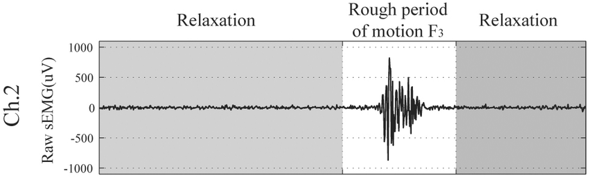
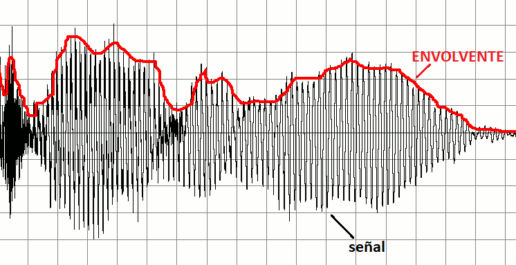
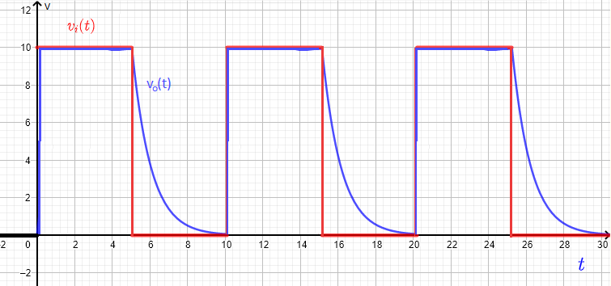

#  Trabajo 2 de Sistemas Electrónicos

#### Segundo Semestre de 2023

## Introducción

La señal de electromiografía (EMG) es una señal variable en el tiempo que nos permite estudiar la relajación y contracción muscular. La figura a continuación muestra una señal de ejemplo:

Figura 1: Ejemplo EMG. Extraído de [1]

En determinadas condiciones, la amplitud de la señal de EMG es aproximadamente proporcional a la activación muscular. Dicha amplitud es lo que se usará para determinar cuantos LEDs se deben encender en nuestro EMG portátil. Para obtener la amplitud de una señal variable en el tiempo, se puede utilizar un circuito llamado detector de envolvente. La figura a continuación muestra la salida del detector de envolvente para la señal de entrada indicada:

Figura 2: Ejemplo de la envolvente de una señal

Para el segundo trabajo, a su Grupo le ha sido asignada la tarea de diseñar el detector de envolvente del EMG. 

Para contextualizar, la tarea de diseño del Electromiógrafo ha sido dividida en los siguientes bloques, donde en el primer trabajo se diseñó el circuito de cada LED:

Figura 3: División del proyecto del EMG en bloques

## Detector de Envolvente

El circuito de detector de envolvente que se utilizará se muestra a continuación:

Figura 4: Circuito detector de envolvente

Cuando el voltaje $v_i$ es mayor que $v_o + V_f$, el diodo conduce. La corriente a través del diodo aumenta, lo que aumenta también la corriente en la resistencia $R_e$ y en el capacitor $C_e$. Eso hace con que $v_o$ aumente, hasta que llegue a $v_i - V_f$ y el circuito llegue a un punto de equilíbrio. Si $V_f$ del diodo es pequeño en comparación con $v_i$, podemos asumir que $v_o \approx v_i$.

Cuando el voltaje $v_i$ disminuye, por ejemplo en una señal cuadrada cuando el voltaje pasa de su valor máximo a su valor minimo, el diodo deja de conducir. En dicha situación, el capacitor empieza a descargarse a través de la resistencia $R_e$. Se puede mostrar que si el voltaje en el momento de corte es $V_{MAX}$, el valor de $v_o$ seguirá la siguiente ecuación- durante la descarga: 

$ v_o = V_{MAX} e^{-\frac{t}{R_e C_e}} $ (1)

La siguiente imagen muestra el resultado cuando $v_i$ es una señal cuadrada.

 

Figura 4: Respuesta del detector de envolvente a una señal cuadrada

El diseño del detector de envolvente significa encontrar un equilíbrio entre el tiempo de respuesta y el tiempo de mantención del valor maximo:
- Si el producto $R_e C_e$ es muy pequeño, la salida no va a mantener el voltaje alto entre un período de la señal de entrada y el siguiente. En la figura 4 se muestra un ejemplo de éste problema. Idealmente, la descarga tiene que ser lenta lo suficiente para que la salida esté en un valor cercano al peak cuando empieza el siguiente ciclo de la señal de entrada, el cual la vuelve a cargar a $V_{MAX}.
- Si el producto $R_e C_e$ es muy grande, el circuito se va a demorar mucho en descargar. Eso hace con que se mantenga la salida con un valor alto de voltaje incluso mucho tiempo después que la señal de entrada ya no está.

Para el EMG que se está diseñando, se identificaron los siguientes requerimientos:
1. Como la señal de EMG suele contener componentes de frecuencia entre 20 Hz y 500 Hz, el mayor período es de 50 ms. El detector de envolvente debe mantener al menos 50% del valor $V_{MAX}$ después de 50 ms de descarga.
2. Como no queremos que la indicación luminosa siga encendida después que se deja de activar los musculos, el tiempo que el detector de envolvente demora en descargar $v_o$ a $0.1 V_{MAX}$ debe ser menor o igual a 500 ms.

Determine el valor de $R_e$ y $C_e$ que cumplen con los requerimentos. El valor de la resistencia y del capacitor tienen que ser uno de los valores disponibles en el anexo.

Plazo de entrega: 23:59, 21 de Septiembre de 2023

## Anexos

Valores de Resistencias disponibles:

|   |  |        |       |  |
|------|------|-----------|------------|-------|
| 10Ω  | 220Ω | 1kΩ       | 6.8kΩ      | 100kΩ |
| 22Ω  | 270Ω | 2kΩ       | 10kΩ       | 220kΩ |
| 47Ω  | 330Ω | 2.2kΩ     | 20kΩ       | 300kΩ |
| 100Ω | 470Ω | 3.3kΩ     | 47kΩ       | 470kΩ |
| 150Ω | 510Ω | 4.7kΩ     | 51kΩ       | 680kΩ |
| 200Ω | 680Ω | 5.1kΩ     | 68kΩ       | 1M    |
    
Valores de Capacitores Electrolíticos disponibles:

|   |  |        |       |  |
|------|------|-----------|------------|-------|
| $2.2\ \mu F$  | $4.7\ \mu F$ | $10\ \mu F$  | $22\ \mu F$ | $33\ \mu F$ |
| $47\ \mu F$  | $68\ \mu F$ | $100\ \mu F$ | $220\ \mu F$ | $470\ \mu F$ |

[1] Finger Motion Decoding Using EMG Signals Corresponding Various Arm Postures - Scientific Figure on ResearchGate. Available from: https://www.researchgate.net/figure/Examples-of-raw-EMG-signal-and-absolute-of-EMG-signal-corresponding-the-2-nd-channel_fig12_51823882 [accessed 3 Sep, 2023]
