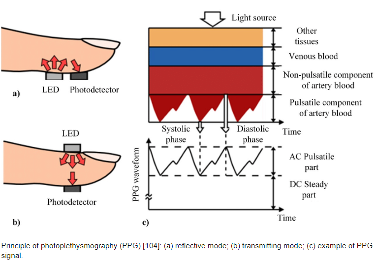
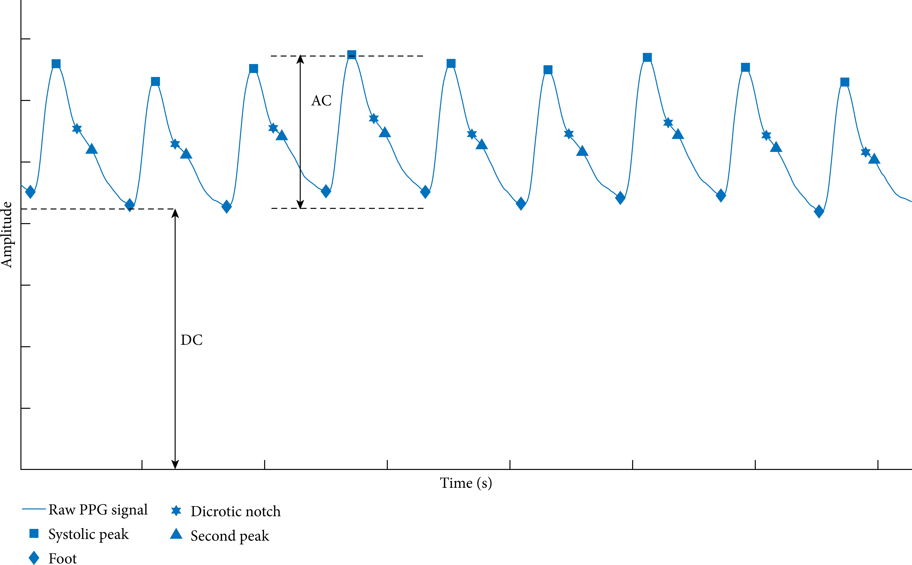

# Trabajo 3

## Introducción

En el contexto del desarrollo de un Fotopletismógrafo, la tarea ha sido dividida en los siguientes bloques:

Figura 1: División del proyecto de Fotopletismografo en bloques

En el primer trabajo se diseñó el bloque de LEDs, y en el segundo trabajo, los circuitos del sensor y del driver de los LEDs. Para el tercer trabajo, a su Grupo le ha sido asignado la tarea de diseñar la primera etapa de amplificación de señal.

## Contexto

El sensor CNY70 puede ser utilizado como en la Figura 2 (a), de forma a obtener una señal de voltaje en el colector que es similar a lo que se muestra en la Figura 2 (b). En la Figura 3 se destaca que la señal tiene una componente DC y otra AC. Para el CNY70 polarizado con el circuito del trabajo 2, el nivel DC podría estar entre 1 V y 4 V, y la amplitud de la señal AC típicamente en menos de 15 mV.

Figura 2: Principio de fotopletismografía. Tomada de Dzedzickis, Andrius & Kaklauskas, Arturas & Bučinskas, Vytautas. (2020). Human Emotion Recognition: Review of Sensors and Methods. Sensors. 20. 592. 10.3390/s20030592. 

Figura 3: Señal PPG. Tomada de Yung-Hui Li, Latifa Nabila Harfiya, Ching-Chun Chang, "Featureless Blood Pressure Estimation Based on Photoplethysmography Signal Using CNN and BiLSTM for IoT Devices", Wireless Communications and Mobile Computing, vol. 2021, Article ID 9085100, 10 pages, 2021. https://doi.org/10.1155/2021/9085100

El objetivo de éste trabajo es ser el primer paso en amplificar la señal, para que pase de algunos pocos milivoltios a que llegue a 5 V de amplitud. Con 5 V de amplitud se podrá, entonces, conectar el circuito de los LEDs con su driver para que se enciendan con el mismo ritmo que el puslo cardíaco.

## Circuito

La primera etapa de amplificación consistirá de un amplificador en emisor común, conforme se muestra en la siguiente imagen:

 

Figura 4: Amplificador en emisor común

Su tarea es diseñar dicho circuito. Se pide determinar el valor de las resistencias, dados los siguientes requerimientos:
- $I_{C_Q} = $
- $A_V = $
- el valor de resistencia equivalente a $R_1$ en paralelo a $R_2$ debe ser aproximadamente 50k

Considere los siguientes valores para el transistor:

- $\beta = 10.000$
- $V_{CE_{SAT}} = 0.7 V$
- $V_{BE} = 1 V$

El trabajo será un ensayo que debe contener la siguiente información:

1. Cálculo de $R_C$ (1pt)
1. Cálculo de $V_{C_Q}$ (1pt)
2. Cálculo de $R_1$ y $R_2$ (2pts)
3. Utilizar los valores de resistencias disponibles más cercanos a los valores calculados, y recalcular $A_V$ y $V_{C_Q}$. (2pts)

Valores de Resistencias disponibles:

|   |  |        |       |  |
|------|------|-----------|------------|-------|
| 10Ω  | 220Ω | 1kΩ       | 6.8kΩ      | 100kΩ |
| 22Ω  | 270Ω | 2kΩ       | 10kΩ       | 220kΩ |
| 47Ω  | 330Ω | 2.2kΩ     | 20kΩ       | 300kΩ |
| 100Ω | 470Ω | 3.3kΩ     | 47kΩ       | 470kΩ |
| 150Ω | 510Ω | 4.7kΩ     | 51kΩ       | 680kΩ |
| 200Ω | 680Ω | 5.1kΩ     | 68kΩ       | 1M    |

