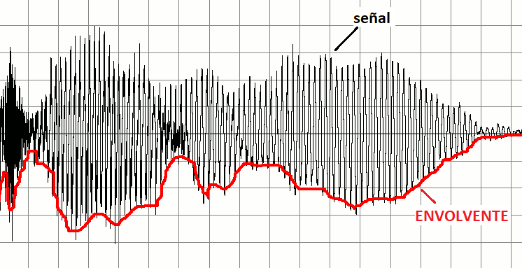

#  Trabajo 6 de Sistemas Electrónicos

#### Segundo Semestre de 2023

## Introducción

En el contexto del diseño de un Electromiógrafo portátil, las tareas han sido divididas en los siguientes bloques:

Figura 1: División del proyecto del EMG en bloques

Con el circuito del trabajo 4 se puede obtener una señal del EMG. Si dicha señal pasa por el detector de envolvente, se obtiene un voltaje que es proporcional a la amplitud del EMG. Sin embargo, dicho voltaje está entre 0 y 5 V, mientras que el circuito de control de los LEDs está diseñado para un voltaje de entrada entre -5 V y 5 V. Por ejemplo, si se conecta la salida del detector de envolvente al circuito de los LEDs, incluso cuando no hay señal de EMG (la salida del detector de envolvente es 0 V), 4 o 5 LEDs estarán encendidos !

En el quinto trabajo, a su grupo le ha sido asignada la tarea de diseñar el circuito del Amplificador 2. El principal objetivo es restar ~ 5 V de la señal de salida del detector de envolvente, de tal forma que cuando no hay EMG la salida sea ~ -5 V y todos los LEDs estén apagados. Adicionalmente, el amplificador 2 también amplificará el voltaje resultante por un valor ajustable a través de un potenciometro.

El trabajo debe ser un ensayo que contiene la información especificada en la siguiente sección.

## Amplificador 2

Para simplificar el circuito del amplificador 2, se invertirá el sentido del diodo en el detector de envolvente, de tal forma que siga la amplitud negativa de la señal, en vez de la positiva. La señal resultante se ilustra en la figura 2. Nótese que la señal resultante será negativa.

Figura 2: Ejemplo de la envolvente negativa de una señal

Considerando que la salida del detector de envolvente es el voltaje $v_i$, y la entrada del circuito de control de los LEDs es el voltaje $v_o$, se requiere diseñar un circuito que implemente la siguiente relación:

$$ v_o = -\frac{R_1}{R_2} v_i -\frac{R_1}{R_3}5$$
$$(ecuación\ 1)$$

Donde $R_1$, $R_2$ y $R_3$ son 3 resistencias que permiten ajustar la resta y la amplificación. En particular, si $R_3 = R_1$, el circuito implementa la siguiente ecuación: $ v_o = -\frac{R_1}{R_2} v_i - 5$, la cual invierte y amplifica el voltaje $v_i$ y resta 5 voltios, como deseado.

1. Diseñen el circuito que implementa la ecuación 1 utilizando apenas los siguientes elementos (3 pt):

Figura 3: Elementos disponibles para implementar el circuito del Amplificador 2

2. Para permitir el ajuste de la ganancia y de la resta de voltaje, $R_2$ y $R_3$ se implementarán como resistencias variables. Cada una de ellas consistirá de una resistencia con un valor fijo ($R_{2_{fija}}$ y $R_{3_{fija}}$) en serie con una resistencia variable entre 0 y $10\ k\Omega$ ($R_{2_{variable}}$ y $R_{3_{variable}}$). Elijan el valor de $R_1$, $R_{2_{fija}}$ y $R_{3_{fija}}$ de tal forma que la ganancia esté entre 1 y 100, y la resta de voltaje entre 2.5 y 7.5 V, aproximadamente (30% de tolerancia) (3 pt). Es decir:
   - $1 \pm 0.3 \leq \frac{R_1}{R_{2_{fija}} + R_{2_{variable}}} \leq 100 \pm 30$
   - $2.5 \pm 0.75 \leq 5\frac{R_1}{R_{3_{fija}} + R_{3_{variable}}} \leq 7.5 \pm 2.25$
   - Los valores de $R_1$, $R_{2_{fija}}$ y $R_{3_{fija}}$ deben ser valores de resistencias disponibles en el anexo, y estar entre $200\ \Omega$ y $220\ k\Omega$

Figura 4: Implementación de las resistencias $R_2$ y $R_3$ como resistencias variables.

Plazo de entrega: 23:59, Miércoles, 8 de Noviembre de 2023

## Anexos

Valores de Resistencias disponibles:

|   |  |        |       |  |
|------|------|-----------|------------|-------|
| ~~10Ω~~  | 220Ω | 1kΩ       | 6.8kΩ      | 100kΩ |
| ~~22Ω~~  | 270Ω | 2kΩ       | 10kΩ       | 220kΩ |
| ~~47Ω~~  | 330Ω | 2.2kΩ     | 20kΩ       | ~~300kΩ~~ |
| ~~100Ω~~ | 470Ω | 3.3kΩ     | 47kΩ       | ~~470kΩ~~ |
| ~~150Ω~~ | 510Ω | 4.7kΩ     | 51kΩ       | ~~680kΩ~~ |
| 200Ω | 680Ω | 5.1kΩ     | 68kΩ       | ~~1M~~    |
