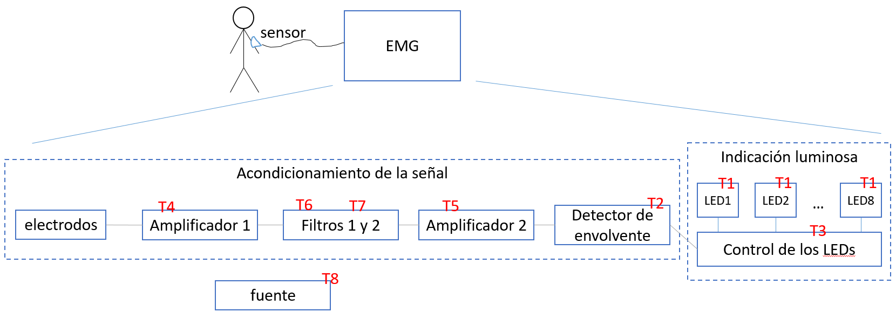

#  Trabajo 6 de Sistemas Electrónicos

#### Segundo Semestre de 2023

## Introducción

En el contexto del diseño de un Electromiógrafo portátil, las tareas han sido divididas en los siguientes bloques:

Figura 1: División del proyecto del EMG en bloques

Algo sobre ruido y la necesidad de filtros

En el sexto trabajo, a su grupo le ha sido asignada la tarea de diseñar el circuito de los filtros 1 y 2. El principal objetivo es eliminar el ruido que tiene frecuencia distinta a las frecuencias de interés de EMG. Consideraremos que las frecuencias de interés están entre 50 Hz y 500 Hz.

El trabajo debe ser un ensayo que contiene la información especificada en las siguientes secciones.

## Filtro 1

La Figura 2 muestra el circuito del filtro 1.

Figura 2: Circuito del Filtro 1

1. Elijan los valores de $R_1$, $R_2$, $C_1$, $C_2$, $R_a$ y $R_b$ de tal forma que el circuito cumpla con las siguientes condiciones:
    1. La frecuencia de corte del filtro es $f_0 = 50\ Hz$ (o, de forma equivalente, $\omega_0 = 2 \pi 50\ rad/s$)
    1. La ganancia maxima del filtro es $A_{V_{MAX}} = 3$
    1. $R_1 = R_2$
    1. $C_1 = 2 C_2$
    1. El valor de las resistencias está dentro de los valores disponibles en el anexo
    1. El valor de los capacitores está dentro de los valores disponibles en el anexo

## Filtro 2

La Figura 3 muestra el circuito del filtro 2.

Figura 3: Circuito del Filtro 2

2. Elijan los valores de $R_1$, $R_2$, $C_1$, $C_2$, $R_a$ y $R_b$ de tal forma que el circuito cumpla con las siguientes condiciones:
    1. La frecuencia de corte del filtro es $f_0 = 500\ Hz$ (o, de forma equivalente, $\omega_0 = 2 \pi 500\ rad/s$)
    1. La ganancia maxima del filtro es $A_{V_{MAX}} = 3$
    1. $R_1 = R_2$
    1. $C_1 = 2 C_2$
    1. El valor de las resistencias está dentro de los valores disponibles en el anexo
    1. El valor de los capacitores está dentro de los valores disponibles en el anexo

## Comprobación de los filtros diseñados

3. Una vez que hayan elegido los valores de los componentes para los dos filtros, comprueben que cumplen con su objetivo realizando las siguientes actividades:

    1. Calculen la ganancia en frecuencia de cada filtro para las siguientes frecuencias 0 Hz, 50 Hz, 160 Hz, 500 Hz y $\infty$ Hz.
    2. Basándose en la respuesta anterior, ¿qué tipo de filtro implementa el filtro 1?, y ¿qué tipo de filtro implementa el filtro 2 ?
    3. Simulen la respuesta a escalón de alguno de los filtros y describan el tipo de respuesta que obtienen.

Plazo de entrega: 23:59, Miércoles, 8 de Noviembre de 2023

## Anexos

Valores de Resistencias disponibles:

|   |  |        |       |  |
|------|------|-----------|------------|-------|
| 10Ω  | 220Ω | 1kΩ       | 6.8kΩ      | 100kΩ |
| 22Ω  | 270Ω | 2kΩ       | 10kΩ       | 220kΩ |
| 47Ω  | 330Ω | 2.2kΩ     | 20kΩ       | 300kΩ |
| 100Ω | 470Ω | 3.3kΩ     | 47kΩ       | 470kΩ |
| 150Ω | 510Ω | 4.7kΩ     | 51kΩ       | 680kΩ |
| 200Ω | 680Ω | 5.1kΩ     | 68kΩ       | 1M    |

Valores de Capacitores Ceramicos disponibles:

|   |  |        |       |  |
|------|------|-----------|------------|-------|
| 100 pF  | 220 pF | 330 pF | 470 pF | 680 pF |
| 1 nF  | 2.2 nF | 3.3 nF | 4.7 nF | 6.8 nF |
| 10 nF  | 22 nF | 33 nF | 47 nF | 68 nF |
| $0.1\ \mu F$  | $0.22\ \mu F$ | $0.33\ \mu F$| $0.47\ \mu F$ | $0.68\ \mu F$ |
