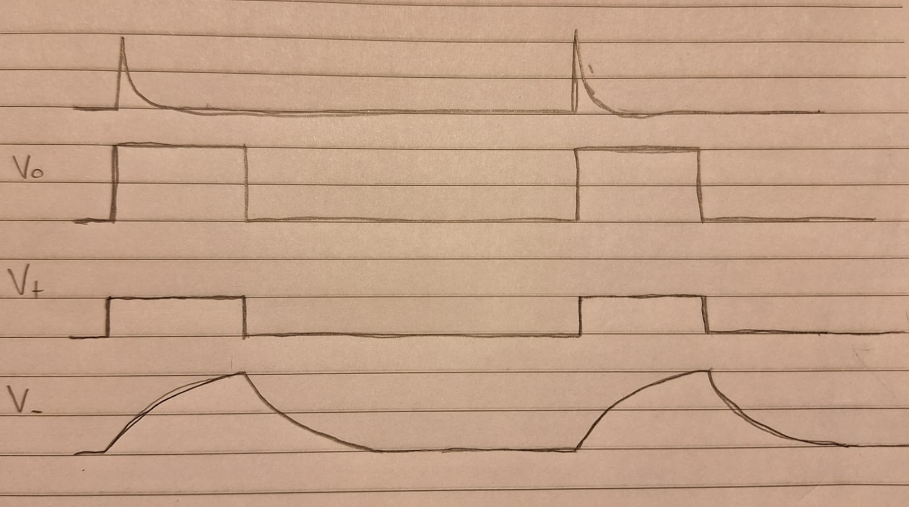

#  Trabajo 7 de Sistemas Electrónicos

## Introducción

¡ Felicitaciones ! El diseño realizado en los trabajos 1 a 6 permite fabricar un fotopletismógrafo funcional. Si se conecta la salida del amplificador 2 directamente al driver de los LEDs, se podrá observar como las luces se encienden de acuerdo al ritmo cardíaco.

Sin embargo, aún falta el diseño de 2 bloques que se pueden ver en la división de las tareas del proyecto: "monoestable" y "fuente".

Figura 1: División del proyecto de Fotopletismografo en bloques

En este trabajo, el objetivo es diseñar el bloque llamado "monoestable", que representa un circuito multivibrador monoestable.

La motivación para introducir dicho bloque es que la duración de los pulsos de luz no es uniforme. Dependiendo de la forma de la señal del sensor, el tiempo encendido de los LEDs podría ser de 300 ms, 500 ms, 700 ms etc. Es deseable uniformizarlo, de tal forma que siempre que se detecte un pulso cardíaco, los LEDs se enciendan por ~200 ms y luego se apaguen. Eso facilitará el conteo de los pulsos por un humano para deducir la frecuencia cardiaca.

El circuito completo, considerando la adición del monoestable, se muestra en las figuras a continuación:

Figura 2: Circuito del Fotopletismógrafo

## Multivibrador Monoestable

La Figura 3 muestra el circuito del multivibrador monoestable a ser implementado, donde $v_i = v_{pletis}$ es la señal de salida del amplificador 2. $v_i$ es una señal que cambia de 0 a $V_{CC}$ y a 0 nuevamente de acuerdo al ritmo cardíaco. El circuito de la figura 3 está normalmente con la salida en 0 V. Cada vez que la señal $v_i$ cambia de 0 a $V_{CC}$ (flanco positivo), el circuito se dispara, y su salida cambia a $V_{CC}$. Una vez que esto sucede, el capacitor $C_4$ se empieza a cargar y, después de un período fijo de tiempo, la salida del circuito vuelve a su estado estable que es 0 V. 

Figura 3: Circuito del multivibrador monoestable

Para facilitar el análisis, se cambia el voltaje de referencia restando $V_{bias}$ a todos los voltajes. Recordando que $V_{CC} = 5\ V$ y $V_{bias} = 2.5\ V$, se puede concluir que donde antes había $V_{CC}$ en el circuito ahora hay $2.5\ V = +V_{bias}$, donde antes había $V_{bias}$ ahora hay $0\ V = tierra$, y donde antes había tierra ahora hay $-2.5\ V = -V_{bias}$. El resultado se muestra en la Figura 4.

Figura 3: Circuito del multivibrador monoestable con voltajes desplazados para facilitar el analisis

Proyecte el circuito (determine el valor de $R_7$, $R_8$, $R_9$, $R_{10}$, $C_3$ y $C_4$), dados los siguientes requerimientos:

1. Todas las resistencias y capacitores deben tener valores dentro de los disponibles en los Anexos del trabajo
2. Los capacitores deben ser del tipo ceramico
1. $R_8 = R_9$
2. $R_7 = 10 R_8$
3. La corriente maxima que fluye por $R_9$ no debe ser mayor a 1 mA
4. Los valores de $R_{10}$ y $C_4$ conllevan a que el circuito monoestable se mantiene encendido por un intervalo de tiempo entre 100 y 300 ms cuando se dispara.
3. Los valores de $R_7$ y $C_3$ generan un filtro con constante de tiempo del orden de algunos milisegundos.

Considere que $V_{bias} = 2.5\ V$ y, si necesario, que el $V_f$ de los diodos $D_2$ y $D_3$ es 0.3 V.

Ayuda: La figura 4 muestra la forma de onda de algunos puntos críticos del circuito.

Figura 4: Bosquejo de las formas de onda del circuito multivibrador monoestable

## Anexos

Valores de Resistencias disponibles:

|   |  |        |       |  |
|------|------|-----------|------------|-------|
| 10Ω  | 220Ω | 1kΩ       | 6.8kΩ      | 100kΩ |
| 22Ω  | 270Ω | 2kΩ       | 10kΩ       | 220kΩ |
| 47Ω  | 330Ω | 2.2kΩ     | 20kΩ       | 300kΩ |
| 100Ω | 470Ω | 3.3kΩ     | 47kΩ       | 470kΩ |
| 150Ω | 510Ω | 4.7kΩ     | 51kΩ       | 680kΩ |
| 200Ω | 680Ω | 5.1kΩ     | 68kΩ       | 1M    |

Valores de Capacitores Ceramicos disponibles:

|   |  |        |       |  |
|------|------|-----------|------------|-------|
| 100 pF  | 220 pF | 330 pF | 470 pF | 680 pF |
| 1 nF  | 2.2 nF | 3.3 nF | 4.7 nF | 6.8 nF |
| 10 nF  | 22 nF | 33 nF | 47 nF | 68 nF |
| $0.1\ \mu F$  | $0.22\ \mu F$ | $0.33\ \mu F$| $0.47\ \mu F$ | $0.68\ \mu F$ |

Valores de Capacitores Electrolíticos disponibles:

|   |  |        |       |  |
|------|------|-----------|------------|-------|
| $2.2\ \mu F$  | $4.7\ \mu F$ | $10\ \mu F$  | $22\ \mu F$ | $33\ \mu F$ |
| $47\ \mu F$  | $68\ \mu F$ | $100\ \mu F$ | $220\ \mu F$ | $470\ \mu F$ |