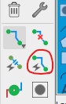

#  Trabajo 7 de Sistemas Electrónicos - Extra

#### Segundo Semestre de 2023

La siguiente actividad es opcional y puede sumar hasta 1 punto extra en el trabajo 7. En el caso que tengan nota maxima en el trabajo 7, el punto extra será para el trabajo 8. En el caso de que nuevamente tengan puntuación maxima, el punto extra será para la Prueba 3.

## Preparación para la fabricación de los circuitos diseñados

Ha llegado el momento de preparar la fabricación del EMG portátil. El circuito completo se dividirá en 4 placas:

1. La placa que se conecta a la batería y genera +5 V y -5 V.
2. La placa que contiene los electrodos, amplificador de instrumentación y filtro 1. Ésta placa debe ser compacta para poder unirse al usuario de forma comfortable.
3. La placa que contiene el filtro 2, detector de envolvente y amplificador 2.
4. La placa con el controlador de los LEDs y los LEDs

Cada una de éstas placas se fabricará con técnicas de fabricación distintas. La placa 1 será fabricada por una empresa especializada, las placas 2 y 3 serán construidas con placas de cobre y componentes de montaje superficial en un proceso de fabricación artesanal, y, por último, la placa 4 se fabricará utilizando una perfboard. Las distintas técnicas de fabricación y sus detalles se explorarán en las últimas clases del semestre.

Para éste trabajo, el enfoque es la placa 3. El objetivo es diseñar la placa en un software de diseño electrónico (Electrical computer-aided design - ECAD), y generar los archivos necesarios para su fabricación. El ECAD elegido para la tarea es el Autodesk EAGLE, que provee una versión gratuita.

1. Descarguen e instalen EAGLE. https://www.autodesk.com/products/eagle/free-download . Alternativamente, utilicen los notebooks del laboratorio.
2. Si necesario, creen sus cuentas en Autodesk para poder iniciar la aplicación.
4. Creen un nuevo proyecto. Luego, creen un nuevo Schematic en el nuevo proyecto.
5. El schematic es donde se diseña el circuito electrónico de forma muy similar a la que se hace en clase. Agreguen las partes que se utilizarán en el circuito, conforme las imagenes a continuación. Asegurense de agregar los mismos componentes que los de las imagenes.
6. Una vez que tienen todos los componentes en el schematic, utilicen los botones de mover, copiar y "net" para diseñar el diagrama del circuito deseado. Consideren que la entrada proviene de uno de los PINHD-1X1, y que la salida se va al otro PINHD-1X1. Asegurense de apenas implementar el filtro 2, detector de envolvente y amplificador 2.
7. Apliquen los valores correctos a los componentes pasivos (resistencias y capacitores).
7. Cambien al layout. Si el objetivo del schematic es determinar las conexiones entre los componentes, el objetivo del layout es diseñar la placa que implementa dichas conexiones. Es decir, el layout es donde realmente se configura la geometría de la placa considerando los tamaños reales de los componentes.
8. Cambien el tamaño de la placa (rectangula amarillo) a 1968 x 1968.
9. Ubiquen todos los componentes dentro de la placa. Intenten posicionarlos de forma que las conexiones eléctricas sean más cortas y simples.
10. En el menu DRC, cambien el minimum width a 10mil y los minimum clearances a 10mil
11. Utilicen el autorouter para generar la conexión entre los componentes. Asegurense de seleccionar N/A para Bottom (vamos a fabricar el circuito en una placa con una sóla cara). Utilicen el ruteo manual para mejorar el resultado si estiman necesario.

IMAGENES:

3:

4:

(agreguen 2 amp ops después de seleccionar esta parte. Pueden apretar ESC para salir del modo de inserción)

(agreguen 2 PINHD-1X1 y uno PINHD-1X5)

Conexiones del PINHD-1X5:

5:

7:

8:

9:

10:

11:

AYUDA:

Schematic: video de ejemplo de utilización de la herramienta. https://youtu.be/VNoaSeiNSxg

Board: el area de la placa está enmarcado por el rectangulo con borde amarillo y es un poco más oscuro que el fondo gris. Para rutear el circuito hay que mover todos los componentes dentro de dicha area. Además, también hay que implementar las lineas de cobre que hacen la conexion electrica entre ellos. Las lineas amarillas entre los terminales muestran que partes deberian ir conectadas. Para implementar un ruteo automatico, pueden utilizar el boton "Autorouter". Utilicen el boton "DRC" para asegurar que está todo correctamente conectado.
