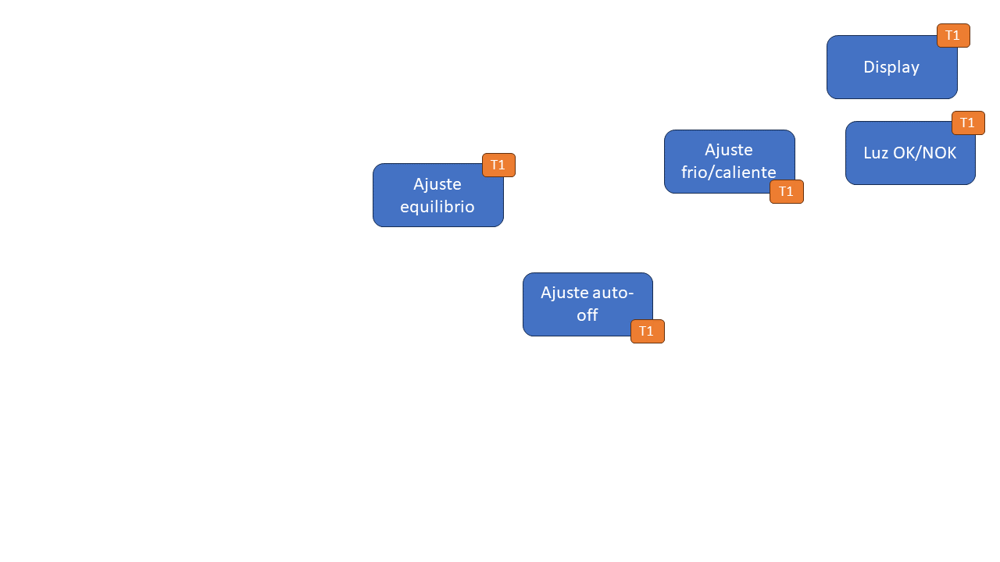

#  Trabajo 1 de Sistemas Electrónicos

#### Primer Semestre de 2024

## Introducción

Este semestre, su grupo es responsable de diseñar y fabricar un espirómetro electrónico para aplicar los conocimientos y tecnicas relacionados a la asignatura de Sistemas Electrónicos. El espirómetro es un instrumento de medida usado en medicina para determinar los volúmenes y capacidades del pulmón. Requiere que el paciente sople por un sistema de recogida de aire (por ejemplo un tubo), y luego realiza mediciones como por ejemplo el flujo espiratorio maximo (PEF - tipicamente en L/min) y el volúmen espiratorio forzado 1 (FEV1 - tipicamente en L). Las mediciones realizadas pueden ser insumo para que un profesional de la salud identifique o descarte ciertas enfermedades pulmonares, como asma, bronquitis y emfisema.

A grandes rasgos, el sistema que deben diseñar puede ser dividido en 6 bloques:

1. medición: responsable por convertir el flujo de aire en una señal eléctrica. En particular, se requiere convertir el flujo de aire en un voltaje.
1. Flujo Espiratorio Maximo (PEF): El PEF es simplemente el valor maximo de flujo de aire que el paciente espira. Por lo tanto, este bloque es responsable por capturar el valor maximo de la señal de medición. También debe contener un display para mostrar el resultado.
1. Volumen Espiratorio forzado 1 (FEV1): El FEV1 es el volumen de aire espirado por el paciente durante 1 segundo. Por lo tanto, este bloque es responsable por integrar la señal de medición durante 1 segundo, y luego retener el resultado. También debe contener un display para mostrar el valor obtenido.
1. energía: responsable por alimentar el resto de los bloques con energía eléctrica. También contendrá un botón de encendido/apagado y una luz que indica cuando el dispositivo está encendido.
1. reset: Tanto el bloque de PEF cuanto el de FEV1 necesitan una señal que les indique cuando descartar la medición anterior e iniciar una nueva. El bloque reset tendrá un botón para que el usuario pueda indicar cuando generar dicha señal. También tendrá el circuito que genera la señal con las características requeridas por los otros bloques.
1. Temporizador 1s: responsable por contar por 1 segundo y luego generar la señal que indica al bloque FEV1 que finalice la medición y retenga el valor obtenido.

Figura 1: División del sistema del espirómetro electrónico en bloques

## Indicaciones Luminosas

En el Trabajo 1, a su grupo le ha sido asignada la tarea de diseñar las indicaciones luminosas, indicadas a continuación. 

Figura 2: Indicaciones luminosas del espirómetro electrónico

El trabajo será un ensayo que debe contener la siguiente información:

1. Identificación del grupo (nombres, apellido y RUT)
1. La información que se pide en cada una de las siguientes sesiones de este documento

### Luz de encendido y luz de medición

La primera indicación luminosa es la luz de encendido, que debe indicar cuando el sistema está energizado. En dicha situación, el bloque de energía produce una salida con +5 V y otra con -5 V. Para implementar la luz de encendido, se utilizará un LED y una resistencia conectados de la siguiente forma:

Figura 3: Luz de encendido

La segunda indicación luminosa es la luz de medición, que debe indicar cuando el sistema está contando el 1 segundo para medir el volumen espiratorio forzado 1. Debe estar encendida cuando se apreta el botón que inicia la medición, y apagarse transcurrido 1 segundo. Para implementarla, se utilizará un LED y una resistencia conectados de la siguiente forma:

Figura 4: Luz de encendido

Posteriormente se introducirá el interruptor que encenderá y apagará el LED de acuerdo al temporizador.

El material que tienen disponible para ambos circuitos son LEDs de 3 mm de 5 colores distintos (Rojo/Amarillo/Verde/Azul/Blanco) y un conjunto de resistencias de 1/4W.

Su tarea es elegir el LED y la resistencia para cada circuito para que produzcan el resultado esperado.

Indiquen en el ensayo:

1. El color de LED elegido para la luz de encendido, y el color de LED elegido para la luz de medición. Pueden elegir cualquier uno de los 5 colores disponibles para cada luz, pero tienen que ser colores distintos y no pueden repetir los colores elegidos por el otro grupo.
1. Identificación de 2 posibles hojas de datos (datasheets) para LEDs del color de la luz de encendido y 2 posibles hojas de datos (datasheets) para LEDs del color de la luz de medición. Indicar link de origen donde se pueden descargar. (1pt)
1. Elección de una de las hojas de datos para cada color e identificación de los siguientes parametros (1pt):
    1. Voltaje de polarización directa máxima $V_{f,max}$
    1. Voltaje de polarización reversa máxima $V_{r,max}$
    1. Corriente directa máxima $I_{f,max}$*
    1. Potencia disipada máxima $P_{D,max}$
    1. Corriente de prueba $I_f$
    1. Voltaje de polarización directa para la corriente de prueba $V_f$
1. Cálculo del valor de las resistencias $R_1$ y $R_2$ para que cada LED  se encienda con una corriente equivalente a la de prueba $I_f$ de su datasheet. (1pt)
1. Cálculo de la potencia disipada en cada resistencia cuando los LEDs están encendidos. ¿Es menor que 1/4 W? (1pt)
1. Para este proyecto, los valores de resistencia disponibles están limitados a los indicados en la tabla anexa. Elección de valores de resistencia cercanos a los calculados, y en cuanto cambia cada $I_f$. (1pt)
1. ~~Respuesta a la siguiente pregunta: ¿Como se podrían conectar resistencias de los valores disponibles para obtener una resistencia equivalente más cercana al valor calculado para COLOR1 ? Se permite repetir el mismo valor más de una vez. No utilizar más que 4 resistencias. (1pt)~~

### displays

## Plazo de entrega: 23:59, 27 de Marzo de 2024

## Anexos

Valores de Resistencias disponibles:

|   |  |        |       |  |
|------|------|-----------|------------|-------|
| 10Ω  | 220Ω | 1kΩ       | 6.8kΩ      | 100kΩ |
| 22Ω  | 270Ω | 2kΩ       | 10kΩ       | 220kΩ |
| 47Ω  | 330Ω | 2.2kΩ     | 20kΩ       | 300kΩ |
| 100Ω | 470Ω | 3.3kΩ     | 47kΩ       | 470kΩ |
| 150Ω | 510Ω | 4.7kΩ     | 51kΩ       | 680kΩ |
| 200Ω | 680Ω | 5.1kΩ     | 68kΩ       | 1M    |