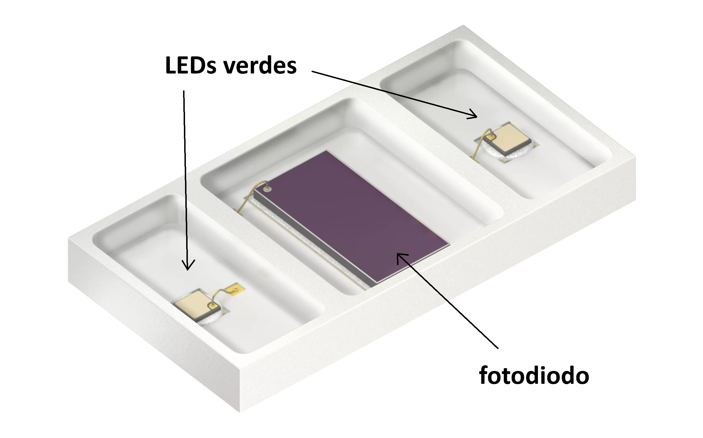

#  Trabajo 1 de Sistemas Electrónicos

#### Primer Semestre de 2025

## Introducción

Este semestre, su grupo es responsable de diseñar y fabricar un prototipo de fotopletismógrafo para aplicar los conocimientos y tecnicas relacionados a la asignatura de Sistemas Electrónicos.

El dispositivo que se busca diseñar puede ser utilizado una unidad a la vez, en cuyo caso apenas mide la frecuencia cardíaca, o junto con otro dispositivo identico al primero, en cuyo caso las dos unidades se comunican entre sí y son capaces de medir y mostrar cuanto tiempo el pulso cardíaco demora en trasladarse. Es decir, la diferencia de tiempo entre el instante que la primera unidad mide el pulso, y el instante en que la segunda unidad lo detecta. Dicha medición se conoce como tiempo de tránsito del pulso (en inglés, Pulse transit time- PTT), y, en conjunto con la medición de la distancia entre los dispositivos, permite calcular la velocidad de propagación de la ola de presión sanguínea. La velocidad de propagación permite inferir la rigidez de las arterias, lo que se relaciona con la presión arterial y riesgo de cardiopatias.

En resúmen, el prototipo debe tener las siguientes funcionalidades:

1. medir la frecuencia cardíaca (Heart Rate - HR)
1. emitir una señal de luz infrarroja cuando hay un pulso cardíaco
1. detectar la señal infraroja emitida por otro prototipo
1. medir el tiempo entre la detección de la señal infrarroja y el siguiente pulso cardíaco (Pulse Transit Time - PTT)
1. Permitir la visualización de los valores de HR y PTT medidos

El sistema que deben diseñar puede ser dividido en los siguientes bloques:

Figura 1: División del sistema del fotopletismógrafo en bloques

En este primer trabajo el objetivo es diseñar las partes del dispositivo que contienen diodos emisores de luz (LEDs):

1. El circuito que emite luz verde para generar la señal de fotopletismografia
1. El circuito que enciende una luz del color del grupo cuando hay un pulso cardíaco
1. El circuito que emite una señal de luz infrarroja cuando hay un pulso cardíaco
1. La pantalla que muestra el valor de HR o PTT

El trabajo será un ensayo que debe contener la siguiente información:

- Identificación del grupo (color)
- Identificación de los integrantes del grupo (nombres, apellidos y RUT)
- La información que se pide en cada una de las siguientes sesiones de este documento

## 1. Fuente de luz verde

Para medir la señal de fotopletismografia se necesita una fuente de luz y un sensor de luz. Típicamente se utiliza una fuente de luz verde pues hay evidencias que produce una señal más immune al ruido causado por movimientos del paciente.

En el caso del prototipo en desarrollo, se utilizará el componente SFH 7070 del fabricante ams-OSRAM, que está diseñado para aplicaciones de fotopletismografia. El SFH 7070 es un componente electrónico que contiene 2 LEDs verdes como fuente de luz y un fotodiodo como sensor de la luz reflejada.

Figura 2: SFH 7070

1. Encuentren la hoja de datos (datasheet) del SFH 7070 e identifiquen, con respecto a los LEDs verdes, los siguientes parametros (0.6pt):
    - El valor tipico del voltaje de polarización directa $V_f$
    - La corriente de prueba $I_f$ con la que se midió el $V_f$ típico
    - El valor máximo de de corriente contínua directa $I_{f,max}$
    - El voltaje de polarización reversa máxima $V_{r,max}$
    - El voltaje de polarización directa máxima $V_{f,max}$

2. Considerando que el voltaje del diodo $V_D$ tiene el valor de $V_f$ típico que obtuvieron en el item anterior, calculen el valor de $R_1$ en el siguiente circuito para que la corriente a través del LED verde sea 10 mA. (0.6pt)

Figura 3: Circuito de polarización para cada LED verde del SFH 7070

3. Para este proyecto, los valores de resistencia disponibles están limitados a los indicados en la tabla anexa. Elijan un valor de resistencia que esté disponible en el anexo y sea cercano al calculado, y determinen cual será la nueva corriente $I_D$ con el valor de $R_1$ elegido. Asegurense de que es menor que $I_{f,max}$. (0.3pt)

## 2. Luz indicadora de pulso cardíaco

Se disponen de LEDs de 3 mm de diametro de 4 colores distintos (Rojo/Amarillo/Verde/Azul) para cumplir la función de indicación luminosa de cada pulso cardíaco. Sin embargo, no se disponen de los números de parte ni de las características eléctricas de los LEDs. Cada grupo utilizará un LED del mismo color que el nombre de su grupo para el prototipo. 

Indiquen en el ensayo:

4. Identificación de 2 posibles hojas de datos (datasheets) para LEDs del color del grupo. Indicar link de origen donde se pueden descargar. (0.3pt)
1. Elección de una de las hojas de datos e identificación de los siguientes parametros (0.6pt):
    1. Voltaje de polarización directa máxima $V_{f,max}$
    1. Voltaje de polarización reversa máxima $V_{r,max}$
    1. Corriente directa máxima $I_{f,max}$*
    1. Potencia disipada máxima $P_{D,max}$
    1. Corriente de prueba $I_f$
    1. Voltaje de polarización directa para la corriente de prueba $V_f$

Para encender el LED se utilizará el siguiente circuito:

Figura 4: Circuito de la indicación luminosa de pulso cardíaco

El objetivo es obtener una corriente en el LED que sea cercana al valor de su corriente de prueba $I_f$. Se disponen de un conjunto de resistencias de 1/4W, cuyos valores están indicados en la tabla anexa. Indiquen en el ensayo:

6. Cálculo del valor de la resistencia $R_{2}$ para que el LED se encienda con una corriente equivalente a la corriente de prueba $I_f$ de su datasheet. (0.6pt) AYUDA: pueden considerar que $V_D = V_f$. 
1. Elección de un valor de resistencia disponible en el anexo cercano al calculado, y en cuanto cambia $I_f$ con la nueva resistencia. Este será el valor que se utilizará en el prototipo. (0.3pt)
1. Cálculo de la potencia disipada en la resistencia $R_{2}$ cuando el LED está encendido. ¿Es menor que 1/4 W? (0.2pt)

## 3. Señal de luz infrarroja

Cuando se utilizan dos fotopletismógrafos en conjunto, es necesario que cada uno envíe una señal al otro dispositivo para informar que detectó un pulso cardíaco y se pueda hacer la medición de PTT. Se utilizará una forma simple de comunicación a través de una señal de luz infrarroja. Es decir, cada vez que se detecta un pulso, el fotopletismógrafo enciende una luz infrarroja por un breve período de tiempo, la cual puede ser detectada por el otro fotopletismógrafo.

Para producir la señal infrarroja, se utilizarán 3 LEDs infrarrojos modelo VSMB10940 del fabricante Vishay Semiconductor. Cada LED estará apuntando en una dirección distinta para asegurar que la señal llegue al otro dispositivo independientemente de su orientación.

9. Encuentren la hoja de datos (datasheet) del LED infrarrojo e identifiquen (0.6pt): 
    - El valor de corriente $I_F$ con la cual la intensidad radiante es 1 mW/sr
    - El valor tipico del voltaje de polarización directa $V_f$ cuando la corriente es igual a $I_F$ determinado en el ítem anterior
    - El voltaje de polarización directa máxima $V_{f,max}$
    - El valor de la corriente directa contínua máxima $I_{f,max}$

1. Asumiendo que $V_d$ es igual al valor de $V_f$ típico identificado en el ítem anterior, calculen el valor de $R_3$ en el siguiente circuito de tal forma que la corriente que fluye a través de los LEDs sea igual a la corriente $I_F$. (0.6pt)

Figura 5: Circuito de la señal de luz infrarroja

11. Elijan un valor de resistencia que esté disponible en el anexo y sea cercano al calculado, y determinen cual será la nueva corriente $I_D$ con el valor de $R_3$ elegido. Asegurense de que es menor que $I_{f,max}$. (0.3pt)

## 4. Pantalla / Display

Para visualizar el valor de HR y PTT se utilizará un display de voltaje como el de la siguiente figura:

Figura 6: Display de voltaje

Los segmentos que componen el display pueden encenderse para mostrar numeros entre 0.01 y 99.9. Cada uno de los segmentos es un LED independiente, que se controla con el circuito que está en la placa de atrás (la placa verde en la figura 6). La figura 7 muestra los 7 segmentos que componen cada numero (A - G) más el pundo (DP).

Figura 7: Segmentos de cada numero del display

Para utilizar el display de voltaje, basta alimentarlo con los cables negro y rojo con un voltaje entre 3.5 y 30 V, y conectar el voltaje que se desea medir en el cable amarillo.

En trabajos posteriores se diseñarán los circuitos que convierten los valores de HR y PTT en voltajes, y luego los escalan para que cada 10 mV correspondan a 1 lpm (en el caso de HR) o 1 ms (en el caso de PTT). El sistema completo se alimentará con 5V y, por lo tanto, se podrán desplegar frecuencias cardíacas entre 0 lpm (correspondiente a 0.00 V) y 500 lpm (correspondiente a 5.00 V), y tiempos de transito de pulso entre 0 ms (correspondiente a 0.00 V) y 500 ms(correspondiente a 5.00 V). Además se utilizará un botón para seleccionar cual valor mostrar en el display (HR o PTT).

Para este trabajo se requiere estimar el consumo de corriente  maximo del display. Para esto, se realizaron distintas mediciones y se registró el consumo de corriente del modulo para cada una.

| número en el display	|	corriente medida (mA) |
| -- | -- |
|1.99	|	17.67|
|2.12	|	16.6|
|2.28	|	18.35|
|2.81	|	16.97|
|3.58	|	18.32|
|3.61	|	16.74|
|4.71	|	15.9|

Tabla 1: mediciones de consumo de corriente del display

Figura 8: display desplegando los valores durante las mediciones

12. Considerando los resultados obtenidos, estimen cual sería el consumo maximo de corriente cuando todos los LEDs del display están encendidos. (1pt)

## Plazo de entrega: 23:59, 24 de Marzo de 2025

## Anexos

Valores de Resistencias disponibles:

|   |  |        |       |  |
|------|------|-----------|------------|-------|
| 10Ω  | 220Ω | 1kΩ       | 6.8kΩ      | 100kΩ |
| 22Ω  | 270Ω | 2kΩ       | 10kΩ       | 220kΩ |
| 47Ω  | 330Ω | 2.2kΩ     | 20kΩ       | 300kΩ |
| 100Ω | 470Ω | 3.3kΩ     | 47kΩ       | 470kΩ |
| 150Ω | 510Ω | 4.7kΩ     | 51kΩ       | 680kΩ |
| 200Ω | 680Ω | 5.1kΩ     | 68kΩ       | 1M    |