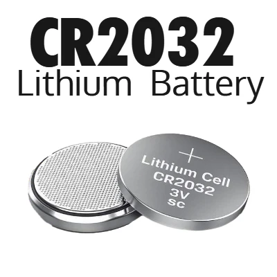
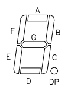
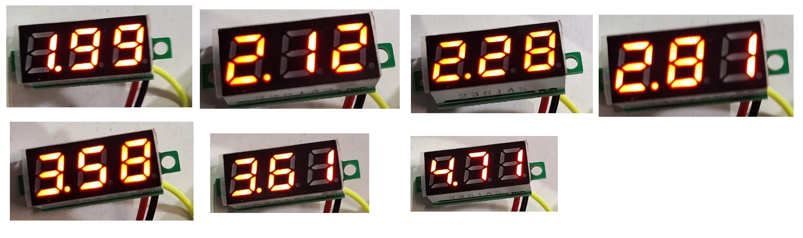

#  Trabajo 1 de Sistemas Electrónicos

#### Segundo Semestre de 2024

## Introducción

Uno de los 5 signos vitales es la temperatura, que es muy importante para evaluar el estado de salud de una persona. En pacientes neonatos, por ejemplo, es necesaria la medición constante de temperatura para ajustar la incubadora. Para medir la temperatura del cuerpo humano o animal, se utiliza un termómetro médico, también llamado termómetro clínico. 

Este semestre, su grupo es responsable de diseñar y fabricar un prototipo de termometro médico electrónico para aplicar los conocimientos y tecnicas relacionados a la asignatura de Sistemas Electrónicos. 

A grandes rasgos, el prototipo debe tener las siguientes funcionalidades:

1. medir la temperatura en °C y mostrar su valor numérico con 1 casa decimal.
1. determinar cuando la medición de temperatura está estable e indicarlo con una señal sonora (bip).
1. encender una luz cuando la temperatura es muy alta o muy baja.
1. permitir el ajuste de los umbrales de temperatura alta y baja.
1. permitir el ajuste del criterio de estabilidad de la señal (más estricto o menos esctricto).
1. contener un sólo botón, que enciende el termometro cuando este está apagado, y lo apaga cuando este está encendido.
1. auto-apagado después de un tiempo ajustable de al menos aproximadamente 1 minuto.

Además, la fuente de energía debe ser una batería del tipo moneda/botón tamaño CR2032 como la que se muestra a continación. Como esta fuente tiene pequeña capacidad energética, considerar bajo consumo de energía durante el desarrollo de todos los circuitos del termometro.

Figura 1: Ejemplo de batería del tipo CR2032

El sistema que deben diseñar puede ser dividido en los siguientes bloques:

Figura 2: División del sistema del termometro electrónico en bloques

En este primer trabajo, los objetivos son los siguientes:

1. diseñar la señal luminosa que indica alta/baja temperatura.
1. diseñar los circuitos que permiten ajustar los distintos parametros ajustables: umbrales de alta/baja temperatura, criterio de estabilidad, tiempo de auto-apagado
1. estudiar y diseñar el display que desplega el valor numérico de la temperatura

El trabajo será un ensayo que debe contener la siguiente información:

- Identificación del grupo (color)
- Identificación de los integrantes del grupo (nombres, apellidos y RUT)
- La información que se pide en cada una de las siguientes sesiones de este documento

## 1. Indicación Luminosa de Alta/Baja Temperatura

Se disponen de LEDs de 3 mm de diametro de 5 colores distintos (Rojo/Amarillo/Verde/Azul/Blanco) para cumplir la función de indicación luminosa. Sin embargo, no se disponen de los números de parte ni de las características eléctricas de los LEDs. Cada grupo utilizará un LED del mismo color que el nombre de su grupo para el prototipo. 

Indiquen en el ensayo:

1. Identificación de 2 posibles hojas de datos (datasheets) para LEDs del color del grupo. Indicar link de origen donde se pueden descargar. (0.5pt)
1. Elección de una de las hojas de datos e identificación de los siguientes parametros (1pt):
    1. Voltaje de polarización directa máxima $V_{f,max}$
    1. Voltaje de polarización reversa máxima $V_{r,max}$
    1. Corriente directa máxima $I_{f,max}$*
    1. Potencia disipada máxima $P_{D,max}$
    1. Corriente de prueba $I_f$
    1. Voltaje de polarización directa para la corriente de prueba $V_f$

Para encender el LED con una corriente constante, se utilizará el siguiente circuito:

Figura 3: Circuito de la indicación luminosa de alta/baja temperatura

El objetivo es obtener una corriente en el LED que sea el 10% del valor de su corriente de prueba $I_f$, para minimizar el consumo de energía. Se disponen de un conjunto de resistencias de 1/4W, cuyos valores están indicados en la tabla anexa. Indiquen en el ensayo:

3. Cálculo del valor de la resistencia $R_{12}$ para que el LED se encienda con una corriente equivalente a una décima de la de prueba $I_f$ de su datasheet ($I_{R_{12}} = I_f / 10$). (0.5pt) AYUDA: pueden considerar que $V_D = V_f$. 
1. Para este proyecto, los valores de resistencia disponibles están limitados a los indicados en la tabla anexa. Elección del valor de resistencia más cercano al calculado, y en cuanto cambia $I_f$. Este será el valor que se utilizará en el prototipo. (0.5pt)
1. Cálculo de la potencia disipada en la resistencia $R_{12}$ cuando el LED están encendido. ¿Es menor que 1/4 W? (0.5pt)

## 2. Ajustes de los Parametros

### 2.1 Ajuste de temperatura alta y baja

Para ajustar el umbral de temperatrua alta y el de temperatura baja, basta diseñar un circuito que es capaz de producir un voltaje ajustable entre 0 y 5 V. El voltaje representará la temperatura de umbral (por ejempo, 3.8V representa 38 °C), el que en futuros trabajos se comparará al valor de temperatura para determinar si se debe encender el led o no.

Para producir un voltaje ajustable entre 0 y 5V, se utilizará un potenciometro (uno para temperatura alta, y uno para temperatura baja):

Figura 4: Circuito para ajustar manualmente un voltaje $V_o$ entre 0 y 5 V.

Se disponen de potenciometros con los valores indicados en la segunda tabla anexa.

6. Elijan el valor de potenciometro a utilizar considerando que cada uno consuma una corriente menor o igual a $100\ \mu A$. El valor elegido debe ser uno de los valores en la segunda tabla anexa. (0.5 pt)

### 2.2 Ajuste de criterio de estabilidad

A grandes razgos, la estrategia para determinar cuando la señal de temperatura se ha estabilizado consiste de obtener un voltaje proporcional a la derivada de la señal de temperatura. Teoricamente, cuando la derivada es cero, la señal se estabilizó. En la práctica, puede ser que la derivada nunca llegue exactamente a cero, entonces se considerará que cuando es "suficientemente pequeña" la señal está estable. Para ajustar el valor de "suficientemente pequeña", se utilizará el siguiente circuito:

Figura 5: Circuito para ajustar manualmente un voltaje $V_o$ entre 0 V y algún valor menor a 5 V

7. Elijan el valor de $R_{pot2}$ y $R_{22}$ considerando los siguientes requerimientos (0.5pt):
   - La corriente por las resistencias es menor a $100\ \mu A$
   - El valor de $R_{pot2}$ es uno de los valores disponibles en la segunda tabla anexa
   - El valor de $R_{22}$ es uno de los valores disponibles en la tabla anexa
   - El valor máximo de $V_o$ está entre 150 mV y 250 mV

### 2.3 Ajuste de tiempo de auto-apagado

En trabajos futuros se diseñará un circuito de auto-apagado cuyo tiempo de apagado está determinado por la siguiente ecuación:

$$\Delta t = \frac{10 V_{REF}}{2.5 - V_o}$$

Donde $V_{REF}$ es un voltaje fijo y $V_o$ es el voltaje de ajuste, producido por el siguiente circuito:

Figura 6: Circuito para ajustar manualmente un voltaje $V_o$ entre algún valor menor a 2.5 V y 2.5 V

8. Elijan el valor de $R_{pot3}$, $R_{23}$ y $V_{REF}$ considerando los siguientes requerimientos (1pt):
   - La corriente por las resistencias es mayor a $5\ \mu A$ y menor a $100\ \mu A$
   - El valor de $R_{pot3}$ es uno de los valores disponibles en la segunda tabla anexa
   - El valor de $R_{23}$ es uno de los valores disponibles en la tabla anexa
   - El valor de $V_{REF}$ está entre 3 V y 4 V
   - Cuando $V_o$ tiene su valor mínimo, $\Delta t \approx 60\ s$

## 3. Display

Para visualizar la temperatura se utilizará un display de voltaje como el de la siguiente figura:

Figura 7: Display de voltaje

Los segmentos que componen el display pueden encenderse para mostrar numeros entre 0.01 y 99.9. Cada uno de los segmentos es un LED independiente, que se controla con el circuito que está en la placa de atrás (la placa verde en la figura 7). La figura 8 muestra los 7 segmentos que componen cada numero (A - G) más el pundo (DP).

Figura 8: Segmentos de cada numero del display

Para utilizar el display de voltaje, basta alimentarlo con los cables negro y rojo con un voltaje entre 3.5 y 30 V, y conectar el voltaje que se desea medir en el cable amarillo.

En trabajos posteriores se diseñarán los circuitos que convierten el valor de la temperatura a un voltaje, y luego lo escalan para que cada 100 mV correspondan a 1 °C. El sistema completo se alimentará con 5V y, por lo tanto, se podrán desplegar temperaturas entre 0 °C (correspondiente a 0.00 V) y 50 °C (correspondiente a 5.00 V).

Para este trabajo se requiere estimar el consumo de corriente del display. Para esto, se realizaron distintas mediciones y se registró el consumo de corriente del modulo para cada una.

| número en el display	|	corriente medida (mA) |
| -- | -- |
|1.99	|	17.67|
|2.12	|	16.6|
|2.28	|	18.35|
|2.81	|	16.97|
|3.58	|	18.32|
|3.61	|	16.74|
|4.71	|	15.9|

Tabla 1: mediciones de consumo de corriente del display

Figura 9: display desplegando los valores durante las mediciones

9. Considerando los resultados obtenidos, estimen cuanta corriente consume cada LED del display, y cual sería el consumo maximo de corriente cuando están todos los LEDs encendidos. (1 pt) AYUDA: además del consumo de corriente de los LEDs, es posible que exista un consumo de corriente constante de los circuitos de control.

## Plazo de entrega: 23:59, 02 de Octubre de 2024

## Anexos

Tabla I - Valores de Resistencias disponibles:

|   |  |        |       |  |
|------|------|-----------|------------|-------|
| 10Ω  | 220Ω | 1kΩ       | 6.8kΩ      | 100kΩ |
| 22Ω  | 270Ω | 2kΩ       | 10kΩ       | 220kΩ |
| 47Ω  | 330Ω | 2.2kΩ     | 20kΩ       | 300kΩ |
| 100Ω | 470Ω | 3.3kΩ     | 47kΩ       | 470kΩ |
| 150Ω | 510Ω | 4.7kΩ     | 51kΩ       | 680kΩ |
| 200Ω | 680Ω | 5.1kΩ     | 68kΩ       | 1M    |

---

Tabla II - Valores de Potenciometros disponibles:

|  |   |   |   |   |
| - |  - | -  | -  | -  |
| 500Ω | 1kΩ | 2kΩ| 5kΩ| 10kΩ |
| 20kΩ | 50kΩ| 100kΩ| 200kΩ| 1MΩ